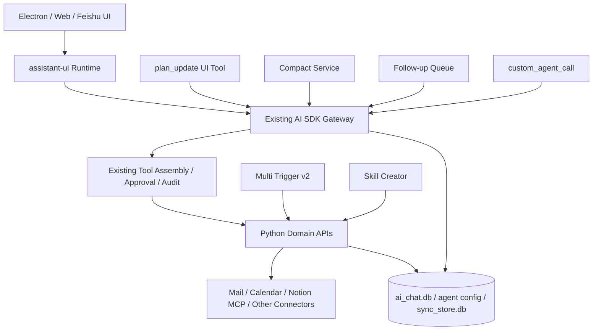

# 目标架构：在现有 AI SDK Harness 上渐进增强

## 1. 架构原则

目标不是重建平台，而是让现有路径增加少量清晰接缝：

1. AI SDK Gateway 继续是唯一运行时；
2. Tool/Approval/Connector/Exec 路径保持原样；
3. 新能力尽量通过新增工具、Endpoint、DB 列或小表实现；
4. Session 继续是持久化和用户查看的中心；
5. Python 继续掌握领域执行与服务端授权；
6. 所有改动独立 Feature Flag；
7. 不以“抽象整洁”为理由改动成熟安全代码。

## 2. 目标拓扑



新模块都是现有 Gateway 的局部能力，不构成第二个 Harness。

## 3. Session 作为统一运行记录

### 3.1 交互 Session

- 用户决定是否新建；
- 运行期间可进入 Follow-up Queue；
- 可手动 `/compact`；
- 复杂任务可显示 Plan 卡。

### 3.2 Custom Agent Session

每次运行独立 Session：

```text
origin = agent
agent_id
agent_job_id
trigger_id
trigger_kind
trigger_fired_at
parent_session_id（可选）
parent_tool_call_id（可选）
invoked_by（可选）
```

Session 不重复保存 Job 状态；查询时根据 `agent_job_id` 投影：

- queued；
- running；
- completed；
- paused；
- skipped；
- failed。

## 4. Trusted Agent Identity

Headless Custom Agent 的 System Prompt 增加代码生成块：

```xml
<current_custom_agent>
  <id>bid-followup</id>
  <title>标案跟进助手</title>
  <job_id>1842</job_id>
  <session_id>732</session_id>
</current_custom_agent>
```

来源只能是服务端权威 spec 与新建 Session 结果，不能来自请求体或 Trigger Payload。

用途：

- 查询自己的运行；
- 引用自己的 ID；
- 生成审计清晰的报告；
- 按 agent_id 筛选 Session。

## 5. 通用 Session 查询

扩展现有 Session API 和工具，不新建专用历史系统：

```ts
interface SessionQuery {
  query?: string;
  origin?: 'interactive' | 'agent' | 'im' | 'all';
  agentId?: string;
  agentJobId?: string;
  triggerId?: string;
  triggerKind?: string;
  createdAfter?: number;
  createdBefore?: number;
  archived?: boolean;
  starred?: boolean;
  limit?: number;
}
```

返回：

- Session 摘要；
- 全文命中片段；
- Agent/Trigger 来源；
- 运行状态投影；
- 创建、更新、完成时间。

权限：

- Custom Agent 默认只查自己的运行；
- 开启 `Knowledge and sessions` 后可查其他 Session；
- `agent_catalog_list/get` 只返回其他 Agent 的非敏感信息。

## 6. Custom Agent 委派

`custom_agent_call` 复用现有 Agent Run Queue：

```text
主 Agent Tool Call
→ 服务端读取目标 Agent 权威配置
→ 创建 agent_run job
→ 创建带 parent_* 的子 Session
→ Headless AI SDK Run
→ 内部固定等待 180 秒（第一版不提供配置）
   ├─ 完成：返回有界结果
   └─ 未完成：返回 running + Session 链接
```

不复制父 Session 全文。只传：

- instruction；
- context_note；
- source_session_id；
- email/thread/calendar/notion/report 引用。

子 Agent 根据自己的工具权限读取事实。

## 7. Compact 架构

```text
/compact 或自动阈值
→ 选择待压缩消息范围
→ 关闭所有工具
→ 当前 Session 模型 + minimal effort
→ 固定 Markdown 摘要
→ 写入特殊 system/compact 消息
→ 下轮上下文使用 compact summary + 保留边界后的原始消息
```

完整历史永远不删除。

Context Overflow：

```text
分块摘要
→ 合并摘要
→ 重试原请求一次
→ 再失败则明确结束
```

## 8. Follow-up Queue 架构

第一阶段不修改 AI SDK Tool Loop：

```text
Run active 时用户输入
→ 持久化 queued input
→ UI 显示在 Composer 上方靠用户侧
→ 可删除或编辑
→ 当前 Run 完成
→ Gateway 自动启动下一轮
```

后续 AI SDK 支持更好的 Tool-boundary Steering 后再实现：

- 当前工具完成；
- 剩余 Tool Call `skipped_by_steering`；
- 注入队列；
- 重新规划。

## 9. 多 Trigger

继续使用 `trigger_json`，v1 向 v2 兼容：

```json
{
  "v": 2,
  "triggers": [
    {
      "id": "trg_01J...",
      "enabled": true,
      "kind": "email_filter"
    }
  ]
}
```

- 不同 Trigger：OR；
- 单 Trigger filters：AND；
- 每条 Trigger 稳定 ID；
- 每条可单独启停；
- 同 Agent 串行队列；
- 相同 trigger + dedupe_key 幂等。

首批类型：

- manual；
- schedule/cron；
- email_filter + `thread_ids`；
- calendar_event_change；
- calendar_before_start。

Calendar 的 change hash 不包含纯开始/结束时间变化：同一 Event 只改时间时不重复生成准备报告，但 `calendar_before_start` 必须按新时间重新调度。Webhook 暂不支持。

## 10. Skill 与 Agent Plugins

Skill Creator 产生草稿并走现有供应链。Agent Plugins 只作为外部包兼容层：

```text
plugin.json / skills/
→ AgentPluginImporter
→ 现有 Skill quarantine / validation / publish
```

不替换内部 Skill Registry、Connector、Tool 权限或 AI SDK。
