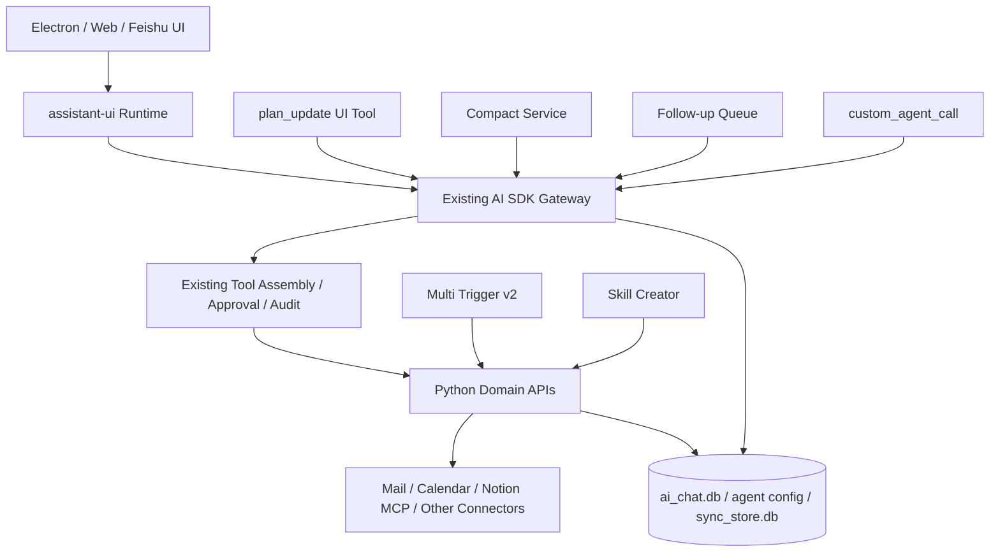

# MailAgent Harness 渐进式优化体系（合并版）

> 版本：2.1-final · 2026-08-07 · Q1–Q100 与 G1–G9 已冻结，可直接进入开发 Handoff。

本文件由独立文档自动合并。持续维护时优先编辑独立文件，并重新生成本文件与 `docs-manifest.yaml`。

## 合并目录

1. `CHANGELOG.md` — 文档体系变更记录
2. `00-executive-summary.md` — 执行摘要
3. `01-current-state-assessment.md` — MailAgent 当前情况评估
4. `02-product-vision-and-scope.md` — 产品愿景与范围
5. `03-target-architecture.md` — 目标架构：在现有 AI SDK Harness 上渐进增强
6. `04-custom-agent-2.md` — Custom Agent 2.0
7. `05-ai-sdk-harness-enhancements.md` — AI SDK Harness 核心增强
8. `06-connectors-skills-plugins.md` — Connector、Skill Creator 与 Agent Plugins
9. `07-session-context-compaction.md` — Session、跨 Session 查询与 Context Compact
10. `08-office-scenarios-and-templates.md` — 办公场景与预设模板
11. `09-security-policy-governance.md` — 安全、权限与治理
12. `10-eval-observability-reliability.md` — Eval、可观测性与可靠性
13. `11-implementation-roadmap.md` — 渐进式实施路线图
14. `12-code-change-map.md` — 源码修改地图
15. `13-accepted-decisions.md` — 已接受的架构与产品决策
16. `14-comparison-matrix.md` — 外部项目横向对比与最终借鉴结论
17. `15-development-handoff.md` — 开发 Handoff
18. `grill.md` — Grill 已关闭：G1–G9 决议与实现期确认规则
19. `references/01-pi-mono.md` — Pi Mono 研究：只吸收交互与上下文能力，不替换 Runtime
20. `references/02-craft-agents-oss.md` — Craft Agents OSS 研究：借鉴 Source 与执行前检查，不引入 Backend 平台
21. `references/03-lobehub.md` — LobeHub 研究：借鉴人工干预与父子运行可见性，不复制平台
22. `references/04-vercel-agent-plugins.md` — Vercel Agent Plugins 研究
23. `references/05-anthropic-skill-creator.md` — Anthropic Skill Creator 研究
24. `appendices/A-contracts.md` — 附录 A：建议契约
25. `appendices/B-data-model.md` — 附录 B：最小数据模型变更
26. `appendices/C-pr-checklist.md` — 附录 C：逐 PR 验收清单
27. `appendices/D-glossary.md` — 附录 D：术语表
28. `appendices/E-source-index.md` — 附录 E：源码索引

---

<!-- SOURCE: CHANGELOG.md -->

# 文档体系变更记录

## 2.1-final — 2026-08-07

完成 G1–G9 最后一轮 Grill，并消除开发文档中的剩余默认值冲突。

### 冻结默认值

- `custom_agent_call` 固定等待 **180 秒**，第一版不向用户暴露 `wait_seconds`；
- 接受模型在 `manual_chat` 中自报 `user_requested=true`，用于跳过高风险 Agent 的**外层调用卡**；该标记必须审计，且不能改变子 Agent 的工具权限或内部审批；
- 普通写审批 TTL 为 **24 小时**，高风险外发审批 TTL 为 **2 小时**；
- Compact 在 80% 提醒、90% 自动，不增加 85% 二级提醒；压缩后上下文目标为模型窗口约 25%，并设置绝对上限；
- Agent Plugins 第一版只导入/导出 Skill，不导入 MCP；
- Calendar 以 Event ID + 业务内容 hash 去重；同一 Event 仅时间变化不触发 `calendar_event_change`，但必须重排 `calendar_before_start`；
- Plan Card 第一版只读，仅由模型更新；
- Stop 当前 Run 后保留 Follow-up Queue，并转为 `restored`，等待用户确认发送。

### 文档维护

- `grill.md` 改为“Grill 已关闭 + 实现期确认规则”；
- 更新 Handoff、契约、路线图、安全、Eval 与源码修改地图；
- 修复并生成 `docs-manifest.yaml`；
- 重新生成合并版与发布压缩包。

## 2.0-final — 2026-08-07

基于 Q1–Q100 Grill 重写。

### 删除近期主线

- Runtime SPI、Pi Runtime、Graph Runtime；
- CompiledRunPlan 与 Canonical AgentEvent 大重构；
- Durable Operation 平台；
- Workspace、Project、WorkItem 和 Work Inbox；
- 团队账号、多租户与 SaaS 控制面；
- 通用 Workflow/Automation Builder；
- 第一阶段 Webhook Trigger。

### 新增或强化

- Session-centered 产品边界；
- `plan_update` 最小恢复；
- `/compact`、90% 自动 Compact 和 Overflow Recovery；
- 持久 Follow-up Queue；
- Custom Agent Description、多 Trigger v2、Thread 与 Calendar Trigger；
- Trusted Agent Identity 与组合 Session Query；
- 主 Agent `custom_agent_call` 与父子 Session；
- Skill Creator、可信 Skill 版本；
- Vercel Agent Plugins 外部兼容层；
- P0–P9 开发 Handoff；
- 无阻塞项的独立 `grill.md`。

### 研究文档

新增独立：

- Vercel Agent Plugins；
- Anthropic Skill Creator。

Pi、Craft 和 LobeHub 文档改为最终决策下的“借鉴而不替换”版本。

---

<!-- SOURCE: 00-executive-summary.md -->

# 执行摘要

> Q1–Q100 与 G1–G9 已全部冻结，当前没有阻塞开发的产品未决问题。

## 1. 最终产品判断

MailAgent 应继续沿着现有路线演进：

> **一个面向单个企业办公人员、以邮件和 Session 为中心、能够读取邮件与 Notion、创建专项 Custom Agent、持续跟进长期任务并安全执行工具的本地办公 Agent 伙伴。**

近期不把 MailAgent 改造成团队协作平台、项目管理系统或多运行时 Agent 平台。当前用户只有一个人，数据与凭证都在本地，远程访问只是现有本地能力的延伸。

## 2. 当前方案中被明确否决的方向

以下内容从近期主线中删除：

- Runtime-neutral `AgentRuntime` SPI；
- Pi Runtime、Craft Runtime 或 Graph Runtime；
- `CompiledRunPlan` 大改造；
- 全新的 Canonical AgentEvent 平台；
- WorkItem、Workspace、Project、Work Inbox；
- 通用 Workflow/Graph 编排系统；
- 组织账号、多租户和团队权限；
- 云 SaaS 数据平面；
- Custom Agent 递归调用 Custom Agent；
- 通用 Webhook Trigger 第一阶段实现。

这些方向并非永远不能做，而是与当前用户规模、人力和风险承受能力不匹配。

## 3. 必须保留的既有资产

MailAgent 已经拥有大量成熟能力，优化应建立在这些资产之上，而不是重新建设：

- AI SDK 7 `streamText` Tool Loop；
- assistant-ui 原生 UIMessage 流与持久化；
- `manual_chat / untrusted_trigger / cron_headless / im_chat` 运行来源矩阵；
- 工具 class、Skill gating 和 Context Mode 过滤；
- `auto / ask / off` 工具权限；
- ApprovalGuard、输入 hash、过期、one-shot 与恢复；
- Detached Run、显式 Stop 与同 Session 并发保护；
- Python 邮件、日历、报告、Notion、Connector 和 Exec 执行权威；
- MCP Connector 工具动态注册、CRUD 天花板和服务端二次授权；
- Skill quarantine、文件 hash、Secret 声明、完整性检查和无 Shell Exec；
- Custom Agent 手动、Schedule/Cron、Email Filter 运行；
- Headless Agent Session、最近运行、未读状态和审批暂停；
- ToolTraceCard、报告 Artifact 和 Agent Eval。

## 4. 核心目标

### 4.1 主 Agent 更像真正的办公伙伴

主 Agent 应能：

- 理解用户提出的长期或重复工作；
- 自动建议建立专项 Custom Agent；
- 根据当前对话生成 Prompt、工具、Skill、Connector、Trigger 与预算配置；
- 在用户确认后创建 Agent；
- 根据当前任务调用已有 Custom Agent；
- 把子 Agent 结果以摘要卡片反馈到父 Session；
- 继续通过邮件、Notion、日历和 Session 工具完成办公任务。

### 4.2 Custom Agent 更适合长期跟进

Custom Agent 的目标形态：

```text
身份与描述
+ Prompt 工作方法
+ 模型
+ Skill 与工具能力
+ Connector 授权
+ 多 Trigger
+ 预算
+ 每次独立 Session
+ 可查询的历史运行
```

不增加独立 Workflow 产品。复杂流程继续写进 Prompt；确定性、可复用或脚本化部分抽成 Skill。

### 4.3 长 Session 更可靠

近期重点补齐：

- 恢复轻量 `plan_update`；
- `/compact` 手动压缩；
- 已知上下文窗口达到 90% 后自动压缩；
- Context Overflow 后分块压缩并重试一次；
- 运行中允许输入 Follow-up Queue；
- 队列可编辑、删除、持久化；
- 后续等待 AI SDK 原生能力成熟后再做真正 Tool-boundary Steering。

## 5. 技术方案总览

```text
现有 Electron / Web UI
        │
        ▼
现有 AI SDK Gateway
  ├─ plan_update UI tool
  ├─ compact endpoint + context selector
  ├─ queued follow-up dispatcher
  ├─ custom_agent_call
  └─ 现有 Tool/Approval/Connector 路径不变
        │
        ▼
Python Serve API / Domain Kernel
  ├─ Agent v2 Trigger 校验
  ├─ Session 组合查询
  ├─ Agent Catalog
  ├─ Agent Run Queue
  ├─ Connector 二次授权
  ├─ Skill Supply / Exec Gate
  └─ Mail / Calendar / Notion / Report
        │
        ▼
现有本地数据库
  ├─ ai_chat.db：Session、消息、队列、Compact、父子来源
  ├─ agent_config.db / report agent：Agent 与 Trigger 配置
  └─ sync_store.db：邮件、日历与领域 SSoT
```

## 6. P0–P9 实施顺序

```text
P0  plan_update 最小恢复
P1  Session 查询、Agent 身份和 Trigger 来源
P2  custom_agent_call 与父子 Session
P3  手动 /compact
P4  90% 自动 Compact 与 Overflow Recovery
P5  Follow-up Steering Queue
P6  多 Trigger v2 与 email thread 过滤
P7  Calendar 创建/更新与会前 Trigger
P8  Skill Creator 与可信 Skill 版本
P9  Agent Plugins Skill 导入/导出
```

每一步均要求：

- 独立 Feature Flag；
- 不依赖下一阶段；
- migration 可回退或兼容旧数据；
- 现有 Eval 与安全测试全绿；
- 不削弱审批、工具矩阵和 Python 二次授权。

## 7. North Star

近期不需要复杂商业指标。成功标准是：

> 用户能够真正使用主 Agent 与专项 Custom Agent 完成日常邮件、Notion、会议准备和项目跟进工作。

建议观察：

- 每周实际运行的 Custom Agent 数；
- 运行成功率；
- 用户打开并阅读结果的比例；
- 报告或 Notion 输出被采用的比例；
- 重复失败、Context Overflow 与审批过期率；
- 用户手工修改 Agent Prompt 的比例；
- 用户主动再次运行或保留模板的比例。

---

<!-- SOURCE: 01-current-state-assessment.md -->

# MailAgent 当前情况评估

## 1. 当前定位

MailAgent 已从邮件同步系统演进为一个本地办公 Agent 应用，当前核心由三层组成：

```text
邮件、日历、附件、Notion、KOS、报告与 Connector 领域内核
                      ↓
               AI SDK Gateway
                      ↓
           Electron / Web / 飞书交互面
```

AI SDK Gateway 已是主 Agent Harness。现阶段不需要更换运行时，而应修补长 Session、Agent 委派、多 Trigger 和 Skill 生产体验。

## 2. 已有 Harness 能力

### 2.1 模型与会话

- AI SDK 7 `streamText`；
- 多 Provider 与模型注册表；
- per-turn effort / thinking；
- assistant-ui runtime；
- UIMessage 原生持久化；
- Detached Run；
- ActiveRunRegistry；
- 显式 Stop；
- 后台运行完成后刷新；
- Session 自动标题、置顶、星标、归档和未读。

关键源码：

- `frontend/src/ai-gateway/chatRun.ts`
- `frontend/src/ai-gateway/server.ts`
- `frontend/src/ai-gateway/activeRuns.ts`
- `frontend/src/shared/assistant/runtime/useMailAgentAiSdkRuntime.ts`
- `frontend/src/electron/main/chat_db/`

### 2.2 工具、审批和安全

- 内置邮件、日历、报告、KOS、Web、Exec、Profile、Session、Skill、Custom Agent 工具；
- 工具 class 与运行来源矩阵；
- `auto / ask / off`；
- ApprovalGuard；
- 邮件发送双 Guard 与幂等；
- 外部内容围栏；
- Tool audit；
- Connector 服务端二次授权；
- Skill 供应链与 Exec Gate。

关键源码：

- `frontend/src/ai-gateway/tools/index.ts`
- `frontend/src/ai-gateway/tools/policy.ts`
- `frontend/src/ai-gateway/tools/types.ts`
- `frontend/src/ai-gateway/tools/connector.ts`
- `frontend/src/ai-gateway/tools/exec.ts`
- `src/connectors/service.py`
- `src/api/routers/exec.py`

### 2.3 Custom Agent

当前已经支持：

- `custom_agent_list/get/create/update/delete/run_now`；
- Prompt、模型、enabled、Trigger、能力、Skill、Connector 和预算；
- Cron、结构化 Schedule 与 Email Filter；
- 每次 Headless 运行创建独立 AI SDK Session；
- `origin='agent'`、`agent_id`、`agent_job_id`；
- 最近运行、Session ID、状态、审批和错误；
- 服务端权威 spec 回拉；
- 每 Agent 工具收窄；
- 审批暂停和恢复。

关键源码：

- `frontend/src/ai-gateway/tools/agents.ts`
- `frontend/src/ai-gateway/agentRun.ts`
- `src/api/routers/agent_runs.py`
- `src/agents/trigger.py`
- `src/agents/email_dispatch.py`
- `src/skills/docs/custom_agent/SKILL.md`

### 2.4 Connector 与 Skill

Connector 已支持：

- MCP Streamable HTTP；
- OAuth/凭证；
- 工具 manifest 同步；
- 动态 AI SDK Tool；
- per-tool `auto / ask / off`；
- CRUD ceiling；
- Headless grant；
- 输出截断与 `UNTRUSTED_MCP_TOOL` 围栏。

Skill 已支持：

- builtin 与 third-party Skill；
- Skill 安装、确认、卸载和读取；
- quarantine、安全解压和 hash；
- manifest Secret；
- 脚本完整性与首次运行记录；
- 绝对路径 argv；
- 固定环境变量；
- 无 `shell=True`；
- 结构化 Exec 白名单。

## 3. 已经存在、无需重建的能力

前期方案曾把以下能力列为“大建设项”，但代码核对后应视为已有：

| 能力 | 当前状态 |
|---|---|
| 工具执行时间线 | 已有成熟 ToolTraceCard、耗时、参数、结果和状态 |
| 重复失败纪律 | 已在系统 Prompt 恒注入，尚可补确定性检测但不是从零 |
| Source/Connector Awareness | 已有 Skill/Connector Catalog 与描述 |
| PreToolUse 安全管线 | 分散在装配、wrapper、policy 与 Python endpoint，但功能已存在 |
| Artifact | 已有 report_write、报告存储与 Notion 输出能力 |
| Headless Run Session | 已有 origin/agent/job 回链与历史 UI |
| Custom Agent CRUD | 已有对话式创建、更新和运行 |

因此近期不为了代码“看起来统一”而重构这些路径。

## 4. 真实缺口

### 4.1 Prompt 要求 `plan_update`，工具已经退役

`src/agent_config/templates.py::AGENT_TEMPLATE` 仍要求复杂任务调用 `plan_update`，但 AI SDK Tool Catalog 只把它当旧历史显示名称。模型可能被要求调用不存在的工具。

这是 P0，应该用最小 UI Tool 修复。

### 4.2 Context 只可观察，不能压缩

当前已有 `context_tokens` 和上下文占用环，但没有正式 Compact：

- 无 `/compact`；
- 无摘要边界；
- 无自动 90% 压缩；
- 无 Overflow Recovery。

### 4.3 运行期间完全禁用输入

当前 Composer 在 Run active 时禁止所有发送路径。用户只能 Stop，不能把补充要求排队到当前 Run 之后。

### 4.4 Custom Agent 缺少自然委派接口

`custom_agent_run_now` 只能运行固定 Prompt。主 Agent 尚不能：

- 传一次性 instruction；
- 传结构化上下文引用；
- 短暂等待结果；
- 显示父子结果卡；
- 记录父子 Session 关系。

### 4.5 Custom Agent 身份没有进入模型上下文

服务端和权限系统知道 `agent_id`，但 Headless 模型只收到 `taskPrompt + emailEnvelope`。模型无法可靠表达“查询我自己的历史运行”。

### 4.6 Session 查询缺少组合过滤

已有 FTS 搜索和 `agent_id` 字段，但 Agent 工具还不够方便地按以下维度组合查询：

- agent_id；
- agent_job_id；
- trigger_id / trigger_kind；
- 时间范围；
- origin；
- 运行状态；
- 全文 query。

### 4.7 Trigger 仍是单对象

当前 `trigger_json` 只能表达一个 Trigger，Email Filter 不支持 Thread ID，Calendar 也未纳入 Custom Agent Trigger。

### 4.8 Skill Creator 缺失

MailAgent 能安装 Skill，但没有内建流程把当前 Session 中的成功工作方法转成 Skill 草稿、测试并发布。

### 4.9 外部插件包缺少兼容格式

Agent Plugins 可以作为 Skill 与 MCP 的外部包格式，但当前 MailAgent 没有 importer/exporter。它不影响 Harness 主线，放在最后。

## 5. 风险判断

| 风险 | 处理原则 |
|---|---|
| 大规模 Harness 重构导致审批回退 | 不做 Runtime 抽象，只做局部新增 |
| Compact 丢失事实或副作用 | 完整历史不删；固定摘要结构；保留来源和已执行动作 |
| Steering 与并行 Tool Call 冲突 | 先做 Run 完成后的 Follow-up Queue，不拦截当前 Tool Loop |
| Agent 委派递归和成本失控 | 第一阶段仅人工主 Agent 可调用，Custom Agent 不可调用其他 Agent |
| 多 Trigger 重复运行 | trigger_id + dedupe_key + per-Agent 串行队列 |
| Skill 脚本扩大为任意 Shell | 保持显式 argv、hash、entrypoint 和结构化权限 |
| Agent Plugins 绕过安装与授权 | 仅作为导入格式，仍走现有 Skill/Connector 生命周期 |

---

<!-- SOURCE: 02-product-vision-and-scope.md -->

# 产品愿景与范围

## 1. 目标用户

第一目标用户是：

> 以邮箱沟通为主要工作方式的单个企业办公人员，当前核心画像是产品经理。

特点：

- 每天处理大量邮件、附件、会议邀请和跨部门沟通；
- PRD、需求池、会议纪要和项目资料主要在 Notion；
- 需要持续跟进产品项目、标案、承诺和会议；
- 希望通过本地应用降低 Notion Custom Agent 等云服务成本；
- 不需要团队账号、组织管理或多人协作平台。

## 2. 产品愿景

MailAgent 不只是邮件分类器，也不是通用聊天壳。它应逐步成为：

> 能理解邮件、Notion、日历和历史 Session，帮助用户创建专项 Agent，持续跟进长期工作，并在安全边界内执行办公动作的个人 Agent 伙伴。

## 3. 产品中心

近期继续保持：

```text
收件箱 / 邮件详情
+ 通用 Agent Session
+ Custom Agent 页面与运行 Session
+ Connectors / Skills / Settings
```

Session 是用户理解和检查 Agent 工作的主要载体。每一次自动 Custom Agent 运行都创建独立 Session；用户手动聊天是否延续旧 Session，继续由用户决定。

不建设：

- WorkItem；
- Workspace；
- 内建 Project；
- 团队任务中心；
- 复杂统一主页。

真实产品项目仍存在于邮件和 Notion 中，MailAgent 通过 Prompt、Connector 和 Session 理解它们。

## 4. 核心场景

### 4.1 邮件理解与处理

现有能力继续强化：

- 分类与重要性判断；
- 邮件和线程检索；
- 附件阅读；
- 总结、翻译和草稿；
- 承诺、截止时间与风险识别；
- 结合 Notion 验证邮件信息。

### 4.2 Notion 知识与写入

Notion 始终通过 MCP Connector 接入：

- 搜索 Database/Page；
- 读取 PRD、需求池、会议纪要；
- 跨页面综合；
- 结合邮件分析；
- 创建或更新页面；
- 按 Prompt 或 Skill 规定的格式输出报告。

MailAgent 不复制 Notion 的项目和数据库模型。

### 4.3 长期专项跟进

用户提出重复或长期需求时，主 Agent 可以建议并创建 Custom Agent，例如：

- 标案跟进；
- 产品项目进展；
- 特定邮件线程跟进；
- 需求反馈整理；
- 每周进展报告；
- 重要会议准备；
- 客户或合作方承诺检查。

### 4.4 会前准备

Custom Agent 可配置：

- Calendar Event 创建或业务字段更新时运行；
- 会前指定提前量再次运行；
- 读取相关邮件、Notion 页面和历史会议；
- 创建或更新 Notion 会前报告。

报告复用与页面格式通过 Prompt 或 `meeting-brief` Skill 表达，不建设 Meeting Report 子系统。

### 4.5 主 Agent 委派专项 Agent

主 Agent 可以：

- 列出已有 Agent；
- 读取它们的描述与状态；
- 选择最合适的专项 Agent；
- 传一次性 instruction 与结构化引用；
- 内部固定等待 180 秒；
- 获得结果或后台 Session 链接。

第一阶段只有人工主 Agent可以调用 Custom Agent，避免 Agent 递归。

## 5. Custom Agent、Skill 与 Connector 的分工

```text
Custom Agent
  谁长期负责什么、何时运行、拥有哪些能力

Prompt
  具体工作方法与输出要求

Skill
  可复用的方法、参考资料与可选确定性脚本

Connector
  连接外部系统并提供结构化工具
```

不单独建设 Workflow 产品。复杂工作流程写在 Prompt 中；重复且稳定的方法抽成 Skill。

## 6. 输出原则

近期不增加复杂 `output_target` 后端模型。输出由 Prompt 规定：

- 当前 Session 回答；
- 写入本地 Report；
- 创建/更新 Notion 页面；
- 生成邮件草稿；
- 读取或更新 Connector 对象。

复杂输出规范应通过 Skill 封装，例如：

- 周报结构；
- 标案风险表；
- 会议 Brief 页面模板；
- Notion Database 字段映射。

## 7. 自主性原则

```text
工具不可见 / off  → Agent 不能调用
工具 auto          → Agent 可自动调用
工具 ask           → 调用时审批
平台安全底线       → 即使 auto 也不能绕过
```

一旦用户把普通读能力开放给 Agent，Agent 应自然使用，不反复询问。写入、外发、Exec 和能力变更继续按风险控制。

## 8. 非目标

- 团队协作；
- 账号与登录；
- 多租户；
- 通用项目管理；
- 多 Runtime；
- 自由多 Agent 群聊；
- 可视化 Workflow Builder；
- 云端统一执行；
- 大规模插件市场；
- 近期商业化设计。

---

<!-- SOURCE: 03-target-architecture.md -->

# 目标架构：在现有 AI SDK Harness 上渐进增强

## 1. 架构原则

目标不是重建平台，而是让现有路径增加少量清晰接缝：

1. AI SDK Gateway 继续是唯一运行时；
2. Tool/Approval/Connector/Exec 路径保持原样；
3. 新能力尽量通过新增工具、Endpoint、DB 列或小表实现；
4. Session 继续是持久化和用户查看的中心；
5. Python 继续掌握领域执行与服务端授权；
6. 所有改动独立 Feature Flag；
7. 不以“抽象整洁”为理由改动成熟安全代码。

## 2. 目标拓扑



新模块都是现有 Gateway 的局部能力，不构成第二个 Harness。

## 3. Session 作为统一运行记录

### 3.1 交互 Session

- 用户决定是否新建；
- 运行期间可进入 Follow-up Queue；
- 可手动 `/compact`；
- 复杂任务可显示 Plan 卡。

### 3.2 Custom Agent Session

每次运行独立 Session：

```text
origin = agent
agent_id
agent_job_id
trigger_id
trigger_kind
trigger_fired_at
parent_session_id（可选）
parent_tool_call_id（可选）
invoked_by（可选）
```

Session 不重复保存 Job 状态；查询时根据 `agent_job_id` 投影：

- queued；
- running；
- completed；
- paused；
- skipped；
- failed。

## 4. Trusted Agent Identity

Headless Custom Agent 的 System Prompt 增加代码生成块：

```xml
<current_custom_agent>
  <id>bid-followup</id>
  <title>标案跟进助手</title>
  <job_id>1842</job_id>
  <session_id>732</session_id>
</current_custom_agent>
```

来源只能是服务端权威 spec 与新建 Session 结果，不能来自请求体或 Trigger Payload。

用途：

- 查询自己的运行；
- 引用自己的 ID；
- 生成审计清晰的报告；
- 按 agent_id 筛选 Session。

## 5. 通用 Session 查询

扩展现有 Session API 和工具，不新建专用历史系统：

```ts
interface SessionQuery {
  query?: string;
  origin?: 'interactive' | 'agent' | 'im' | 'all';
  agentId?: string;
  agentJobId?: string;
  triggerId?: string;
  triggerKind?: string;
  createdAfter?: number;
  createdBefore?: number;
  archived?: boolean;
  starred?: boolean;
  limit?: number;
}
```

返回：

- Session 摘要；
- 全文命中片段；
- Agent/Trigger 来源；
- 运行状态投影；
- 创建、更新、完成时间。

权限：

- Custom Agent 默认只查自己的运行；
- 开启 `Knowledge and sessions` 后可查其他 Session；
- `agent_catalog_list/get` 只返回其他 Agent 的非敏感信息。

## 6. Custom Agent 委派

`custom_agent_call` 复用现有 Agent Run Queue：

```text
主 Agent Tool Call
→ 服务端读取目标 Agent 权威配置
→ 创建 agent_run job
→ 创建带 parent_* 的子 Session
→ Headless AI SDK Run
→ 内部固定等待 180 秒（第一版不提供配置）
   ├─ 完成：返回有界结果
   └─ 未完成：返回 running + Session 链接
```

不复制父 Session 全文。只传：

- instruction；
- context_note；
- source_session_id；
- email/thread/calendar/notion/report 引用。

子 Agent 根据自己的工具权限读取事实。

## 7. Compact 架构

```text
/compact 或自动阈值
→ 选择待压缩消息范围
→ 关闭所有工具
→ 当前 Session 模型 + minimal effort
→ 固定 Markdown 摘要
→ 写入特殊 system/compact 消息
→ 下轮上下文使用 compact summary + 保留边界后的原始消息
```

完整历史永远不删除。

Context Overflow：

```text
分块摘要
→ 合并摘要
→ 重试原请求一次
→ 再失败则明确结束
```

## 8. Follow-up Queue 架构

第一阶段不修改 AI SDK Tool Loop：

```text
Run active 时用户输入
→ 持久化 queued input
→ UI 显示在 Composer 上方靠用户侧
→ 可删除或编辑
→ 当前 Run 完成
→ Gateway 自动启动下一轮
```

后续 AI SDK 支持更好的 Tool-boundary Steering 后再实现：

- 当前工具完成；
- 剩余 Tool Call `skipped_by_steering`；
- 注入队列；
- 重新规划。

## 9. 多 Trigger

继续使用 `trigger_json`，v1 向 v2 兼容：

```json
{
  "v": 2,
  "triggers": [
    {
      "id": "trg_01J...",
      "enabled": true,
      "kind": "email_filter"
    }
  ]
}
```

- 不同 Trigger：OR；
- 单 Trigger filters：AND；
- 每条 Trigger 稳定 ID；
- 每条可单独启停；
- 同 Agent 串行队列；
- 相同 trigger + dedupe_key 幂等。

首批类型：

- manual；
- schedule/cron；
- email_filter + `thread_ids`；
- calendar_event_change；
- calendar_before_start。

Calendar 的 change hash 不包含纯开始/结束时间变化：同一 Event 只改时间时不重复生成准备报告，但 `calendar_before_start` 必须按新时间重新调度。Webhook 暂不支持。

## 10. Skill 与 Agent Plugins

Skill Creator 产生草稿并走现有供应链。Agent Plugins 只作为外部包兼容层：

```text
plugin.json / skills/
→ AgentPluginImporter
→ 现有 Skill quarantine / validation / publish
```

不替换内部 Skill Registry、Connector、Tool 权限或 AI SDK。

---

<!-- SOURCE: 04-custom-agent-2.md -->

# Custom Agent 2.0

## 1. 定位

Custom Agent 是 MailAgent 中承担长期、重复或专项办公工作的配置单元：

```text
Prompt 工作方法
+ Skill 与工具
+ Connector 授权
+ Trigger
+ 预算
+ 每次独立 Session
```

它不是独立 Runtime，也不是 Workflow Graph。

## 2. 最小 Agent 规范

```yaml
id: bid-followup
version: 2

title: 标案跟进助手
description: 跟踪标案邮件、附件和 Notion 资料，识别截止时间、资格条件、缺口和风险。

prompt: |
  你的任务是……

model: null
enabled: true

capabilities:
  email: read
  calendar: read
  knowledge_and_sessions: on
  reports: produce
  web: gated
  files_and_commands: off

skills:
  - bid-review

grant_connectors:
  notion: update

triggers:
  - id: trg_bid_mail
    enabled: false
    kind: email_filter
    subject_pattern: "标案|招标"
    folders: ["收件箱"]

budget:
  max_runs_per_day: 8
  max_run_seconds: 1800
```

后端仍可以保存为现有 `report_agent` 行和 JSON 字段，不要求一次性改变所有 API 名称。

## 3. Agent Description

新增可选 `description`：

- 1–3 句话；
- 说明擅长什么；
- 说明何时适合调用；
- 不复制完整 Prompt；
- 进入 Agent Catalog、模板、导入导出和委派卡。

## 4. ID

- 根据标题生成 slug；
- 冲突时追加短后缀；
- 创建后不可修改；
- 标题可以任意修改；
- 用户界面主要显示标题，不强迫用户理解 ID。

## 5. Agent 与 Trigger 两级开关

```text
agent.enabled
  是否允许手动运行、被主 Agent 调用、执行自动 Trigger

trigger.enabled
  该 Trigger 是否自动触发
```

新建带自动 Trigger 的 Agent：

```text
agent.enabled = true
trigger.enabled = false
```

因此 Agent 可以先手动测试，再单独发布自动化。

## 6. 主 Agent 自动创建 Agent

### 6.1 触发时机

当用户提出：

- 长期跟进；
- 固定周期报告；
- 重复检查；
- 某邮件线程持续监控；
- 会前自动准备；
- 标案或项目专项追踪；

主 Agent 应主动建议创建 Custom Agent。

### 6.2 创建流程

```text
识别重复/长期需求
→ 说明适合建立 Custom Agent
→ 复用当前 Session 已有信息
→ 只追问缺失 Trigger、权限和输出
→ 生成完整配置摘要
→ 用户确认
→ custom_agent_create 审批卡
→ 创建 Agent
→ 自动 Trigger 默认关闭
```

### 6.3 输出要求

输出继续写在 Prompt 中，例如：

```text
每周生成 Markdown 报告，并使用 Notion Connector：
1. 在指定 Database 中按项目名查找现有页面；
2. 找到则更新；
3. 未找到则创建；
4. 页面包含进展、风险、待确认和来源链接。
```

复杂格式抽成 Skill，不增加 output engine。

## 7. 多 Trigger v2

### 7.1 存储

旧 v1：

```json
{ "v": 1, "kind": "email_filter", "subject_pattern": "..." }
```

新 v2：

```json
{
  "v": 2,
  "triggers": [
    {
      "id": "trg_01JABC",
      "enabled": true,
      "kind": "email_filter",
      "subject_pattern": "..."
    }
  ]
}
```

读取旧 v1 时内存转换为单元素数组；第一次编辑后写回 v2。

### 7.2 Trigger 语义

- Trigger 之间 OR；
- 同一个 Trigger 中条件 AND；
- 每条 Trigger 有稳定 ID；
- 可单独启停；
- 每次 Session 记录 trigger ID、kind 和 firedAt。

### 7.3 Email Filter

新增：

```yaml
thread_ids:
  - <mail thread id>
```

匹配：

```text
folder AND sender AND subject AND thread_id
```

未配置的条件恒 True。

UI 在邮件线程上提供：

```text
为此线程建立跟进 Agent
```

自动填充 Thread ID。

### 7.4 Calendar Trigger

首批支持：

```text
calendar_event_change
calendar_before_start
```

业务字段变化：

- 新建；
- 标题；
- 组织者；
- 参与人；
- 地点或会议链接；
- 议程/正文；
- 取消状态。

忽略同步时间戳、ETag 等技术变化。对同一 Calendar Event，若只有开始/结束时间改变，不触发 `calendar_event_change`；系统只重排该 Event 的 `calendar_before_start`。若时间变化同时伴随其他业务字段变化，则按业务内容变化正常触发。

`calendar_before_start` 的 `lead_time` 可配置，模板默认 1 天。Calendar change 去重使用 `event_id + business_content_hash`，默认 60 秒合并窗口。

### 7.5 去重和并发

```text
相同 trigger_id + dedupe_key → 幂等
不同 trigger_id             → 独立运行
manual run-now              → 不被自动 Trigger 去重
```

默认 key：

- email：internal_id/message_id；
- calendar_event_change：event_id + business_content_hash；
- calendar_before_start：event_id + scheduled_start + lead_time；
- schedule：scheduled occurrence。

同一 Agent 固定串行；新运行排队，不并行。

## 8. 每次运行独立 Session

自动运行与委派运行均创建独立 Session。

Custom Agent 可以通过 Session 查询工具读取过去记录，但不自动注入所有历史。

使用原则：

```text
需要了解过去执行情况
→ 先按 agent_id 查询最近 Session
→ 读摘要或命中片段
→ 必要时读取完整 Session
→ 仍需用邮件/Notion检查最新事实
```

## 9. Agent Catalog

增加纯只读：

```text
agent_catalog_list
agent_catalog_get
```

仅在 `Knowledge and sessions = on` 时给 Custom Agent 注册。

返回：

- id；
- title；
- description；
- enabled；
- Trigger 摘要；
- 最近运行时间和状态。

不返回：

- 完整 Prompt；
- 详细权限规则；
- Secret；
- 修改、删除或启动入口。

## 10. 主 Agent 调用 Custom Agent

### 10.1 工具

新增 `custom_agent_call`，保留 `custom_agent_run_now`。

```ts
interface CustomAgentCallInput {
  agent_id: string;
  instruction: string;
  context_note?: string;
  source_session_id?: number;
  email_internal_ids?: number[];
  email_thread_ids?: string[];
  calendar_event_ids?: string[];
  notion_refs?: Array<{
    connector_id: string;
    object_id: string;
    object_type?: string;
  }>;
  report_ids?: string[];
  user_requested?: boolean;
}
```

`instruction` 是本次用户消息，不能覆盖固定 Prompt，也不能扩大工具权限。

### 10.2 调用范围

第一阶段只有人工 `manual_chat` 主 Agent 可调用。

Custom Agent：

- 可以发现其他 Agent；
- 可以查询获准范围的 Session；
- 不能调用、创建、更新或删除其他 Agent。

### 10.3 同步与后台

内部固定等待 180 秒，第一版不向用户或模型开放等待时间配置：

```text
快速完成 → 返回 final_answer、引用和 Session
未完成   → 返回 running、job_id、session_id
```

结果卡持续更新，但完成后不自动重新唤醒父模型。

### 10.4 父子 Session

子 Session 记录：

```text
parent_session_id
parent_tool_call_id
invoked_by = main_agent | user
```

一次性 instruction 已作为第一条用户消息保存，不在 Session 行重复。

### 10.5 审批

- 只读/报告型 Agent 调用可自动；
- 拥有写、开放 Web、Exec 或外发能力的 Agent，主 Agent 主动委派时默认显示调用确认卡；
- 第一版接受模型在 `manual_chat` 中自报 `user_requested=true`：为 true 时跳过**外层 Agent 调用卡**；该字段必须进入审计；
- `user_requested` 只影响是否显示外层调用卡，不能改变目标 Agent 的 ToolSet、Connector ceiling、Exec 规则或子 Tool 审批；
- 子 Agent 的具体 Tool Call 仍走自身审批；
- 子 Agent 审批只在子 Session 操作；
- 父结果卡显示“等待确认”并提供入口。

### 10.6 结果卡

显示：

- Agent 名称；
- 运行状态；
- 耗时；
- 简短结论；
- Artifact/Notion 引用；
- 子 Session 入口；
- 审批或错误；
- 停止子运行按钮。

## 11. 模板

首批模板只做 3–5 个已验证场景：

- 标案跟进；
- 会前准备；
- 产品项目跟进；
- 重要邮件与待办梳理；
- 每周进展总结。

模板只是普通 Custom Agent JSON，不写特殊代码。

---

<!-- SOURCE: 05-ai-sdk-harness-enhancements.md -->

# AI SDK Harness 核心增强

## 1. 原则

继续使用现有 Vercel AI SDK。近期增强聚焦：

- Plan；
- Compact；
- 运行中 Follow-up Queue；
- 确定性失败检测的小补强；
- 保持 ToolTrace、审批和 Detached Run 稳定。

不做：

- Runtime SPI；
- 替换 Agent Loop；
- 自研完整 Loop；
- Pi Runtime；
- Graph Runtime。

## 2. 恢复 `plan_update`

### 2.1 问题

系统 Prompt 仍要求复杂任务调用 `plan_update`，但 AI SDK 工具面已经没有可调用实现。

### 2.2 最小工具

```ts
interface PlanUpdateInput {
  goal: string;
  steps: Array<{
    id: string;
    title: string;
    status: 'pending' | 'in_progress' | 'done' | 'blocked' | 'unavailable';
    note?: string;
  }>;
}
```

属性：

- local；
- silent；
- 无审批；
- 无外部副作用；
- 不新增 plan 表；
- 作为 UIMessage Tool Part 持久化；
- 人工与 Headless Session 都可用；
- 第一版 Plan Card 只读，只允许模型通过 `plan_update` 更新。

### 2.3 使用规则

需要计划：

- 跨邮件、Notion、Calendar；
- 预计多个 Tool Call；
- 三个以上步骤；
- 长时间运行。

不需要计划：

- 单次检索；
- 简单总结；
- 翻译；
- 单封草稿。

## 3. Context Compact

### 3.1 用户入口

- Slash Command：`/compact`；
- 上下文环菜单：手动压缩；
- 已知 context window 达到 90%：当前 Run 完成后自动压缩；
- 80% 以上给出接近上限提醒；
- 用户可关闭自动 Compact。

模型 context window 未知时：

- 不自动触发；
- 保留手动 `/compact`。

### 3.2 模型选择

第一版：

```text
当前 Session 模型
+ tools disabled
+ thinking/effort = none 或 minimal
```

原因：当前模型已证明能接收这个 Session 的上下文规模。

后续可增加独立 Compact Model；若窗口不足，回退当前模型。

压缩后的模型输入目标为当前模型 context window 的 20%–30%，默认按 25% 计算，并设置 64K tokens 的整体绝对上限。摘要自身的生成预算建议不超过 8K tokens，并继续受模型实际 output limit 约束。

### 3.3 摘要结构

```markdown
## User goal
## Stable facts
## Decisions made
## Constraints and preferences
## Work completed
## Open questions
## Pending actions
## Important source references
## Tool side effects already performed
## Rejected or expired approvals
```

必须保留：

- 邮件 ID、Thread ID；
- Calendar Event ID；
- Notion 页面/Database；
- Report ID；
- 已经发送或写入的动作；
- 用户拒绝的动作；
- 未完成审批；
- 用户明确限制。

### 3.4 持久化

Compact 作为特殊 system message：

```json
{
  "kind": "compact",
  "compacted_through_message_id": 86,
  "first_kept_message_id": 87,
  "tokens_before": 91000,
  "estimated_tokens_after": 28000,
  "model": "..."
}
```

UI 显示专门卡片，不伪装为 Assistant 回答。

完整历史不删。

### 3.5 上下文装配

下轮送模型：

```text
System Prompt
+ 最新有效 Compact Summary
+ first_kept_message_id 之后的原始消息
```

旧 Compact 卡本身不重复送进模型，只使用最新边界。

### 3.6 Overflow Recovery

Provider 返回 context overflow：

```text
按安全窗口分块旧消息
→ 每块生成部分摘要
→ 合并摘要
→ 写 Compact 记录
→ 自动重试原请求一次
```

再失败则结束，不循环。

## 4. Follow-up Steering Queue

### 4.1 第一阶段语义

不尝试中断 AI SDK 当前 Tool Loop：

```text
Agent 运行中
→ 用户仍可输入
→ Enter 加入 Follow-up Queue
→ 当前 Run 完成
→ 队列内容作为下一轮用户消息自动发送
```

Stop 继续立即取消当前 Run。未送达队列不会被清空，而是统一转为 `restored`，等待用户编辑、删除或确认发送；第一版不提供“Stop 并清空队列”的快捷选项。

### 4.2 UI

队列位于 Composer 上方、靠右侧用户消息方向。

每条：

- 显示文本；
- 单独删除；
- 单独编辑；
- 编辑时取回 Composer；
- 顺序可见；
- 标明“将在当前任务完成后发送”。

### 4.3 持久化

使用 `ai_chat.db` 专门队列表：

```text
queued
claimed
sent
canceled
restored
```

理由：Detached Run 期间用户可能切换 Session 或卸载组件。

应用重启后，若旧 Run 已不存在：

- 不自动发送；
- 恢复为“待发送补充”；
- 由用户编辑、删除或确认发送。

### 4.4 多条消息

默认在下一轮按时间顺序合并，但保留逐条边界：

```xml
<queued_followups>
  <message>先不要写入 Notion。</message>
  <message>还要检查上周会议纪要。</message>
</queued_followups>
```

### 4.5 等待审批时

用户输入不代表批准或拒绝：

- 仍进入队列；
- 审批必须明确处理；
- UI 提示将在审批解决后送达。

### 4.6 第二阶段 Tool-boundary Steering

等待 AI SDK 提供更可靠支持后再实现：

```text
当前工具完成
→ 同批尚未执行工具 skipped_by_steering
→ 注入 Steering
→ 模型重新规划
```

## 5. 失败循环补强

已有 Prompt discipline 要求相同失败 2–3 次停止。可小步增加确定性 guard：

```text
tool_name
+ 规范化 input hash
+ error code
```

相同三元组连续达到 3 次：

- 不再自动执行第四次；
- 产生 Tool Result：`E_REPEATED_TOOL_FAILURE`；
- 要求模型换方法或报告未完成。

此功能可后置，不能修改现有错误语义或把不同输入误判为同一次失败。

## 6. 现有能力保持不动

- ToolTraceCard；
- Tool Approval Card；
- Detached Run；
- Stop endpoint；
- ActiveRunRegistry；
- UIMessage persistence；
- Smooth stream；
- A2UI card；
- AG-UI mirror。

---

<!-- SOURCE: 06-connectors-skills-plugins.md -->

# Connector、Skill Creator 与 Agent Plugins

## 1. 三者边界

```text
Connector：外部系统原子工具
Skill：完成一类任务的方法、参考资料和可选脚本
Agent Plugin：把 Skill 与 MCP 配置放进一个可分发目录
```

Agent Plugins 不是 Harness，也不替换 AI SDK、Tool Registry 或权限系统。

## 2. Connector 继续使用现有体系

当前设计保持：

- Python MCP client；
- TS Gateway 只持工具 envelope；
- OAuth/Secret 不进 Gateway Prompt；
- 工具 manifest 白名单；
- per-tool `auto / ask / off`；
- CRUD ceiling；
- Headless `grant_connectors`；
- 服务端再次读取 Agent grant；
- 外部内容围栏；
- 调用超时和截断。

近期不引入新 Connector 抽象层。

## 3. Notion

Notion 通过 MCP Connector 使用：

- Search；
- Fetch；
- Database/Page 读取；
- 创建和更新；
- 复杂输出通过 Prompt 或 Skill 规定。

不为 Notion 建第二套项目、任务或页面模型。

## 4. Skill Creator

### 4.1 目标

用户可以说：

> 把我们刚才整理产品周报的方式做成一个 Skill。

Skill Creator：

```text
理解场景
→ 提炼触发描述
→ 生成 SKILL.md 草稿
→ 可选 references/assets/scripts
→ 生成测试案例
→ 静态校验
→ 用户预览
→ 发布
```

### 4.2 草稿区

Skill 不直接安装。先进入隔离草稿区：

- 显示文件树；
- 展示 SKILL.md；
- 展示引用与脚本；
- 展示声明权限；
- 展示测试；
- 用户确认后发布。

可复用现有 quarantine/hash 思路，但用户本地创建不需要下载授权卡。

### 4.3 默认内容

第一版优先生成：

- `SKILL.md`；
- `references/`；
- `assets/`；
- 测试 prompts。

脚本可由模型判断加入，但必须在草稿中解释：

- 为什么纯指令不足；
- 脚本解决什么确定性问题；
- 读取/写入路径；
- 网络需求；
- Secret；
- entrypoint；
- smoke test。

用户可删除脚本后再发布。

### 4.4 验证

第一版必须生成：

- 触发正例；
- 不应触发的负例；
- 预期输出检查；
- 脚本 smoke test。

暂不建设完整 benchmark 平台。

## 5. Skill 信任三级模型

### 5.1 Builtin Skill

- 随 MailAgent 发布；
- 代码签名/版本控制；
- 声明脚本可免每次审批；
- 仍受 manifest、hash、敏感路径、固定环境和输出围栏约束。

### 5.2 User-created Trusted Skill

- 由 Skill Creator 生成并发布；
- 首次运行展示完整权限摘要；
- 用户可“信任此版本”；
- 文件变化或 package hash 变化后信任失效。

### 5.3 Third-party Skill

- 继续隔离下载与二阶段安装；
- 默认不信任脚本；
- 首次运行审批；
- 用户主动信任指定版本后才允许窄范围免卡。

## 6. 信任不等于任意 Exec

“信任此 Skill 版本”编译成结构化规则：

```text
skill_name
package_hash
entrypoint
argv constraints
cwd scope
read paths
write paths
network capability
secret names
```

UI 可提供：

```text
仅本次允许
始终允许这个输入模式
信任此 Skill 版本声明的入口
```

底层仍然：

- 显式 argv；
- 无 Shell；
- 文件 hash；
- 绝对脚本路径；
- fixed env；
- Secret 声明交集；
- stdout/stderr 脱敏；
- 敏感路径地板。

## 7. Headless Skill Exec

Custom Agent 无人值守执行脚本必须同时满足：

1. Skill 版本已信任；
2. Agent 挂载该 Skill；
3. Agent 有 `grant_exec`；
4. 命中此 Skill 的结构化允许规则；
5. 文件 hash 与 package hash 未变化。

缺一项就不免审批或不注册。

## 8. Vercel Agent Plugins

### 8.1 采用方式

Agent Plugins 1.0 作为**外部导入/导出兼容格式**：

```text
外部 plugin package
→ MailAgent importer
→ 现有 Skill / Connector 生命周期
```

内部不改成 Agent Plugins 原生存储。

### 8.2 第一版范围

支持：

```text
plugin.json
skills/
SKILL.md
references/
assets/
scripts/
```

若发现 `mcp.json`：

- 展示包含哪些 MCP Server；
- 提示当前版本暂未导入；
- 不自动连接或授权。

Streamable HTTP MCP、stdio 与 MailAgent 专属 extension 均记录为未来事项，不属于 P9 第一版。

### 8.3 导入流程

```text
选择目录或 ZIP
→ 验证 plugin.json
→ 路径 containment / symlink 防逃逸
→ 每个 Skill 独立校验
→ 展示成功与失败组件
→ 进入 Skill 草稿/隔离区
→ 用户发布
```

一个 Skill 失败不应阻塞其他 Skill。

### 8.4 导出

Skill Creator 稳定后支持：

- 导出单 Skill；
- 导出 Agent Plugin；
- 不导出 Secret、Token、Session 和审批规则。

### 8.5 不替换的内容

Agent Plugins 不替换：

- `buildGatewayTools`；
- Skill Registry；
- Connector Store；
- ApprovalGuard；
- Tool Class；
- Context Mode；
- Exec Gate；
- Custom Agent；
- Trigger；
- Session。

## 9. 配置导入导出

Custom Agent JSON 包含：

- schema_version；
- title/description/prompt；
- 模型偏好；
- Skill；
- 能力；
- Connector 引用；
- Trigger；
- 预算；
- enabled 状态。

不包含：

- OAuth/API Token；
- Skill Secret；
- 本机绝对路径；
- Session 历史；
- 敏感审批规则。

导入时缺少依赖：显示未满足，不自动安装或授权。

---

<!-- SOURCE: 07-session-context-compaction.md -->

# Session、跨 Session 查询与 Context Compact

## 1. Session 是核心工作记录

MailAgent 近期继续以 Session 为中心：

- 人工会话；
- 邮件锚定会话；
- 飞书会话；
- Custom Agent 自动运行；
- 主 Agent 委派子 Agent。

不增加 WorkItem 或 Operation 平台。

## 2. 当前 Session 字段

已有：

```text
id
email_id / anchor_type / anchor_id
backend_kind / backend_model
title / archived
created_at / updated_at
origin
agent_id / agent_job_id
last_read_at
pinned_at / starred
```

## 3. 建议新增来源字段

```text
trigger_id TEXT NULL
trigger_kind TEXT NULL
trigger_fired_at INTEGER NULL
parent_session_id INTEGER NULL
parent_tool_call_id TEXT NULL
invoked_by TEXT NULL
```

语义：

- `created_at`：Session 创建时间；
- `trigger_fired_at`：业务事件发生时间；
- `parent_*`：委派来源；
- `invoked_by`：`main_agent | user`。

`agent_job_id` 继续关联权威运行状态。

## 4. Agent 是否知道自己的 ID

当前权限上下文知道 `agent_id`，模型不知道。新增 Trusted Identity Block 后，模型可以：

- 查“我自己的最近运行”；
- 在报告中记录生成 Agent；
- 使用 agent_id 过滤 Session；
- 引用当前 Session。

## 5. 通用组合查询

扩展 `chat_session_list/search/get` 或新增底层统一查询：

```ts
interface SessionQuery {
  query?: string;
  origin?: string;
  agentId?: string;
  agentJobId?: string;
  triggerId?: string;
  triggerKind?: string;
  createdAfter?: number;
  createdBefore?: number;
  archived?: boolean;
  starred?: boolean;
  limit?: number;
}
```

查询路径：

- 无 query：结构化 SQL；
- 有 query：FTS 命中，再套结构化过滤；
- 短 query：保留 LIKE fallback。

## 6. 运行状态投影

查询 `origin='agent'` Session 时，根据 `agent_job_id` 返回：

```text
run_state
outcome
approval_state
finished_at
error
```

不复制进 Session 表，避免双状态漂移。

## 7. 历史权限

### 7.1 自己的运行

Custom Agent 默认能查自己的 Session：服务端强制加 `agent_id = currentAgentId`。

### 7.2 所有 Session

只有 `Knowledge and sessions = on` 时，Agent 才能查用户其他历史。

### 7.3 其他 Agent

通过 `agent_catalog_list/get` 发现 ID；Catalog 不暴露完整 Prompt 或敏感权限。

## 8. Compact 数据模型

推荐继续使用 `ai_chat_messages`，不新建大型子系统。

Compact Message：

```text
role = system
content = summary markdown
status = complete
metadata.kind = compact
metadata.compacted_through_message_id
metadata.first_kept_message_id
metadata.tokens_before
metadata.estimated_tokens_after
metadata.model
metadata.created_reason = manual | threshold | overflow
```

`ui_message_json` 保存 Compact 卡片。

## 9. Compact 有效性

最新一条有效 Compact 决定上下文边界。

若用户之后编辑/删除历史导致边界不再可信：

- 标记 Compact invalid；
- 回退完整历史或重新 Compact；
- 不静默使用错误摘要。

## 10. 自动阈值

```text
<80%      正常
80%–89%   提示接近上限
>=90%     本轮结束后自动 Compact
Overflow  紧急分块 Compact + 重试一次
```

比例只在模型 context window 已知时计算。不设置 85% 二级提醒。压缩后模型输入目标默认取 context window 的 25%，允许落在 20%–30% 区间，并以 64K tokens 作为整体绝对上限。

## 11. Compact UI

卡片显示：

```text
已压缩上下文
覆盖消息 #12–#86
压缩前 91K
压缩后估计 28K
模型 ...
原因：手动/自动/溢出恢复
```

可展开摘要全文。

Compact 运行期间：

- 显示明确状态；
- 可 Stop；
- 完成后提示；
- 失败不改变当前上下文边界。

## 12. 未读红点

三层：

```text
主导航 Agents：存在任意未读 Agent Session
Agent 行：该 Agent 未读数
Session 行：未读点
```

只有真正打开 Session 时更新 `last_read_at`。

等待审批使用橙色/警告状态，不与普通未读混淆。

---

<!-- SOURCE: 08-office-scenarios-and-templates.md -->

# 办公场景与预设模板

## 1. 模板原则

- 模板只是普通 Custom Agent 配置；
- 不写专用运行代码；
- 用户可通过主 Agent 自然语言定制；
- 输出格式放在 Prompt；
- 重复的格式和步骤抽成 Skill；
- 项目数据继续以邮件和 Notion 为真源。

## 2. 标案跟进助手

### Description

跟踪标案相关邮件、附件与 Notion 标案资料，识别截止时间、资格要求、材料缺口、责任人与风险。

### 建议 Trigger

- Email Filter：主题/发件人/Thread ID；
- Schedule：工作日早上检查；
- 可选 Calendar：答疑会、截止日更新。

### 建议能力

```text
Email: read
Calendar: read
Knowledge and sessions: on
Reports: produce
Notion connector: update
Web: gated
Files/commands: 按需
```

### Prompt 要点

- 读取命中邮件正文与附件；
- 查询指定 Notion Database；
- 按标案编号去重；
- 提取资格条件、交付日期和材料；
- 对邮件与 Notion 不一致处单列；
- 生成报告并更新对应 Notion 页面；
- 不自动发送外部邮件。

## 3. 会前准备

> 同一会议仅调整开始/结束时间时，不重复生成 change-run 报告；系统只把会前再次检查任务移动到新的会议时间。

### Trigger

```text
calendar_event_change
calendar_before_start(lead_time=1 day)
```

也可在首次收到会议邀请邮件时由 Email Trigger 运行。

### 工作方法

1. 读取会议标题、参与人、时间和议程；
2. 检索相关邮件线程；
3. 检索 Notion PRD、需求池和历史会议纪要；
4. 输出背景、最新进展、争议、待决策和建议问题；
5. 用 Calendar Event ID 在 Notion 中查找已有 Brief；
6. 找到则更新，未找到则创建。

### Skill

建议提供 `meeting-brief` Skill，固定页面结构与查找规则。

## 4. 产品项目跟进助手

不在 MailAgent 建 Project 实体。Prompt 维护项目识别线索：

```text
项目名称与别名
相关联系人
邮件关键词与 Thread
Notion Page/Database
固定报告页面
```

### Trigger

- 相关 Thread 新邮件；
- 主题或发件人过滤；
- 每周 Schedule；
- 关键会议创建/更新。

### 输出

- 本周进展；
- 需求变化；
- 风险与依赖；
- 待确认；
- 下一步；
- 证据引用。

## 5. 重要邮件与待办梳理

### Trigger

- 工作日早上 Schedule；
- 特定文件夹新邮件。

### 工作方法

- 扫描未处理或高优先级邮件；
- 读取正文，不只看 snippet；
- 识别需要回复、决策、跟进和等待事项；
- 按紧急/重要分组；
- 生成 Session 报告或本地 Report；
- 只生成草稿，不发送。

## 6. 每周产品进展总结

### 数据源

- 本周项目邮件；
- Notion 需求池；
- 会议纪要；
- 过去一周 Agent Session；
- 可选 Calendar。

### 输出格式

```markdown
# 本周进展
## 已完成
## 需求变化
## 风险与阻塞
## 待决策
## 下周计划
## 证据
```

## 7. 主 Agent 自动生成模板

当用户描述新的长期工作时，主 Agent 应：

- 判断是否已有接近模板；
- 有则复制并改写；
- 无则从空白生成；
- 明确 Prompt、Trigger、能力、Connector、预算和输出；
- 自动 Trigger 默认关闭；
- 引导一次手动试运行。

## 8. 模板验证

每个内置模板至少有：

- 一个成功 fixture；
- 一个无命中 fixture；
- 一个外部内容注入 fixture；
- 一个 Connector 不可用 fixture；
- 一个审批暂停 fixture；
- 输出格式断言。

---

<!-- SOURCE: 09-security-policy-governance.md -->

# 安全、权限与治理

## 1. 安全基线

本方案不得削弱：

- Context Mode；
- Tool Class；
- 注册期过滤；
- Python 执行期二次授权；
- ApprovalGuard；
- 输入 hash 与 one-shot；
- 发送幂等；
- 外部内容围栏；
- Connector ceiling；
- Skill 供应链；
- Exec 无 Shell；
- Secret 隔离。

## 2. 权限三轴

```text
Capability：Agent 能看到哪些工具
Data Scope：可以读取或传输哪些数据
Autonomy：auto / ask / off
```

打开 Connector 不等于允许所有 Agent 使用；Agent 获得 Connector 不等于允许任意外传；工具为 auto 也不等于能绕过产品安全地板。

## 3. Custom Agent 创建与修改

- 仅 manual chat 注册；
- 属于 capability change；
- 完整 spec 固定在审批 hash 中；
- 模型不能创建审批白名单规则；
- 自动 Trigger 默认关闭；
- 权限升级在卡片中突出；
- 导入 JSON 不携带 Secret。

## 4. Custom Agent 委派

### 4.1 不能扩大能力

`custom_agent_call` 只能调用目标 Agent 已保存的配置。一次性 instruction 与上下文引用不能增加：

- Tool；
- Skill；
- Connector；
- Web；
- Exec；
- 审批模式。

### 4.2 调用审批

- 低风险只读 Agent：可直接调用；
- 高风险 Agent：主 Agent 主动委派时默认显示确认；
- 第一版接受 `manual_chat` 中模型自报的 `user_requested=true`，用于跳过外层调用卡；该值必须审计；
- `user_requested` 不属于权限声明，不能扩大目标 Agent 能力，也不能跳过子 Agent 具体工具审批；
- 父卡不能替代子工具审批。

### 4.3 递归

第一阶段：

```text
manual main agent → custom agent
```

禁止：

```text
custom agent → custom agent
```

## 5. Session 查询

- 当前 Agent ID 由服务端注入；
- 自己的历史默认可查；
- 全部历史需要 `Knowledge and sessions = on`；
- Agent Catalog 不暴露 Prompt、规则和 Secret；
- Session 内容继续作为潜在不可信历史围栏处理。

## 6. Compact 安全

Compact 是有损摘要，必须：

- 保留来源 ID；
- 保留已执行副作用；
- 保留用户拒绝；
- 保留未完成审批；
- 不把外部内容提升为系统指令；
- 摘要只作为历史压缩，不修改 Safety Floor；
- 失败时不切换有效边界；
- 完整历史保留。

Compact 模型不拥有工具。

## 7. Follow-up Queue 安全

- 队列消息仍是用户消息；
- 不代表审批；
- 不能在旧 Run 不存在时自动发送；
- 编辑和删除有审计时间；
- 发送后状态改为 delivered；
- 重复 dispatcher 不能重复发送。

## 8. Trigger 安全

### 8.1 多 Trigger

- Trigger ID 由系统生成；
- 保存时严格 schema 校验；
- 旧 v1 兼容读取；
- 未知 kind fail-closed；
- Trigger Payload 不能决定工具和权限。

### 8.2 Email

- 正文始终 untrusted；
- Thread ID 是匹配条件，不是可信指令；
- Regex 长度和输入截断继续有效；
- 同 email dedupe。

### 8.3 Calendar

- 只对业务字段变化触发；
- 同一 Event 只有开始/结束时间变化时不触发 `calendar_event_change`，但必须重排 `calendar_before_start`；
- 去重使用 Event ID + 不含纯时间变化的业务内容 hash，并在 60 秒窗口内合并重复同步；
- 日历正文/议程是外部内容；
- 重复同步不重复运行。

### 8.4 Webhook

近期不支持，因此不新增公网接收面。

## 9. Skill Creator

### 9.1 生成不等于执行

模型可以生成脚本草稿，但：

```text
生成草稿 ≠ 发布
发布 ≠ 信任脚本
信任脚本 ≠ 任意 Exec
```

### 9.2 版本信任

信任绑定：

- skill name；
- package hash；
- entrypoint；
- 参数约束；
- 路径范围；
- 网络和 Secret 声明。

文件变化后自动撤销。

### 9.3 Headless

必须同时命中：可信版本、挂载、grant_exec、结构化规则。

## 10. Agent Plugins

- 包内容不携带 Token；
- 路径不可逃逸根目录；
- 每个 Skill 独立失败；
- 导入后仍进入 MailAgent 草稿/隔离区；
- `mcp.json` 第一版只展示，不自动连接；
- 外部 metadata 是不可信内容；
- 许可证和归属保留。

## 11. 审批 TTL

- 普通写操作审批：24 小时；
- 高风险外发审批：2 小时；
- 过期后明确记录 `approval_expired`；
- 过期审批不能被恢复为自动执行。

## 12. 日志与隐私

日志可记录：

- ID；
- 状态；
- error code；
- tool name；
- hash；
- 耗时；
- token 和成本。

默认不记录：

- 完整邮件正文；
- 完整 Notion 页面；
- Secret；
- OAuth token；
- 脚本 Secret 值；
- 用户队列完整文本到普通系统日志。

---

<!-- SOURCE: 10-eval-observability-reliability.md -->

# Eval、可观测性与可靠性

## 1. 继续扩展现有 Agent Eval

不建立第二套 Eval。继续使用：

- Task；
- Trace；
- Rubric；
- Tool Catalog；
- 硬规则；
- Baseline。

## 2. P0 Plan Eval

新增：

- 复杂跨源任务必须出现 plan_update；
- 简单任务禁止无意义 Plan；
- Plan step 状态可更新；
- 不存在 `plan_update` 幻觉失败。

## 3. Session Query Eval

覆盖：

- 按 agent_id 查询自己的运行；
- 按时间范围；
- 按 trigger kind；
- FTS + 结构化筛选；
- 权限关闭时不能查全部历史；
- 运行状态正确投影；
- 无命中诚实返回。

## 4. Agent Call Eval

### 硬规则

- 主 Agent 只能调用现有 Agent；
- instruction 不扩大权限；
- 父子 Session 关系完整；
- 同 tool call 重放不重复创建子 Agent Run；
- 子 Agent 审批只在子 Session；
- 结果卡不谎报 completed；
- 超时后返回 running；
- Custom Agent 不能调用其他 Custom Agent。
- `user_requested=true` 只跳过外层调用卡并进入审计，不跳过子 Tool 审批；
- 同步等待固定 180 秒，Tool schema 不暴露等待时间；
- 普通写审批 24h、高风险外发 2h，过期后只能进入 `approval_expired`。

### 场景

- 快速只读 Agent；
- 慢 Agent 转后台；
- 等待审批；
- 失败；
- 停止子运行；
- Connector 不可用；
- 主 Agent 引用子结果。

## 5. Compact Eval

### 质量

摘要必须保留：

- 用户目标；
- 事实；
- 决定；
- 来源；
- 副作用；
- 审批；
- 待办。

### 硬规则

- 旧消息不删除；
- 有效边界正确；
- 最新 Compact 生效；
- 失败不切换边界；
- 80% 提醒、90% 触发，且不存在 85% 二级提醒；
- Overflow 最多重试一次；
- Compact 调用没有工具。

### 回归任务

将同一长 Session 在 Compact 前后运行关键问题，比较：

- 事实正确性；
- 引用；
- 用户约束；
- 已执行动作；
- 待处理事项。

## 6. Follow-up Queue Eval

- Run active 时可排队；
- 逐条删除；
- 编辑取回 Composer；
- 顺序保持；
- Run 完成后只发送一次；
- Session 切换不丢；
- 应用重启后不自动发送；
- 等待审批时不误判批准/拒绝；
- Stop 不清空尚未发送队列；队列转为 `restored`，等待用户确认。

## 7. Trigger Eval

### 多 Trigger

- 旧 v1 可读；
- v2 多 Trigger OR；
- 单 Trigger 条件 AND；
- 稳定 ID；
- 单独启停；
- 未知 kind 拒绝。

### Email Thread

- 正确 Thread 命中；
- 相同邮件幂等；
- 不同 Thread 不误触发；
- Thread + sender/subject/folder 组合。

### Calendar

- 创建触发；
- 标题、组织者、参与人、地点/链接、议程/正文、取消状态变化触发；
- 同一 Event 仅开始/结束时间变化不触发 change run；
- 时间变化会重排 before_start；
- 仅 ETag 变化不触发；
- 60 秒窗口内相同业务内容 hash 合并；
- before_start 正确计算时区和 lead_time；
- 重复 occurrence 幂等。

## 8. Skill Creator Eval

- 生成合法 SKILL.md；
- 描述能触发正确场景；
- 负例不触发；
- 脚本必要性说明；
- 脚本权限声明；
- 草稿不自动执行；
- 发布后 hash 正确；
- 版本变化撤销信任；
- Headless 三锁/四锁生效。

## 9. Agent Plugins Eval

- 合法 plugin.json；
- 目录逃逸拒绝；
- Symlink 逃逸拒绝；
- 单个坏 Skill 不阻塞其他；
- mcp.json 只展示；
- Secret 不导出；
- 导入后进入草稿区。

## 10. 可观测字段

建议日志/指标：

```text
plan.created / plan.updated
compact.started / completed / failed
compact.tokens_before / estimated_after
queue.enqueued / edited / canceled / delivered / restored
agent_call.started / backgrounded / completed / failed
trigger.id / kind / dedupe_key
skill.trust_granted / revoked
plugin.import_component_result
```

## 11. SLO 建议

不是商业 SLA，仅作为本地质量目标：

- Session 查询 P95 < 500ms（不含完整内容读取）；
- Queue 写入 < 100ms；
- Agent Call 创建 job < 1s；
- 重复 Tool Call 不产生第二个子 Run；
- Compact 失败 0 数据损坏；
- Trigger 重复同步 0 重复副作用；
- 安全关键 Eval 100% 通过。

## 12. Dogfood 清单

每个阶段至少由真实用户完成：

- 一个普通邮件场景；
- 一个 Notion 跨源场景；
- 一个审批场景；
- 一个失败场景；
- 一个应用重启或 Session 切换场景。

---

<!-- SOURCE: 11-implementation-roadmap.md -->

# 渐进式实施路线图

## 1. 总体原则

- 一次只交付一个小闭环；
- 不承诺半年平台项目；
- 人力假设：用户本人 + Coding Agent；
- 每个阶段可以单独停止；
- 所有新能力默认 Feature Flag；
- 不为未来假设提前抽象。

## 2. P0：恢复 Plan

### 目标

修复 Prompt 与工具面不一致。

### 交付

- `plan_update` AI SDK local tool；
- 只读 Plan Card；
- 人工与 Headless 可用；
- 复杂任务 Prompt 规则；
- 简单任务不滥用；
- 历史兼容。

### 非目标

- 任务调度；
- Workflow；
- Plan DB 表。

## 3. P1：Session 来源与查询

### 交付

- `trigger_id`；
- `trigger_kind`；
- `trigger_fired_at`；
- Trusted Agent Identity；
- 组合 Session Query；
- Agent Job 状态投影；
- Agent Catalog；
- Agents 主导航未读红点。

### 迁移

`ai_chat.db` additive columns；同步 TS/Python 类型镜像。

## 4. P2：主 Agent 调用 Custom Agent

### 交付

- `description`；
- 自动 slug ID；
- `custom_agent_call`；
- 一次性 instruction；
- 结构化引用；
- 固定等待 180 秒 + 后台；
- `user_requested` 外层调用卡审计语义；
- 父子 Session；
- Agent Call Result Card；
- 停止子运行；
- 审批状态入口。

### 非目标

- 子 Agent 调其他 Agent；
- 并行子 Agent；
- 父 Agent 自动恢复模型。

## 5. P3：手动 Compact

### 交付

- `/compact`；
- Compact endpoint/service；
- 固定摘要结构；
- 特殊 Compact Message/Card；
- 上下文边界选择；
- 完整历史保留；
- 当前模型 minimal effort。

## 6. P4：自动 Compact

### 交付

- 80% 提醒；
- 90% Run 后自动压缩；
- 用户开关；
- Overflow 分块压缩；
- 原请求自动重试一次；
- 失败回退。

## 7. P5：Follow-up Queue

### 交付

- Run active 仍可输入；
- 持久队列表；
- 右上方队列 UI；
- 编辑/删除；
- Run 完成后下一轮；
- 重启后恢复待发送；
- 审批期间排队。

### 非目标

- 当前 Tool Call 中断；
- 同批工具跳过；
- 真正 Pi 式 Steering。

## 8. P6：多 Trigger v2

### 交付

- v1→v2 兼容解析；
- Trigger 稳定 ID；
- 单独启停；
- 多个 Trigger OR；
- `thread_ids`；
- dedupe key；
- per-Agent 串行队列；
- Trigger 来源写入 Session；
- 配置 UI。

## 9. P7：Calendar Trigger

### 交付

- `calendar_event_change`；
- `calendar_before_start`；
- 业务字段 diff（纯时间变化不触发 change run）；
- lead_time；
- timezone；
- event occurrence dedupe；
- 会前准备模板。

## 10. P8：Skill Creator 与可信版本

### 交付

- 内建 Skill Creator；
- 草稿区；
- SKILL.md/references/assets/scripts；
- 测试生成；
- 发布确认；
- 信任此版本；
- 结构化 entrypoint 规则；
- Headless 授权组合；
- 版本变化撤销。

## 11. P9：Agent Plugins

### 第一阶段

- 读取 plugin.json；
- 导入 Skills；
- 组件级验证；
- mcp.json 展示但不导入；
- 导出 Skill/Plugin；
- 许可证归属。

## 12. 每阶段统一出口门禁

- 原功能行为不回退；
- Feature Flag off 字节级或语义级保持；
- migration 幂等；
- TS/Python 类型镜像更新；
- Tool Catalog 完整；
- Agent Eval 全绿；
- 安全关键 100%；
- 有真实 Dogfood 记录；
- 有回滚说明。

## 13. 推荐实际开发节奏

不要并行推进多个大功能。建议：

```text
先 P0
→ dogfood 数天
→ P1
→ P2
→ 再判断 Compact 与 Queue 谁更痛
```

P6–P9 只有在前面能力稳定后再启动。

---

<!-- SOURCE: 12-code-change-map.md -->

# 源码修改地图

> 原则：修改点尽量贴近现有模块，不建立新的 `agent-platform/` 大目录。

## P0：Plan

### 新增

- `frontend/src/ai-gateway/tools/plan.ts`
- `frontend/src/shared/assistant/tools/generic/PlanCard.tsx`（第一版只读）
- tests：Tool、Card、Prompt parity

### 修改

- `frontend/src/ai-gateway/tools/index.ts`：注册 `plan_update`
- `frontend/src/ai-gateway/tools/policy.ts`：class 建议 `artifact` 或 `read` 类 local tool
- `frontend/src/shared/assistant/tools/registerToolUIs.tsx`
- `frontend/src/shared/components/chat/tool_steps.ts`
- `tests/agent_eval/tool_catalog.json`
- `src/agent_config/templates.py::AGENT_TEMPLATE`：更新真实使用说明

## P1：Session 来源与查询

### Schema

- `frontend/src/electron/main/chat_db/connection.ts`
  - bump `CHAT_DB_VERSION`
  - additive columns：trigger_id/kind/fired_at
- `frontend/src/electron/main/chat_db/sessions.ts`
  - `createAgentSession` 接收来源
  - list projection 增加字段
- `frontend/src/shared/chat_model.ts`
- `frontend/src/shared/api/types/chat.ts`
- `src/chat/db.py` 镜像
- `tests/config/test_chat_type_mirror_parity.py`

### Agent Spec

- `src/api/routers/agent_runs.py::_assemble_spec`
  - 输出 triggerId/firedAt
- `frontend/src/shared/api/types/chat.ts::AgentRunSpec`
- `frontend/src/ai-gateway/agentRun.ts`
  - 传 Agent Identity 给 System Prompt
- `frontend/src/ai-gateway/systemPrompt.ts`
  - 渲染 trusted agent identity

### Query

- `src/chat/db.py`：统一组合查询
- `src/api/routers/chat.py`：query params/schema
- `frontend/src/ai-gateway/python/domainClient.ts`
- `frontend/src/ai-gateway/tools/sessions.ts`
- `frontend/src/ai-gateway/tools/agents.ts` 或新 `agent_catalog.ts`

### UI

- Agent 主菜单未读 aggregate；
- Agent 行未读数；
- 打开 Session 更新 last_read_at。

## P2：Custom Agent Call

### Schema

- Session additive columns：
  - parent_session_id
  - parent_tool_call_id
  - invoked_by

### Tool

- `frontend/src/ai-gateway/tools/agents.ts`
  - `custom_agent_call`
  - 输入 schema（含审计用 `user_requested`，不含可配置 wait）
  - 固定 180 秒内部等待
  - 动态审批信息
- `frontend/src/ai-gateway/tools/schemas.ts`
- Tool Catalog/i18n/UI registry

### Backend

- 扩展 `src/agents/run_queue.py` enqueue params：
  - invocation instruction
  - context refs
  - parent provenance
- `src/api/routers/agent_runs.py::_assemble_spec`
  - Prompt 加 invocation instruction
  -上下文引用进入受控 envelope
- `frontend/src/electron/main/chat_db/sessions.ts::createAgentSession`
  - parent metadata
- 增加 job poll/wait endpoint 或复用现有 run history

### Result Card

- `CustomAgentCallCard.tsx`
- 状态轮询：queued/running/paused/completed/failed
- 打开子 Session
- 停止子 Run

## P3/P4：Compact

### Gateway

- `frontend/src/ai-gateway/compact.ts`
- `POST /api/ai/compact`
- 复用 `resolveModelFactory`
- tools = none
- effort minimal

### DB

优先复用 `ai_chat_messages`：

- metadata.kind = compact
- 写 ui_message_json
- 如需要索引，可加 `compact_valid` metadata，不先建表

### Context Assembly

- `frontend/src/ai-gateway/chatRun.ts`
  - 在 `convertToModelMessages` 前选择最新 Compact 边界
- 新纯函数：`selectMessagesForModelContext`
- 测试旧消息完整保留、模型只收摘要+最近消息

### UI

- Slash Command `/compact`
- Context Usage Ring 菜单
- Compact Card
- 状态/完成提示
- 自动 Compact 设置

## P5：Follow-up Queue

### DB

建议新表 `chat_queued_input`，见附录 B。

### Gateway

- Queue CRUD endpoint
- ActiveRun 结束后 dispatcher
- idempotent claim
- 启动下一轮
- 重启恢复逻辑
- Stop 时 queued/claimed 恢复为 `restored`，不清空

### Runtime/UI

- 放开 Composer 输入但不直接 send
- 检测 session active → enqueue
- 队列条 UI
- 编辑取回 Composer
- 删除

### 注意

现有 `sendDisabled` 测试要改成：

```text
Run active：普通即时发送禁用
但 Queue enqueue 路径可用
```

## P6：多 Trigger

### Parser

- `src/agents/trigger.py`
  - TriggerV1/TriggerSetV2
  - stable ID validation
  - unknown kind fail-closed
- `frontend/src/shared/api/types/*`
- Config UI schema

### Workers

- Schedule worker 遍历 enabled triggers
- Email dispatch 遍历 email triggers
- enqueue 参数写 trigger_id
- dedupe key
- per-Agent serial queue

### Email Thread

- `EmailFilterTrigger.thread_ids`
- `AgentEmailMatcher` 增加 thread_id 输入
- watcher/dispatch 传递真实 thread_id

## P7：Calendar Trigger

- 复用 `calendar_event` SSoT；
- 新增 diff projector（业务内容 hash 排除纯开始/结束时间变化）；
- 新增 trigger worker；
- Event ID + hash + 60 秒合并窗口；
- 时间变化时重排 before_start；
- 时区和 lead_time；
- Calendar payload 围栏；
- Session trigger provenance。

## P8：Skill Creator

### Builtin Skill

- `src/skills/builtin/skill_creator.py`
- `src/skills/docs/skill_creator/SKILL.md`

### Draft Store

- agent_config DB 增加 skill draft 或使用 quarantine 扩展；
- 生成文件树；
- 静态校验；
- 发布 endpoint；
- UI Draft Drawer。

### Trust

- 扩展 first-run/trust record：package hash + entrypoint policy；
- 设置页展示；
- 版本变化撤销；
- Headless evaluate 加 trust version 条件。

## P9：Agent Plugins

- `src/skills/plugin_import.py`
- plugin.json schema
- ZIP/dir containment
- 组件独立结果
- 导入到 Skill Draft
- 导出 package
- 第三方 NOTICE/License 保留。

## 不应修改的主干

除非某个阶段明确需要，不应重写：

- `auditedWriteTool` 主审批梯；
- Connector invoke service；
- Exec endpoint 安全地板；
- Send Tool 双 guard；
- ActiveRunRegistry 基本语义；
- AI SDK `streamText` 主 Tool Loop；
- Python 邮件同步和 SQLite SSoT。

---

<!-- SOURCE: 13-accepted-decisions.md -->

# 已接受的架构与产品决策

> 本文是 Grill Q1–Q100 与 G1–G9 的冻结结果。当前没有未回答的产品问题；开发应以本文件为需求真源。

## A. 产品与用户

| 决策 | 结果 |
|---|---|
| 目标用户 | 单个企业办公人员，尤其是邮件沟通为主的产品经理 |
| 协作 | 不做团队账号或协作平台；通过 Agent/配置 JSON 导入导出分享 |
| 部署 | 数据和执行本地，可远程访问 |
| 产品中心 | 邮件、Session、Custom Agent；不引入 WorkItem/Workspace |
| Notion | MCP 知识与写入源，不复制项目数据模型 |
| 开源/商业 | 个人开源项目，不围绕商业化设计 |
| 成功标准 | 用户能真实用 Agent 完成日常工作，优先回答与执行质量 |

## B. Harness

| 决策 | 结果 |
|---|---|
| Runtime | 继续 Vercel AI SDK |
| Runtime 抽象 | 不做 |
| 第三方框架 | 学设计，不整体替换 |
| Plan | 恢复最小 `plan_update` UI Tool；第一版卡片只读、仅模型可更新 |
| Compact | `/compact` + 90% 自动 + Overflow Recovery |
| Compact 模型 | 第一版当前 Session 模型、minimal effort；以后可配置 |
| Steering | 第一阶段 Run 完成后的持久 Follow-up Queue；后续等待 AI SDK 再做 Tool-boundary |
| 工具时间线 | 复用现有 ToolTraceCard |
| 失败纪律 | 现有 Prompt 已有；可后续补相同错误确定性 Guard |

## C. Custom Agent

| 决策 | 结果 |
|---|---|
| 定义 | Prompt + Skill + Connector/Tool + 模型 + Trigger + 预算 |
| Workflow | 不单独建设，流程写进 Prompt，复杂确定性部分用 Skill |
| 每次运行 | 独立 Session |
| 跨 Session | 通过 Session 查询按需读取，不自动注入全部历史 |
| 项目跟踪 | 使用邮件和 Notion；不建 MailAgent Project 实体 |
| 输出 | Prompt 规定；复杂格式做 Skill |
| 主 Agent 创建 | 主 Agent 主动建议、生成配置、用户确认；自动 Trigger 默认关闭 |
| Description | 新增简短描述 |
| ID | 标题生成稳定 slug，冲突加后缀，创建后不可改 |
| UI | Agent 列表、编辑、启停、运行、最近运行、权限预览、Dry Run、导入导出 |
| 模板 | 标案、会前、产品项目、重要邮件、周报等少量模板 |

## D. Session 与历史

| 决策 | 结果 |
|---|---|
| 来源字段 | agent_id/job_id 基础上增加 trigger_id/kind/fired_at |
| Agent 身份 | Headless System Prompt 注入可信 agent identity |
| 查询 | 统一组合查询：FTS + agent/trigger/origin/time 等过滤 |
| 自己历史 | Custom Agent 默认可查自己的运行 |
| 全部历史 | 需要 Knowledge and sessions = on |
| Agent Catalog | 只读 ID、标题、描述、Trigger 摘要和最近状态 |
| 未读 | 打开具体 Session 才清除；主导航与 Agent 行聚合红点 |
|父子关系 | parent_session_id、parent_tool_call_id、invoked_by |

## E. Agent 委派

| 决策 | 结果 |
|---|---|
| 谁可调用 | 第一阶段仅人工主 Agent |
| 工具 | 新增 `custom_agent_call`，不替换 `run_now` |
| 临时输入 | 允许 instruction，不覆盖固定 Prompt |
| 上下文 | 结构化引用 + 有界 context_note，不复制父 Session |
| 等待 | 内部固定 180 秒；不暴露配置；完成则返回，否则后台 Session |
| 结果 | 父 Session 显示有界结果卡和子 Session 入口 |
| 审批 | 低风险可自动；高风险主动委派默认显示调用卡；接受模型自报 `user_requested=true` 跳过外层卡，但子工具仍独立审批并审计该标记 |
| 子审批 | 只在子 Session 操作 |
| 停止 | 父结果卡可停止子运行 |
| 并发 | 第一阶段串行 |
| 父停止 | 尚未开始的调用取消；已开始的子 Agent 默认继续后台 |
| 自动恢复父模型 | 第一阶段不做 |

## F. Trigger

| 决策 | 结果 |
|---|---|
| 存储 | `trigger_json` v2 envelope，多 Trigger 数组，兼容 v1 |
| 关系 | Trigger 之间 OR，单 Trigger 条件 AND |
| ID | 系统生成稳定短 ID |
| 当前类型 | manual、schedule/cron、email_filter |
| Email Thread | 在 email_filter 中增加 thread_ids |
| Calendar | event create/update + before_start，lead_time 可配置 |
| Calendar 更新 | 只看业务字段变化；同一 Event 纯时间变化不触发 change run，但重排 before_start |
| 会前准备 | 收到会议时可准备，会前指定时间再次更新 |
|报告复用 | Prompt/Skill 用 Event ID 查找/更新 Notion，不建新模型 |
| Webhook | 暂不支持 |
| 去重 | trigger_id + dedupe_key |
| 并发 | 同 Agent 排队串行 |
| 通知 | Session 未读红点即可；不要求系统通知/飞书 |
| 审批暂停 | 普通写 TTL 24h，高风险外发 2h；过期明确记录 |

## G. Connector、Skill 与权限

| 决策 | 结果 |
|---|---|
| 工具开放 | `auto / ask / off`；开放普通读能力后 Agent 可自然调用 |
|安全地板 | 高风险不能因 auto 绕过 |
| Skill Creator | 先生成 Skill 草稿、测试、用户发布 |
|脚本 | 模型可判断需要并放进草稿，必须说明权限与原因 |
|信任模型 | Builtin / User-created Trusted / Third-party 三层 |
|版本信任 | 绑定 package hash、entrypoint、argv/path/network/secret 约束 |
| Headless Exec | 可信版本 + mounted + grant_exec +结构化规则 |
|发布后 enabled | 发布确认时选择，默认勾选启用 |
| Agent Plugins | 外部兼容层，内部系统不替换 |
|第一版 Plugins | 只导入 Skills；mcp.json 展示但不导入 |
|许可证 | 学习为主；MIT/Apache 可依赖或保留归属复用；LobeHub 不复制受限代码 |

## H. Compact 细节

| 决策 | 结果 |
|---|---|
|历史记录 | 专门 Compact 卡，作为 system message 持久化 |
|上下文 | Summary + first_kept_message_id 后的消息 |
|自动规则 | 80% 提醒、90% Run 后压缩、用户可关闭；不设 85% 二级提醒 |
|Overflow | 分块压缩 + 合并 + 自动重试一次 |
|摘要 | 固定 Markdown 章节；压缩后上下文目标 20%–30%，默认 25%，整体上限 64K |
|删除 | 不删除任何历史消息 |
|状态提醒 | Compact 开始、进行、完成、失败均明确展示 |

## I. Follow-up Queue 细节

| 决策 | 结果 |
|---|---|
| UI | Composer 上方右侧、逐条显示 |
|编辑 | 编辑后回到 Composer |
|删除 | 可逐条删除 |
|多条 | 按顺序合并到下一轮 |
|持久化 | ai_chat.db |
|审批中 | 排队，但不表示审批决定 |
|应用重启 | 恢复待发送，不自动执行 |
|Stop 行为 | 保留未送达消息并转 `restored`，不提供 Stop+清空快捷项 |
|剩余工具 | 第二阶段真正 Steering 时全部 skipped_by_steering |

## J. 实施顺序

已接受：

```text
P0 Plan
P1 Session 来源/查询/身份
P2 Custom Agent Call
P3 手动 Compact
P4 自动 Compact
P5 Follow-up Queue
P6 Multi Trigger + Thread
P7 Calendar Trigger
P8 Skill Creator/Trust
P9 Agent Plugins Skill Import/Export
```

## K. G1–G9 固定实现默认

```text
custom_agent_call wait = 180s（内部常量，无 UI/Tool 配置）
normal approval TTL = 24h
high-risk outbound approval TTL = 2h
compact warning = 80%
compact auto = 90%
compact target = 25% context window, max 64K total context
calendar coalesce window = 60s
plan card = read-only
stop queue behavior = restored
agent plugin v1 = skills only
```

开发 Agent 何时必须向 Owner 询问，见 `grill.md`。

---

<!-- SOURCE: 14-comparison-matrix.md -->

# 外部项目横向对比与最终借鉴结论

## 1. 总表

| 维度 | MailAgent 当前 | Pi Mono | Craft Agents OSS | LobeHub | 最终选择 |
|---|---|---|---|---|---|
| 核心场景 | 邮件与办公 | 终端 Coding Harness | 多 Backend 桌面 Agent | 综合 Agent 平台 | 保持邮件/办公定位 |
| Runtime | Vercel AI SDK | 自有轻量 Loop | Claude/Pi 等 Backend | General/Graph Runtime | 继续 AI SDK 单 Runtime |
| Session | SQLite UIMessage | JSONL Tree | Workspace Session | Server Thread/Operation | 强化现有 SQLite Session |
| Steering | 当前只能 Stop | Steering/Follow-up | Redirect/Abort | 运行控制 | 先做 Follow-up Queue |
| Compact | 仅占用可视化 | 成熟 Compaction | Backend 相关 | Runtime Compression | 借鉴摘要边界，不换 Loop |
| Agent 定制 | Custom Agent | Extension/Skill | Sources/Automation | Agent Builder | 强化 Custom Agent |
| Connector | MCP + 服务端双闸 | Extensions/MCP | Source Manager | Connector Engine | 保持现有 Connector |
| Skill | Registry/安装/Exec | Agent Skills | Skill storage | Builtin/Market | 引入 Skill Creator |
|审批 | 强领域审批 | Extension 自定义 | Permission modes | Human intervention | 保留 MailAgent 体系 |
|项目/团队 | Notion 为真源 | cwd/project | Workspace/Project | Workspace/Group | 不在 MailAgent 重建 |

## 2. 从 Pi Mono 借鉴

采纳：

- Context Compaction 的 full history / model context 分离；
- Steering 与 Follow-up 两种语义；
- 运行中可排队输入；
- 轻量 Plan/Session UI 思想；
- Skill/Extension 可扩展性。

不采纳：

- 替换 AI SDK Loop；
- 默认 bash/file 工具；
- 完整系统权限的 Extension；
- Session Tree/Fork 近期实现；
- Pi Runtime。

## 3. 从 Craft Agents 借鉴

采纳：

- Source 状态可见；
- 组件级失败隔离；
- 自动化 Trigger 的简单模型；
- 权限和输入转换的集中思维；
- Session 状态与未读体验；
- 同一产品可包装多个底层能力，但不要求底层统一。

不采纳：

- AgentBackend 抽象；
- Workspace/Project 产品模型；
- Pi subprocess RPC；
- 通用 Automation Engine；
- 文件系统为核心工作空间。

## 4. 从 LobeHub 借鉴

采纳：

- 人工审批状态清晰；
- 父子 Agent 运行引用；
- 等待审批不等于完成；
- Agent Builder 产品交互；
- 运行状态、成本和错误可观察；
- Graph 的 typed output 思想可用于 Prompt/Skill，而非近期 Runtime。

不采纳：

- 服务端 Operation 平台；
- GraphAgent；
- Agent Group；
- Workspace/Project/Task；
- 复制 Community License 代码。

## 5. 从 Anthropic Skill Creator 借鉴

采纳：

- 从用户任务反推 Skill；
- SKILL.md + references/assets/scripts；
- 测试正例与负例；
- 先草稿、后评审和发布；
- 优化触发描述；
- 打包与分享。

MailAgent 加强：

- 脚本权限摘要；
- 现有 quarantine/hash；
- 可信版本；
- Headless 多重授权；
- Secret 声明与脱敏。

## 6. 从 Vercel Agent Plugins 借鉴

采纳：

- 统一外部包目录；
- Skill + MCP component；
- 组件级失败隔离；
- 客户端负责权限和凭证；
- 插件根路径 containment。

不采纳：

- 把它当 Runtime；
- 替换 MailAgent 内部插件系统；
- 安装后自动授权 Connector；
- 第一版实现 stdio MCP。

## 7. 最终组合

```text
MailAgent AI SDK Harness
+ Pi 风格 Compact / Follow-up UX
+ Craft 风格 Source 状态与组件隔离
+ LobeHub 风格父子运行可观察性
+ Anthropic 风格 Skill Creator
+ Vercel Agent Plugins 外部包兼容
```

所有借鉴都落在现有架构内，不引入第二套运行时和控制面。

---

<!-- SOURCE: 15-development-handoff.md -->

# 开发 Handoff

> 本文可直接交给 Coding Agent。实施前先读 `13-accepted-decisions.md`，禁止重新扩大范围。

## 1. 全局约束

### 必须

- AI SDK 继续唯一 Runtime；
- 每个 PR 独立 Feature Flag；
- 保留现有审批与 Python 二次授权；
- 所有 schema 变更 additive 或兼容迁移；
- 同步 TS/Python 类型镜像；
- 更新 Tool Catalog、i18n 和 Eval；
- Feature Flag off 保持旧行为；
- 每个 PR 有回滚说明；
- 只有命中 `grill.md` 的 `[OWNER_CONFIRMATION_REQUIRED]` 条件时才询问 Owner。

### 审批 TTL

- 普通写：24 小时；
- 高风险外发：2 小时；
- 过期必须记录 `approval_expired`。

### 禁止

- 创建 `AgentRuntime`/`CompiledRunPlan` 等新平台抽象；
- 重写 `chatRun.ts` 主 Loop；
- 把 Connector/Exec 移到 Renderer；
- 引入 WorkItem/Workspace；
- 允许 Custom Agent 递归调用；
- 为了 P0–P2 顺便重构所有 tools。

## 2. P0 Handoff：Plan Tool

### 目标

使系统 Prompt 中的 Plan 指令与真实 ToolSet 一致。

### 实现

1. 新建 `createPlanTools()` 或单工具 `plan_update`。
2. Tool 无 `execute` 副作用，仅返回规范化输入。
3. class 使用 local/artifact 语义，所有 Context Mode 可见。
4. UI 注册只读 Plan Card；用户不能直接编辑步骤。
5. 持久化依赖现有 UIMessage。
6. 修改 Prompt：只有复杂任务使用。

### 验收

- [ ] manual/headless ToolSet 都有工具；
- [ ] 简单任务 Eval 不要求 Plan；
- [ ] 计划更新后同一 Card 语义清晰；
- [ ] 旧 `plan_update` 历史仍可渲染；
- [ ] 无数据库新表。

## 3. P1 Handoff：Session 与 Identity

### Schema

`ai_chat_sessions` additive：

```sql
trigger_id TEXT NULL
trigger_kind TEXT NULL
trigger_fired_at INTEGER NULL
```

### Identity

Headless run System Prompt 注入：

```xml
<current_custom_agent>
  <id>...</id>
  <title>...</title>
  <job_id>...</job_id>
  <session_id>...</session_id>
</current_custom_agent>
```

### Query API

支持：query/origin/agentId/jobId/triggerId/kind/time/archived/starred/limit。

### Scope

- self history：服务端强制 current agent id；
- all history：需要 knowledge/sessions grant；
- Catalog：非敏感字段。

### 未读

- Agents 导航 aggregate；
- Agent 行 count；
- 打开具体 Session 才 read。

### 验收

- [ ] v23 旧库迁移成功；
- [ ] Session 创建时间与 firedAt 区分；
- [ ] Agent 能查询自己的历史；
- [ ] 未授权 Agent 不能查询全部；
- [ ] Job 状态投影不复制入 Session；
- [ ] Agent Identity 不来自 request body。

## 4. P2 Handoff：Custom Agent Call

### Tool 输入

使用 `appendices/A-contracts.md`。

### 后端流程

```text
validate target agent
→ compute effective risk summary
→ enqueue agent_run with invocation params
→ create child Session with parent fields
→ poll job for fixed 180 seconds
→ completed: bounded result
→ otherwise: running result
```

### 默认

- 等待时间固定 180 秒；
- Tool schema 与 UI 不暴露等待时间配置；
- 同 tool call 使用 idempotency key；
- 子 answer 上限建议 10K 字符；
- 第一阶段串行。

### 权限

- Tool 仅 manual_chat；
- 目标 Agent 必须 enabled；
- instruction 不能修改 config；
- 上下文引用不自动赋予子 Agent 权限；
- 高风险 Agent 调用卡；`user_requested=true` 时跳过外层卡并审计；
- 子 Tool 独立审批。

### UI

Result Card 状态：

```text
queued
running
waiting_approval
completed
failed
stopped
```

操作：打开子 Session、停止子运行。

### 验收

- [ ] 快速完成返回结果；
- [ ] 超时返回 running；
- [ ] 子 Session 有 parent 字段；
- [ ] 重放不重复创建；
- [ ] Custom Agent ToolSet 中无 `custom_agent_call`；
- [ ] 父停止不默认杀已启动子运行；
- [ ] 子审批只有一个可操作面。

## 5. P3/P4 Handoff：Compact

### 手动

- `/compact`；
- 状态卡；
- 当前模型 minimal effort；
- Compact 后上下文目标 25%，整体上限 64K；
- 无工具；
- 固定 Markdown；
- 写 system compact message。

### 自动

- context window known；
- 80% warn；
- 90% current run finish 后；
- user setting；
- unknown window 不自动。

### Overflow

- 识别 Provider 错误；
- 按模型安全输入窗口分块；
- 合并；
- 重试一次；
- 第二次失败结束。

### 验收

- [ ] 完整历史未删；
- [ ] 模型上下文只用最新 Compact；
- [ ] 副作用/拒绝/引用保留；
- [ ] Compact 失败不改变边界；
- [ ] auto 不在 Tool Loop 中途触发；
- [ ] 手动可 Stop。

## 6. P5 Handoff：Follow-up Queue

### DB

新表见附录 B。

### UI

- active run 时 Composer 可编辑；
- Enter 不直接调用 `/api/ai/chat`，而 enqueue；
- 队列在右上；
- 删除；
- 编辑回填 Composer；
- 等待审批提示。

### Dispatcher

- onFinish 后 CAS claim queued rows；
- 按顺序构造下一轮；
- 启动 detached run；
- 成功后 sent；
- 失败恢复 queued；
- 重启发现无 active run → restored，用户确认。

### 验收

- [ ] Session 切换不丢；
- [ ] 重启不自动发送；
- [ ] 不重复 dispatch；
- [ ] 审批消息不变成批准；
- [ ] Stop 后队列统一转 `restored`，不清空；
- [ ] 现有 send gate 安全不回退。

## 7. P6/P7 Handoff：Trigger

### v2 Parser

- v1 读取兼容；
- 写入 v2；
- Trigger ID 自动生成；
- 未知 kind fail；
- 每 Agent 串行。

### Email

- `thread_ids`；
- 传 watcher thread_id；
- dedupe internal_id；
- 线程 UI 快捷创建。

### Calendar

- change diff；
- before_start schedule；
- lead_time；
- timezone；
- Event ID + business content hash + 60 秒合并；
- 纯时间变化不触发 change run，但重排 before_start；
- Calendar 内容围栏。

### 验收

- [ ] 多 Trigger OR；
- [ ] filters AND；
- [ ] disabled 不执行；
- [ ] same dedupe 不重复；
- [ ] manual 永不去重；
- [ ] Calendar 技术字段不触发。

## 8. P8 Handoff：Skill Creator

### 流程

```text
conversation → draft → files/tests → validate → preview → publish → optional enable
```

### Script

模型可生成，但必须输出权限说明。发布不等于 trust。

### Trust

新增结构化 trust record；执行前校验 package hash 与 entrypoint。

### 验收

- [ ] 草稿不执行；
- [ ] 正负触发测试；
- [ ] 发布确认；
- [ ] hash 变化撤销；
- [ ] Headless 四条件；
- [ ] Secret 不进入草稿日志。

## 9. P9 Handoff：Agent Plugins

### Import-only 起步

- plugin.json；
- skills；
- containment；
- 组件独立错误；
- 进入 Skill Draft；
- mcp.json 只展示。

### Export

- 无 Secret；
- 保留许可证；
- 生成稳定目录。

## 10. PR 模板

每个 PR 描述必须包含：

```markdown
## Goal
## Non-goals
## Current behavior
## New behavior
## Security invariants
## Schema/migration
## Feature flag
## Tests
## Agent Eval
## Dogfood evidence
## Rollback
```

## 11. 建议第一个开发任务

直接从 P0 开始：

```text
Task: restore lightweight plan_update for AI SDK runtime
```

不要同时做 Compact 或 Session Schema。P0 完成并 Dogfood 后再进入 P1。

---

<!-- SOURCE: grill.md -->

# Grill 已关闭：G1–G9 决议与实现期确认规则

> Q1–Q100 与 G1–G9 已全部回答。**当前不存在阻塞 P0–P9 的产品未决问题。** 开发 Agent 应直接按本文与 `13-accepted-decisions.md` 实施，不应重新发起泛化需求讨论。

## 1. G1–G9 最终决议

| 编号 | 决议 |
|---|---|
| G1 | `custom_agent_call` 内部固定等待 **180 秒**；第一版不提供 UI 或 Tool 参数配置。超时后返回 `running` 并继续后台执行。 |
| G2 | 在 `manual_chat` 中接受模型自报 `user_requested=true`。该字段可跳过高风险 Agent 的**外层调用确认卡**，但必须写入审计；它不能扩大目标 Agent 权限，也不能跳过子 Agent 内部 Tool 审批。缺失或 false 时，高风险主动委派仍显示调用卡。 |
| G3 | 普通写操作审批 TTL = **24 小时**；高风险外发审批 TTL = **2 小时**。过期后明确记录 `approval_expired`，不能静默执行。 |
| G4 | Compact 后送入模型的上下文目标为窗口的 **20%–30%**，实现默认取 **25%**；整体目标上限建议 `min(contextWindow × 25%, 64K tokens)`，摘要生成输出预算建议不超过 8K tokens，并受模型实际 output limit 约束。 |
| G5 | Context 使用率 **80% 提醒、90% 自动 Compact**；不做 85% 二级提醒。 |
| G6 | Agent Plugins 第一版只处理 Skill；MCP、stdio 和 MailAgent 专属 extension 留待未来。 |
| G7 | Calendar 采用 `event_id + business_content_hash` 与 **60 秒合并窗口**去重。对同一 Event，若只有开始/结束时间变化，不触发 `calendar_event_change`；但必须更新 `calendar_before_start` 的调度时间。若标题、组织者、参与人、地点/链接、议程/正文或取消状态同时变化，则正常触发。 |
| G8 | Plan Card 第一版**只读**，只允许模型通过 `plan_update` 更新；用户不能直接编辑步骤。 |
| G9 | Stop 当前 Run 后，未送达 Follow-up Queue 不清空，统一转为 `restored`；由用户编辑、删除或确认发送。第一版不提供“Stop 并清空队列”的快捷选项。 |

## 2. 实现时必须向 Owner 确认的情况

开发 Agent 只有在出现以下情况时才应暂停并询问 Owner：

1. **必须改变已冻结语义**，例如把 180 秒改成可配置、让时间变化触发会议 Agent、允许 Custom Agent 递归调用或增加 Webhook；
2. **需要降低安全地板**，例如跳过子 Tool 审批、扩大 Connector/Exec 权限、把插件安装等同于信任；
3. **需要破坏性迁移或丢失兼容性**，例如删除旧 Session、无法兼容 Trigger v1、重建表可能丢历史；
4. **第三方库限制导致产品行为降级**，例如 AI SDK 无法实现已定义的队列/Compact/审批恢复语义，且没有兼容方案；
5. **准备新增公开产品面**，例如新的长期设置、全局导航、账号体系、Runtime 抽象或 MCP Plugin 导入，而这些不在 P0–P9 内。

建议在开发文档或 PR 中使用显式标记：

```text
[OWNER_CONFIRMATION_REQUIRED]
```

并说明：当前约束、可选方案、推荐项、影响范围与回滚方式。

## 3. 实现时不需要询问的情况

以下属于工程实现细节，开发 Agent 应自行选择并用测试证明，不要打断 Owner：

- 文件名、函数名和内部模块拆分；
- additive migration 的具体 SQL 写法；
- 内部缓存、重试、日志字段和索引；
- 与现有设计一致的视觉间距、图标和微交互；
- 在不改变上述产品语义前提下的性能优化；
- 测试 fixture、mock 和 Eval case 的组织方式；
- Bug 修复和类型镜像同步。

## 4. 需求真源优先级

发生冲突时按以下顺序处理：

```text
13-accepted-decisions.md
→ 本文件 G1–G9
→ 15-development-handoff.md
→ 专题文档与附录
→ 参考仓库研究文档
```

参考仓库文档只提供设计借鉴，不能覆盖 MailAgent 已冻结的产品边界。

---

<!-- SOURCE: references/01-pi-mono.md -->

# Pi Mono 研究：只吸收交互与上下文能力，不替换 Runtime

## 1. 定位

Pi 是轻量、可扩展的终端 Coding Harness。核心价值是简单 Agent Loop、Session Tree、Compaction、Steering、Follow-up、Skill 和 Extension。

MailAgent 最终决策：

- 不引入 Pi Runtime；
- 不建设 Runtime SPI；
- 只借鉴 Compact、Steering/Follow-up 和轻量 Plan/Session 体验。

## 2. 核心源码

### `packages/agent/src/agent.ts`

关键：

- `Agent`
- `steer()`
- `followUp()`
- `dequeueSteeringMessages()`
- `dequeueFollowUpMessages()`
- `transformContext`
- `convertToLlm`

值得借鉴：

- Steering 与 Follow-up 明确分开；
- 队列支持 `one-at-a-time / all`；
- 上下文变换在模型调用前；
- Agent 状态与 UI 事件相对简单。

MailAgent 落地：

- 第一阶段只做 Follow-up Queue；
- Compact 在 `convertToModelMessages` 前选择摘要边界；
- 不复制 Pi Agent Class。

### `packages/agent/src/types.ts`

关键：

- `AgentLoopConfig`
- `AgentMessage`
- `AgentEvent`
- `AgentTool`

值得借鉴：

- Custom message 可不进入 LLM；
- 工具进度与结果分开；
- UI-only 消息和模型消息可分离。

MailAgent 落地：

- Compact Card 用 UIMessage data/custom part；
- Plan Card 也可作为 UI-only Tool Part；
- 不再建设独立 AgentEvent 协议。

### Coding Agent Session/Compaction

参考内容：

- Session JSONL；
- Tree/Fork；
- 自动和手动 Compact；
- full history 保留、模型 context 有损压缩。

MailAgent 落地：

- 完整 SQLite 历史保留；
- 特殊 Compact System Message；
- 最新摘要 + 最近消息；
- 不做 Tree/Fork 近期功能。

## 3. 不适合 MailAgent 的部分

- cwd 与代码仓库为中心；
- 默认 read/write/edit/bash；
- Extension 可任意系统访问；
- 没有 MailAgent 的持久审批和办公领域双闸；
- Session 文件不是 MailAgent 数据 SSoT；
- 完整 Pi 接入会复制 AI SDK、审批和持久化。

## 4. 最终借鉴表

| Pi 能力 | MailAgent 方案 |
|---|---|
| Steering Queue | P5 后续第二阶段 Tool-boundary Steering |
| Follow-up Queue | P5 第一阶段持久队列 |
| Compaction | P3/P4 SQLite Compact Message |
| transformContext | `chatRun.ts` 模型消息选择纯函数 |
| Custom messages | Plan/Compact/Agent Call 卡片 |
| Skill | 延续现有 Skill Registry + Skill Creator |
| Extension | 不开放任意代码扩展 |

---

<!-- SOURCE: references/02-craft-agents-oss.md -->

# Craft Agents OSS 研究：借鉴 Source 与执行前检查，不引入 Backend 平台

## 1. 定位

Craft Agents 是桌面 Agent 平台，支持多个 Agent Backend、Workspace Session、Sources、Permissions、Automation 和 Headless Server。

MailAgent 最终决策：

- 不引入 `AgentBackend`；
- 不建设 Workspace/Project；
- 不复制 Craft 平台；
- 借鉴 Source Awareness、PreToolUse 思路、组件级失败隔离和简单 Trigger。

## 2. 核心源码

### `packages/shared/src/agent/base-agent.ts`

关键：

- `BaseAgent`
- `PermissionManager`
- `SourceManager`
- `PromptBuilder`
- `UsageTracker`
- `PrerequisiteManager`

值得借鉴：

- 通用状态与 Provider 逻辑分开；
- Source、权限、使用量和 Prompt 各有职责；
- Source 激活后可重启/重试当前任务。

MailAgent 现状：

- 已有 Tool/Policy/Connector 分层；
- 近期不为代码整齐重构；
- 可把 Agent Catalog、Connector 状态和 Skill 可用性继续做得更明确。

### `packages/shared/src/agent/core/source-manager.ts`

关键：

- `SourceManager`
- `updateActiveState()`
- `formatSourceState()`
- `detectInactiveSourceToolError()`
- `getAuthToolName()`

值得借鉴：

- 区分“用户希望启用”和“实际工具可用”；
- 给模型可执行的修复提示；
- 一个 Source 失败不阻断其他；
- 新 Source 的说明渐进展示。

MailAgent 落地：

- Connector Catalog 继续显示 connected/enabled/tools/needs_auth；
- Agent Plugins 导入时组件级验证；
- Connector 错误继续给用户可执行的 Connectors Console 指引。

### `packages/shared/src/agent/core/pre-tool-use.ts`

关键：

- `runPreToolUseChecks()`
- `shouldPromptInAskMode()`

Pipeline：

1. Permission Mode；
2. Source 是否 active；
3. prerequisite；
4.特殊工具拦截；
5.输入变换；
6.审批判定。

MailAgent 对比：

MailAgent 功能上已具备类似层次，只是分布在：

- Tool assembly；
- `policy.ts`；
- audited wrappers；
- Python endpoints。

最终选择：不做大统一重构，新增功能沿现有层次接入并补测试。

### Automations 与 Session Storage

值得借鉴：

- Trigger/Automation 有稳定 ID；
- Session 状态与附件/计划/长结果明确；
- 配置可校验和 lint；
- 事件与动作分离。

MailAgent 落地：

- Trigger v2 稳定 ID；
- Plan/Compact 作为 Session 可见记录；
- 不建设通用 Automation Action Engine。

## 3. 不适合 MailAgent 的部分

- 多 Backend 抽象；
- Workspace Root/CWD；
- 通用 Bash 与文件权限；
- Session 文件夹模型；
- 大型 Automation 配置；
- Pi subprocess RPC。

## 4. 最终借鉴表

| Craft 设计 | MailAgent 方案 |
|---|---|
| SourceManager | 现有 Connector Catalog 继续强化状态与错误 |
| PreToolUse | 保留现有多层闸，新增能力按同样顺序接入 |
| Component isolation | Agent Plugin 每 Skill 独立验证 |
| Session status | Agent Result Card 与 Job 状态投影 |
| Automation ID | Multi Trigger v2 stable id |
| Config lint | Skill Creator、Trigger 与 Plugin import 校验 |

---

<!-- SOURCE: references/03-lobehub.md -->

# LobeHub 研究：借鉴人工干预与父子运行可见性，不复制平台

## 1. 定位

LobeHub 已构建服务端 Agent Runtime、Operation、Human Intervention、Graph Agent、Agent Group、Workspace 和多种 Connector。

MailAgent 最终决策：

- 不建设 Operation 平台；
- 不引入 GraphAgent；
- 不引入 Agent Group；
- 不复制 Workspace/Project；
- 借鉴等待审批的诚实状态、父子运行关联和结果卡。

## 2. 核心源码

### `packages/agent-runtime/src/agents/GeneralChatAgent.ts`

关键：

- `partitionToolsByAllowList()`
- `checkInterventionNeeded()`
- 静态/动态 Human Intervention；
- 安全 Tool 先执行、需审批 Tool 等待。

MailAgent 对比：

MailAgent 已通过 Tool Class、per-tool tier、ApprovalGuard 和 Context Mode 实现更贴合本地办公的审批。

借鉴：

- `waiting_for_human` 不能报告 completed；
- 未知工具默认更保守；
- 审批策略应结合全局与 Tool 自身。

### `apps/server/src/services/agentRuntime/HumanInterventionHandler.ts`

关键：

- `approve()`
- `reject()`
- `rejectAndContinue()`
- `rejectAndHalt()`

值得借鉴：

- 拒绝后继续与拒绝后停止是不同语义；
- 批量 Tool 审批尚未全部解决时不能恢复模型；
- 状态和消息内容同时更新。

MailAgent 落地：

- 子 Agent 审批仍在子 Session；
- 父结果卡只展示 waiting；
- 过期、拒绝、批准不能混为 completed。

### `packages/database/src/models/agentOperation.ts`

关键：

- `recordStart()`
- `recordCompletion()`
- `findLatestParkedOperationId()`
- `tryResumeFromAsyncTool()`
- 父子 usage 汇总。

MailAgent 不建 Operation 表，但借鉴：

- 父子关系必须持久；
- 恢复需 CAS；
- 重复回调不能双计或双执行；
- 状态投影应从权威 Job 读取。

### `packages/agent-runtime/src/agents/GraphAgent.ts`

值得借鉴：

- 节点有输出 schema；
- 路由状态与执行指令分开；
- 有最大 transition 限制；
- 输出验证失败有重试上限。

MailAgent 落地：

- 复杂办公流程仍写 Prompt；
- 需要确定性时做 Skill；
- 不引入 Graph Runtime。

## 3. 许可证与工程形态

LobeHub 平台代码依赖其内部包、服务端数据库和自定义许可证。MailAgent 应学习设计和测试，不复制受限平台实现。

## 4. 最终借鉴表

| LobeHub 设计 | MailAgent 方案 |
|---|---|
| waiting_for_human | 现有 paused_handoff + Agent Result Card |
| Human intervention branches | 子 Session 明确批准/拒绝/过期 |
| Parent operation | parent_session_id + parent_tool_call_id |
| Async completion | 第一阶段卡片轮询，不自动恢复父模型 |
| Graph typed output | Skill/Prompt 结构化输出，不建 Graph Runtime |

---

<!-- SOURCE: references/04-vercel-agent-plugins.md -->

# Vercel Agent Plugins 研究

## 1. 它是什么

Agent Plugins 是一种开放插件目录格式，用于把以下组件放在一个包中：

- Agent Skills；
- MCP Server 配置；
- 插件 metadata；
- 客户端专属 extension 目录。

它不是：

- Agent Runtime；
- AI SDK Tool Loop；
- 权限系统；
- Connector Client；
- 自动化或 Trigger 系统。

## 2. 与 Vercel AI SDK 的关系

二者正交：

```text
Agent Plugins = 包和发现
AI SDK        = 模型、流和工具调用
```

MailAgent 可以支持 Agent Plugins，但需要自己实现 importer，并把组件映射到现有 Skill/Connector 系统。

## 3. 典型目录

```text
my-plugin/
├── plugin.json
├── skills/
│   └── meeting-brief/
│       ├── SKILL.md
│       ├── scripts/
│       ├── references/
│       └── assets/
└── mcp.json
```

## 4. 对 MailAgent 有价值的设计

### 4.1 统一分发

一个办公扩展可以同时声明 Skill 和 MCP 依赖。

### 4.2 组件独立失败

坏 Skill 不应阻止其他 Skill；坏 MCP 不应阻止 Skills。

### 4.3 Client-owned Credentials

插件包不能替代 MailAgent OAuth、Keychain、Tool Sync 和权限配置。

### 4.4 路径边界

插件引用必须在根目录内，防止 `../` 和 symlink 逃逸。

## 5. MailAgent 映射

| Plugin Component | MailAgent |
|---|---|
| plugin.json | 外部包 metadata |
| skills/ | Skill Draft/Install |
| scripts/ | 现有 hash/trust/exec |
| references/assets | Skill 渐进资源 |
| mcp.json | 后续 Connector Draft |
| client extensions | 可选 MailAgent 私有扩展，近期不做 |

## 6. 最终采用范围

P9 第一版：

- 导入 plugin.json；
- 导入 Skills；
- mcp.json 只展示；
- 导出 Skill/Plugin；
- 不改内部存储。

后续：

- Streamable HTTP MCP 导入为 disabled Connector Draft；
- 用户在 Connectors Console 授权；
- stdio 暂缓。

## 7. 不应发生

- 安装 Plugin 自动连接 MCP；
- 自动导入 Secret；
- 绕过 quarantine；
- 绕过 Skill trust；
- 把 plugin metadata 放进可信系统 Prompt；
- 替换 `buildGatewayTools`。

---

<!-- SOURCE: references/05-anthropic-skill-creator.md -->

# Anthropic Skill Creator 研究

## 1. 定位

Anthropic `skills/skill-creator` 提供创建和迭代 Agent Skill 的方法，强调：

- 理解目标；
- 编写 SKILL.md；
- 设计触发描述；
- 生成测试；
- 比较效果；
- 用户评审；
- 打包。

其独立 Skill 许可为 Apache 2.0；复用或修改时应保留许可证与修改声明。

## 2. 对 MailAgent 的价值

MailAgent 当前能安装 Skill，但缺少从真实办公对话中生产 Skill 的流程。

适合的用户入口：

> 把我们刚才处理周报/标案/会议 Brief 的方法做成一个 Skill。

## 3. 建议工作流

```text
理解任务与触发场景
→ 判断纯指令还是需要脚本
→ 生成 SKILL.md
→ 生成 references/assets/scripts
→ 生成正例和负例测试
→ 静态校验
→ 用户预览
→ 发布
→ 可选启用
```

## 4. MailAgent 需要加强的部分

Anthropic 流程更偏通用内容生产。MailAgent 必须额外处理：

- 脚本权限；
- 读取/写入路径；
- 网络；
- Secret；
- entrypoint；
- quarantine；
- package hash；
- 版本信任；
- Headless 授权；
- Exec 输出围栏。

## 5. 文件映射

```text
Skill Draft
├── SKILL.md
├── references/
├── assets/
├── scripts/
├── tests/
└── manifest.json
```

`manifest.json` 由 MailAgent 管理：

- name/version；
- entrypoints；
- secret declarations；
- file hashes；
- permission summary；
- source metadata。

## 6. 脚本生成原则

模型可以判断需要脚本，但必须说明：

- 为什么；
- 做什么；
- 输入输出；
- 路径；
- 网络；
- Secret；
- 测试。

脚本只进入草稿，不立即执行。

## 7. 测试最小集

- 应触发；
- 不应触发；
- 正确输出；
- 缺依赖；
- 恶意输入；
- 脚本 smoke test。

第一版不要求完整 benchmark 对比。

---

<!-- SOURCE: appendices/A-contracts.md -->

# 附录 A：建议契约

## A.1 Session Query

```ts
export interface SessionQueryInput {
  query?: string;
  origin?: 'interactive' | 'agent' | 'im' | 'all';
  agentId?: string;
  agentJobId?: string;
  triggerId?: string;
  triggerKind?: 'manual' | 'cron' | 'schedule' | 'email_filter' | 'calendar_event_change' | 'calendar_before_start';
  createdAfter?: number;
  createdBefore?: number;
  archived?: boolean;
  starred?: boolean;
  limit?: number;
}

export interface SessionSearchHit {
  session: ChatSessionSummary;
  snippets: Array<{
    messageId: number;
    role: string;
    snippet: string;
    createdAt: number;
  }>;
  run?: {
    state: string;
    outcome?: string | null;
    approvalState?: string | null;
    finishedAt?: number | null;
    error?: string | null;
  };
}
```

## A.2 Trusted Agent Identity

```ts
export interface HeadlessAgentIdentity {
  agentId: string;
  agentTitle: string;
  jobId: number;
  sessionId: number;
}
```

必须从服务端 spec 与 `createAgentSession` 结果构造。

## A.3 Multi Trigger v2

```ts
export interface TriggerSetV2 {
  v: 2;
  triggers: CustomAgentTriggerV2[];
}

export interface TriggerBaseV2 {
  id: string;
  enabled: boolean;
  kind: string;
}

export interface EmailFilterTriggerV2 extends TriggerBaseV2 {
  kind: 'email_filter';
  subjectPattern?: string;
  senderPattern?: string;
  folders?: string[];
  threadIds?: string[];
}

export interface CalendarEventChangeTriggerV2 extends TriggerBaseV2 {
  kind: 'calendar_event_change';
  titlePattern?: string;
  organizerPattern?: string;
  attendeePattern?: string;
  calendarIds?: string[];
}

export interface CalendarBeforeStartTriggerV2 extends TriggerBaseV2 {
  kind: 'calendar_before_start';
  leadSeconds: number;
  titlePattern?: string;
  organizerPattern?: string;
  attendeePattern?: string;
  calendarIds?: string[];
}
```

## A.4 Custom Agent Call

```ts
export interface CustomAgentCallInput {
  agent_id: string;
  instruction: string;
  context_note?: string;
  source_session_id?: number;
  email_internal_ids?: number[];
  email_thread_ids?: string[];
  calendar_event_ids?: string[];
  notion_refs?: Array<{
    connector_id: string;
    object_id: string;
    object_type?: string;
  }>;
  report_ids?: string[];
  /** Model-asserted in manual_chat; affects only the outer call card and is audited. */
  user_requested?: boolean;
}

export type CustomAgentCallResult =
  | {
      status: 'completed';
      agent_id: string;
      agent_title: string;
      job_id: number;
      session_id: number;
      final_answer: string;
      truncated: boolean;
      references: AgentCallReference[];
      duration_ms: number;
      usage?: Record<string, number | null>;
    }
  | {
      status: 'queued' | 'running' | 'waiting_approval';
      agent_id: string;
      agent_title: string;
      job_id: number;
      session_id: number;
      summary?: string;
    }
  | {
      status: 'failed' | 'stopped';
      agent_id: string;
      agent_title: string;
      job_id: number;
      session_id?: number;
      error: { code: string; message: string };
    };

export interface AgentCallReference {
  type: 'session' | 'report' | 'notion' | 'email' | 'calendar';
  id: string | number;
  title?: string;
}
```

调用等待时间不是公开输入：第一版内部固定 `CUSTOM_AGENT_CALL_WAIT_MS = 180_000`。`user_requested` 不能改变子 Agent 权限或内部审批。

## A.5 Plan Tool

```ts
export interface PlanUpdateInput {
  goal: string;
  steps: Array<{
    id: string;
    title: string;
    status: 'pending' | 'in_progress' | 'done' | 'blocked' | 'unavailable';
    note?: string;
  }>;
}
```

约束：最多建议 12 个 step；ID 在同一计划中唯一；无外部副作用。

## A.6 Compact Metadata

```ts
export interface CompactMessageMetadata {
  kind: 'compact';
  version: 1;
  compactedThroughMessageId: number;
  firstKeptMessageId: number;
  tokensBefore: number | null;
  estimatedTokensAfter: number | null;
  model: string;
  reason: 'manual' | 'threshold' | 'overflow';
  valid: boolean;
  createdAt: number;
}
```

## A.7 Follow-up Queue

```ts
export interface QueuedInput {
  id: number;
  sessionId: number;
  runId: string | null;
  mode: 'follow_up' | 'steering';
  content: string;
  status: 'queued' | 'claimed' | 'sent' | 'canceled' | 'restored';
  createdAt: number;
  updatedAt: number;
  deliveredMessageId?: number | null;
}
```

第一版只产生 `follow_up`；预留 `steering` 值但不启用真正 Tool-boundary 语义。

## A.8 Skill Trust Rule

```ts
export interface SkillTrustRule {
  id: string;
  skillName: string;
  packageHash: string;
  entrypoint: string;
  argvPattern?: string[];
  cwdScope?: string[];
  readScopes?: string[];
  writeScopes?: string[];
  networkMode: 'off' | 'gated';
  secretNames: string[];
  trustedAt: number;
  revokedAt?: number | null;
}
```

## A.9 Agent Plugin Import Result

```ts
export interface AgentPluginImportResult {
  plugin: {
    name: string;
    version?: string;
    source: string;
  };
  skills: Array<{
    path: string;
    status: 'ready' | 'invalid' | 'unsupported';
    draftId?: string;
    errors?: string[];
  }>;
  mcpServers: Array<{
    name: string;
    status: 'detected_not_imported' | 'invalid';
    errors?: string[];
  }>;
}
```

---

<!-- SOURCE: appendices/B-data-model.md -->

# 附录 B：最小数据模型变更

## B.1 原则

- 继续使用现有数据库边界；
- 不建立 Operation/WorkItem 数据库；
- Session 来源进入 `ai_chat.db`；
- Agent/Trigger 配置继续留在现有 Agent Store；
- 邮件和日历继续留在 `sync_store.db`；
- 所有变更 additive 或 JSON v2 兼容。

## B.2 `ai_chat_sessions` 新列

```sql
ALTER TABLE ai_chat_sessions ADD COLUMN trigger_id TEXT;
ALTER TABLE ai_chat_sessions ADD COLUMN trigger_kind TEXT;
ALTER TABLE ai_chat_sessions ADD COLUMN trigger_fired_at INTEGER;
ALTER TABLE ai_chat_sessions ADD COLUMN parent_session_id INTEGER;
ALTER TABLE ai_chat_sessions ADD COLUMN parent_tool_call_id TEXT;
ALTER TABLE ai_chat_sessions ADD COLUMN invoked_by TEXT;
```

建议索引：

```sql
CREATE INDEX IF NOT EXISTS idx_chat_sessions_agent_updated
  ON ai_chat_sessions(agent_id, updated_at DESC);

CREATE INDEX IF NOT EXISTS idx_chat_sessions_trigger_fired
  ON ai_chat_sessions(trigger_id, trigger_fired_at DESC);

CREATE INDEX IF NOT EXISTS idx_chat_sessions_parent
  ON ai_chat_sessions(parent_session_id, created_at ASC);
```

`parent_session_id` 可不加 FK，避免删除父 Session 时级联删除子运行。删除父会话后子会话仍是独立审计记录。

## B.3 Follow-up Queue

```sql
CREATE TABLE IF NOT EXISTS chat_queued_input (
  id INTEGER PRIMARY KEY AUTOINCREMENT,
  session_id INTEGER NOT NULL,
  run_id TEXT,
  mode TEXT NOT NULL DEFAULT 'follow_up',
  content TEXT NOT NULL,
  status TEXT NOT NULL DEFAULT 'queued',
  claimed_at INTEGER,
  delivered_message_id INTEGER,
  created_at INTEGER NOT NULL,
  updated_at INTEGER NOT NULL,
  CHECK (mode IN ('follow_up', 'steering')),
  CHECK (status IN ('queued', 'claimed', 'sent', 'canceled', 'restored')),
  FOREIGN KEY (session_id) REFERENCES ai_chat_sessions(id) ON DELETE CASCADE
);

CREATE INDEX IF NOT EXISTS idx_chat_queued_input_dispatch
  ON chat_queued_input(session_id, status, created_at ASC);

CREATE UNIQUE INDEX IF NOT EXISTS idx_chat_queued_input_delivery
  ON chat_queued_input(delivered_message_id)
  WHERE delivered_message_id IS NOT NULL;
```

Claim 必须在事务中：

```sql
UPDATE chat_queued_input
SET status='claimed', claimed_at=?, updated_at=?
WHERE id=? AND status IN ('queued','restored');
```

只有 affected row = 1 的 dispatcher 获胜。

## B.4 Compact

第一版不建表，使用 `ai_chat_messages`：

```text
role='system'
content=<summary>
metadata=<CompactMessageMetadata JSON>
ui_message_json=<Compact Card UIMessage>
```

如后续查询性能不足，再加生成列或独立索引，不提前建设。

## B.5 Agent Trigger v2

继续使用现有 `trigger_json`：

```json
{
  "v": 2,
  "triggers": []
}
```

不需要 schema migration。保存时验证：

- id 唯一；
- id 合法；
- enabled boolean；
- kind 已知；
- 至少一条可执行条件（对应 Trigger 要求）；
- 时区合法；
- Regex 合法和长度受限；
- leadSeconds 有界。

## B.6 Agent Description

在现有 Agent 配置行增加 `description` 字段的两种方案：

优先：如果 `report_agent` 已有 description/metadata 可复用则复用；否则 additive column：

```sql
ALTER TABLE report_agent ADD COLUMN description TEXT;
```

限制建议 500–1000 字符。

## B.7 Skill Draft

优先扩展现有 quarantine/skill store。如果需独立记录：

```sql
CREATE TABLE IF NOT EXISTS agent_skill_draft (
  id TEXT PRIMARY KEY,
  name TEXT,
  status TEXT NOT NULL,
  root_path TEXT NOT NULL,
  manifest_json TEXT,
  validation_json TEXT,
  source_session_id INTEGER,
  created_at INTEGER NOT NULL,
  updated_at INTEGER NOT NULL,
  CHECK (status IN ('draft','valid','invalid','published','discarded'))
);
```

文件内容保存在本地草稿目录，DB 不存大文本。

## B.8 Skill Trust

```sql
CREATE TABLE IF NOT EXISTS agent_skill_trust (
  id TEXT PRIMARY KEY,
  skill_name TEXT NOT NULL,
  package_hash TEXT NOT NULL,
  entrypoint TEXT NOT NULL,
  policy_json TEXT NOT NULL,
  trusted_at INTEGER NOT NULL,
  revoked_at INTEGER,
  UNIQUE(skill_name, package_hash, entrypoint)
);
```

执行前：

- 读取当前 package hash；
- 匹配 entrypoint；
- 验证 policy；
- 若 hash 不同则不命中。

## B.9 Agent Call Idempotency

可复用 `parent_tool_call_id` +目标 Agent 唯一约束。若 Session 创建发生在 job enqueue 前，建议有独立 invocation key：

```text
agent-call:<parent_session_id>:<parent_tool_call_id>
```

写进 async job params 或既有 idempotency 字段；重复 Tool resume 返回同一 job/session。

## B.10 固定运行常量（非用户配置）

```text
CUSTOM_AGENT_CALL_WAIT_MS = 180_000
CALENDAR_TRIGGER_COALESCE_MS = 60_000
NORMAL_APPROVAL_TTL_MS = 86_400_000
HIGH_RISK_OUTBOUND_APPROVAL_TTL_MS = 7_200_000
COMPACT_WARN_RATIO = 0.80
COMPACT_AUTO_RATIO = 0.90
COMPACT_TARGET_RATIO = 0.25
COMPACT_TARGET_ABSOLUTE_CAP_TOKENS = 65_536
```

这些常量第一版不暴露为用户设置。Calendar 业务内容 hash 排除纯开始/结束时间字段；时间变化仅更新 before-start 调度。

---

<!-- SOURCE: appendices/C-pr-checklist.md -->

# 附录 C：逐 PR 验收清单

## C.1 通用

- [ ] 目标与非目标明确。
- [ ] 不顺带引入 Runtime/Workspace/Workflow 抽象。
- [ ] Feature Flag off 保持旧行为。
- [ ] TypeScript typecheck 全绿。
- [ ] Python tests 全绿。
- [ ] migration 幂等。
- [ ] TS/Python wire type mirror 同批更新。
- [ ] i18n 中英文完整。
- [ ] Tool Catalog 完整。
- [ ] Agent Eval hard gates 全绿。
- [ ] 安全关键通过率 100%。
- [ ] 有 Dogfood 记录。
- [ ] 有回滚方法。
- [ ] 审批 TTL：普通写 24h，高风险外发 2h。

## C.2 新工具

- [ ] 工具名称唯一。
- [ ] Tool Class 明确。
- [ ] Context Mode 明确。
- [ ] Skill gating 明确。
- [ ] approval tier 明确。
- [ ] 工具描述诚实说明自动/审批。
- [ ] 输入 schema strict。
- [ ] 外部输出有 fence。
- [ ] 审计行完整。
- [ ] UI fallback 可用。

## C.3 Session Schema

- [ ] `CHAT_DB_VERSION` bump。
- [ ] `src/chat/db.py` 头注释同步。
- [ ] 两份 TS 类型同步。
- [ ] Python读侧兼容缺列场景。
- [ ] 旧会话可正常显示。
- [ ] list/query 投影字段完整。
- [ ] 时间戳单位明确为 ms。

## C.4 Plan

- [ ] Prompt 与 Tool 同时上线。
- [ ] 复杂任务可更新 Plan。
- [ ] 简单任务不强制。
- [ ] Plan 无副作用。
- [ ] Headless 历史可查看。
- [ ] Plan Card 只读，用户编辑路径不存在。

## C.5 Agent Call

- [ ] 仅 manual_chat 注册。
- [ ] 目标 Agent 权威读取。
- [ ] instruction 不改配置。
- [ ] 子 Agent ToolSet 不扩大。
- [ ] idempotency。
- [ ] 等待固定 180 秒，schema/UI 无 wait 配置。
- [ ] `user_requested` 只影响外层卡并进入审计。
- [ ] result 内容有界。
- [ ] parent metadata。
- [ ] 子审批单一入口。
- [ ] Custom Agent 不能调用。

## C.6 Compact

- [ ] 无工具调用。
- [ ] 当前模型 minimal effort。
- [ ] 摘要固定结构。
- [ ] 旧消息不删。
- [ ] 最新边界生效。
- [ ] 引用和副作用保留。
- [ ] 失败不切边界。
- [ ] overflow 只重试一次。
- [ ] auto 仅在窗口已知时。
- [ ] 80%/90% 阈值，无 85% 二级提醒。
- [ ] 压缩后上下文目标 25%，整体不超过 64K。

## C.7 Follow-up Queue

- [ ] enqueue 不发模型请求。
- [ ] UI 可编辑/删除。
- [ ] Session 切换不丢。
- [ ] CAS claim。
- [ ] 重复 onFinish 不双发。
- [ ] 重启后 restored。
- [ ] 审批中不改变审批状态。
- [ ] Stop 后未送达队列转 `restored`，不清空。

## C.8 Trigger

- [ ] v1 兼容。
- [ ] v2 ID 唯一。
- [ ] OR/AND 语义正确。
- [ ] disabled 不触发。
- [ ] dedupe 正确。
- [ ] per-Agent 串行。
- [ ] firedAt 与 Session createdAt 区分。
- [ ] external payload fenced。
- [ ] Calendar 纯时间变化不触发 change run。
- [ ] 时间变化重排 before_start。
- [ ] Event ID + business hash 在 60 秒内合并。

## C.9 Skill Creator/Trust

- [ ] 草稿不执行。
- [ ] 文件路径 containment。
- [ ] 文件 hash。
- [ ] Script permission summary。
- [ ] 正例/负例测试。
- [ ] 发布确认。
- [ ] package hash trust。
- [ ] 修改撤销。
- [ ] Headless 条件全满足。
- [ ] Secret 不出日志。

## C.10 Agent Plugins

- [ ] plugin.json validation。
- [ ] ZIP bomb / traversal 防护。
- [ ] symlink containment。
- [ ] 组件独立失败。
- [ ] mcp.json 不自动连接。
- [ ] 导入进入 Draft。
- [ ] 导出无 Secret。
- [ ] License/NOTICE 保留。

---

<!-- SOURCE: appendices/D-glossary.md -->

# 附录 D：术语表

| 术语 | 定义 |
|---|---|
| Main Agent | 用户在人工 Session 中直接交互的通用 MailAgent Agent |
| Custom Agent | 用户配置的专项 Agent，拥有 Prompt、能力、Trigger 和预算 |
| Session | AI 对话和 Agent 运行的主要持久化与查看单元 |
| Agent Run | 一次 Custom Agent 后台运行，对应 job 和独立 Session |
| Trigger | 使 Custom Agent 自动运行的条件 |
| Skill | 一套可复用的方法、文档、资源和可选脚本 |
| Connector | 外部服务连接及其结构化工具 |
| Agent Plugin | 外部可分发目录格式，可包含 Skills 和 MCP 配置 |
| Plan | 当前 Session 中模型维护的轻量步骤卡，不是 Workflow |
| Compact | 把旧消息摘要为模型上下文，同时保留完整数据库历史 |
| Follow-up Queue | 当前 Run 完成后送达模型的持久用户补充消息 |
| Steering | 中途改变当前运行计划；第一版只做 Follow-up，后续做 Tool-boundary |
| Trusted Skill Version | 与 package hash 和结构化入口权限绑定的 Skill 信任 |
| Context Mode | manual_chat、untrusted_trigger、cron_headless、im_chat |
| Tool Class | read、artifact、domain_write、capability_change、exec、web、outbound、connector_write 等 |
| Safety Floor | 用户配置不可削弱的产品安全规则 |
| Dedupe Key | 防止同一 Trigger 事件重复创建运行的稳定键 |
| Parent Session | 启动 Custom Agent 子运行的人工 Session |
| Child Session | 被主 Agent 委派后创建的 Custom Agent 运行 Session |

---

<!-- SOURCE: appendices/E-source-index.md -->

# 附录 E：源码索引

> 路径基于 MailAgent `main` 约 2026-08-07 的实现。开发时应重新确认最新位置。

## MailAgent Harness

| 文件 | 关键职责/函数 |
|---|---|
| `frontend/src/ai-gateway/chatRun.ts` | `prepareChatRun`、`streamText` 装配、持久化输入、模型解析 |
| `frontend/src/ai-gateway/server.ts` | Chat、Stop、Active、Agent Run 等 HTTP 路由 |
| `frontend/src/ai-gateway/activeRuns.ts` | `ActiveRunRegistry`、同 Session 并发、Stop |
| `frontend/src/ai-gateway/agentRun.ts` | `runHeadlessAgent`、`agentRunContextFromSpec`、Context Mode |
| `frontend/src/ai-gateway/systemPrompt.ts` | Stable Prompt、执行纪律、Context Block |
| `frontend/src/shared/assistant/runtime/useMailAgentAiSdkRuntime.ts` | assistant-ui transport、Stop side channel |

## Tool 与审批

| 文件 | 关键职责/函数 |
|---|---|
| `frontend/src/ai-gateway/tools/index.ts` | `buildGatewayTools` |
| `frontend/src/ai-gateway/tools/policy.ts` | Tool Class、Context Mode、动态工具分类 |
| `frontend/src/ai-gateway/tools/types.ts` | `auditedReadTool`、`auditedWriteTool`、needsApproval |
| `frontend/src/ai-gateway/tools/agents.ts` | Custom Agent CRUD/Run |
| `frontend/src/ai-gateway/tools/sessions.ts` | Session list/search/get |
| `frontend/src/ai-gateway/tools/connector.ts` | manifest、动态工具、fence、grant |
| `frontend/src/ai-gateway/tools/exec.ts` | run_command/file tools 与 policy evaluate |
| `frontend/src/ai-gateway/tools/skill_supply.ts` | Skill fetch/confirm/read/uninstall |

## UI

| 文件 | 职责 |
|---|---|
| `frontend/src/shared/assistant/tools/generic/ToolTraceCard.tsx` | 通用 Tool 过程卡 |
| `frontend/src/shared/assistant/tools/registerToolUIs.tsx` | Tool UI 注册 |
| `frontend/src/shared/components/chat/tool_steps.ts` | Tool 标题和分类 |
| `frontend/src/shared/assistant/components/ContextUsageRing.tsx` | Context 占用与详情 |
| `frontend/src/shared/assistant/components/ThreadRunStatusBar.tsx` | 后台运行状态 |
| `frontend/src/shared/components/agents/*` | Agent 列表、会话、配置抽屉 |

## Chat DB

| 文件 | 职责 |
|---|---|
| `frontend/src/electron/main/chat_db/connection.ts` | Schema version 与 migrations |
| `frontend/src/electron/main/chat_db/sessions.ts` | Session CRUD、createAgentSession |
| `frontend/src/shared/chat_model.ts` | Electron 侧类型 |
| `frontend/src/shared/api/types/chat.ts` | API/Renderer 类型镜像 |
| `src/chat/db.py` | Serve API 对 ai_chat.db 的镜像读写与 FTS |
| `src/api/routers/chat.py` | Session API |

## Custom Agent Backend

| 文件 | 职责 |
|---|---|
| `src/api/routers/agent_runs.py` | `_assemble_spec`、spec CAS、approval state |
| `src/agents/trigger.py` | Trigger、Budget、Tool Policy 解析 |
| `src/agents/email_dispatch.py` | Email Trigger 入队 |
| `src/agents/matcher.py` | `AgentEmailMatcher` |
| `src/agents/run_queue.py` | Agent Run enqueue/dedupe |
| `src/skills/docs/custom_agent/SKILL.md` | 对话式 Agent Builder 约定 |
| `src/skills/builtin/custom_agent.py` | 内建 Prompt fragment |

## Connector 与 Exec

| 文件 | 职责 |
|---|---|
| `src/connectors/service.py` | Connector 调用单源闸与执行 |
| `src/api/routers/connector.py` | Connector HTTP API |
| `src/api/routers/exec.py` | Exec endpoint、固定 env、Skill gate |
| `src/skills/exec_gate.py` | Skill 脚本 probe/hash/首次运行 |
| `src/agent_config/tool_prefs.py` | per-tool tier |
| `src/agent_config/policy.py` | 结构化 allow rules |

## Pi Mono

| 文件 | 借鉴点 |
|---|---|
| `packages/agent/src/agent.ts` | `steer`、`followUp`、`transformContext` |
| `packages/agent/src/types.ts` | Agent Message/Event/Tool 类型 |
| Coding Agent Session docs/source | Tree、Fork、Compaction |

## Craft Agents OSS

| 文件 | 借鉴点 |
|---|---|
| `packages/shared/src/agent/base-agent.ts` | 公共 Agent 服务组织 |
| `packages/shared/src/agent/core/source-manager.ts` | Source 状态与修复提示 |
| `packages/shared/src/agent/core/pre-tool-use.ts` | 执行前检查顺序 |
| `packages/shared/src/sessions/storage.ts` | Session 文件与状态 |
| `apps/electron/resources/docs/automations.md` | Trigger/Automation 配置 |

## LobeHub

| 文件 | 借鉴点 |
|---|---|
| `packages/agent-runtime/src/agents/GeneralChatAgent.ts` | Tool intervention 分流 |
| `apps/server/src/services/agentRuntime/HumanInterventionHandler.ts` | 批准/拒绝/继续 |
| `packages/database/src/models/agentOperation.ts` | 父子运行、CAS 恢复 |
| `packages/agent-runtime/src/agents/GraphAgent.ts` | Typed output 和边界限制 |

## Anthropic Skills

| 文件 | 借鉴点 |
|---|---|
| `anthropics/skills/skills/skill-creator/SKILL.md` | Skill 创建与评测流程 |
| `anthropics/skills/skills/skill-creator/LICENSE.txt` | Apache 2.0 许可 |

---
