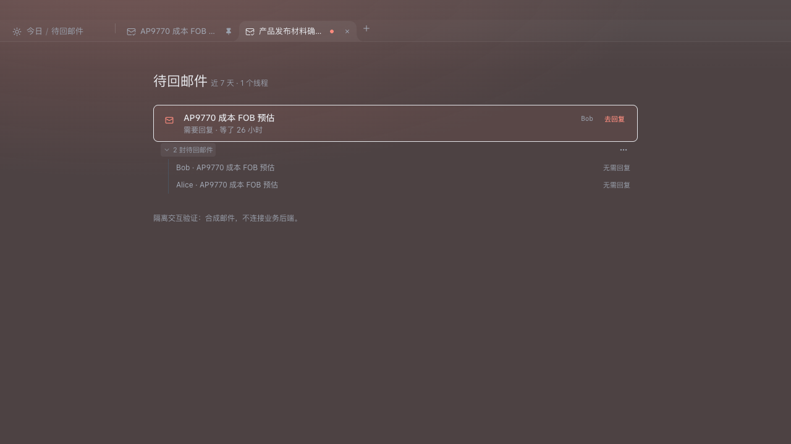
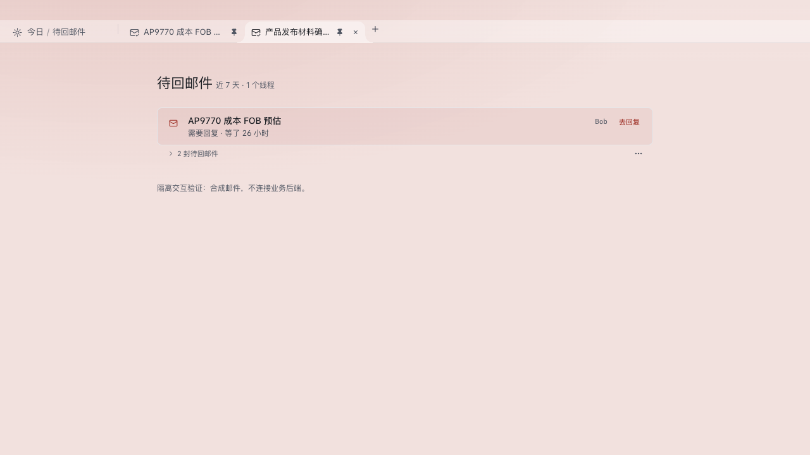

# Feedback implementation and verification

## Delivered

- Email browsing reuses an eligible tab by default. Double-click, the list context menu and Tab Pin retain the same target. The always-new preference is optional and defaults off; existing stored tabs migrate as retained.
- Retention can be cancelled while editing. Dirty/composer protection remains; after send clears the snapshot and closes composer, that tab becomes reusable. Solid Pin and the unsaved dot share one compact status slot.
- Today pending replies aggregate by real thread before limiting, remain collapsed initially, and support per-message or snapshot-group “no reply needed” with undo. Later incoming messages remain visible. Undo is operation-owned and cannot erase a later decision.
- Independent clock and day query keys handle midnight, resume and focus; foreground refresh backs up events. Read failures surface instead of silently becoming empty data.
- Search echoes effective filters; omitted/null booleans do not imply false. Missing body/index coverage is separate from search hits, with unknown scope for complex expressions and a bounded audit budget. Already fetched old mail is stored locally before Notion date filtering. Bulk recovery can explicitly include unmirrored messages; targeted ID recovery remains available.

## Verification

- Frontend full suite: 714 files, 9,000 passed, 1 skipped, 5 failures on first valid-ABI pass. Four failures were old contract assertions (retention eviction and additive search fields), updated to the approved behavior. The remaining composer wait timed out under full-suite load. All affected files were rerun together: **6 files / 79 tests passed**, including the unchanged composer scenario and new send/cleanup protection test.
- Python affected suite: 578 cases, initially one new test using attribute access for an existing dictionary result. Corrected the assertion; the affected file passed **3/3**. The other **577 passed**, covering repository/search, Today, HTTP actions, watcher, backfill, agent evaluation and undefined-name gates.
- Frontend node/web type checking passed; test type ratchet passed with no new errors (204 existing baseline entries).
- Repository lint completed with **0 errors / 457 warnings**. Existing ref warnings in TabStrip were reproduced against HEAD; this work does not attempt to clear the repository-wide warning backlog.
- Mutation check: removing the locked-tab replacement guard makes the new unpin-during-edit regression fail; restoring it makes the test pass.
- Browser interaction check used actual TabStrip and TodayReplyThreadRow with synthetic mail and isolated API stubs. Verified unpin, unsaved dot, collapsed/expanded thread rows, and light/dark rendering. No real email was sent or dismissed.

## Limits and rollout

This is a local code implementation, not a release or production data backfill. DB v74 changes are additive and the Electron expected version matches. No Notion records were modified. The original reporter's historical mail was absent from this developer database, so its recovery is not claimed as revalidated here; see the separate assessment for evidence and confidence levels. The pre-existing untracked `frontend/tests/shared/__probe.test.ts` was excluded from the suite and left untouched.
