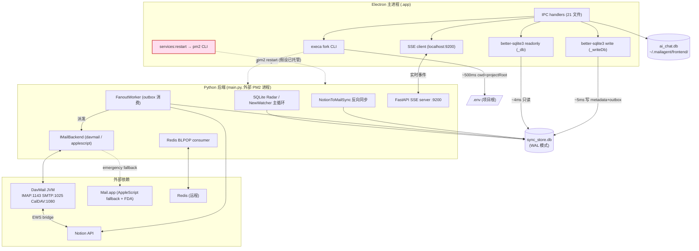
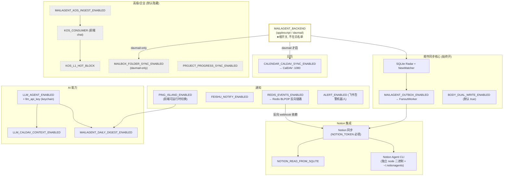
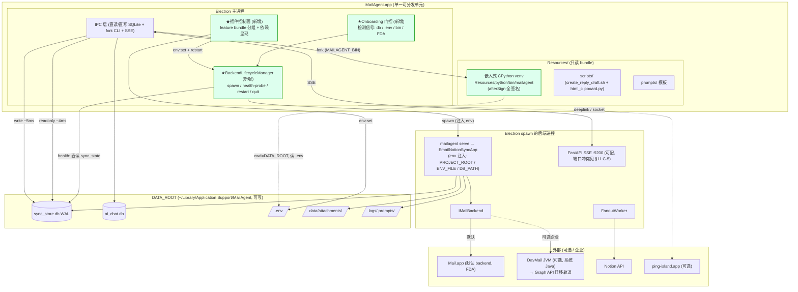

# MailAgent 一体化打包：架构分析与方案

> 文档类型：架构分析 + 打包方案（决策级）
> 作者：架构组（基于 7 路并行代码调查）
> 日期：2026-05-29
> 范围：把当前「Electron 前端 + Python 后端 + DavMail JVM + PM2 三件套」收敛为一个可分发的 macOS `.app`，并把后端各功能做成可独立开关的插件控制面。
> 状态：待评审 → 转 PRD / 落地计划

---

## 0. 阅读指南

本文是**决策文档**，不是实现手册。它回答三个问题：

1. 一体化打包**能不能做**、推荐**哪条路**、**代价多大**（§1 执行摘要）。
2. 当前架构**长什么样**、耦合在哪、哪些是打包的硬骨头（§2 现状、§3 命题拆解）。
3. **怎么做**——打包方案对比与推荐（§4）、插件控制面设计（§5）、约束与风险（§6）、目标架构（§7）。

落地步骤、Sprint 拆分、PRD 验收项不在本文，由后续 `02-packaging-plan.md` / PRD 承接。

---

## 1. 执行摘要（结论先行）

### 1.1 能不能做

**技术上可行，但当前不是一个「打包问题」，而是一个「先补齐缺失的运行时编排层，再打包」的问题。** 现状下前后端是两个独立部署单元，靠三处硬编码路径（`~/Documents/MailAgent`）和外部 PM2 粘合，Electron 对 Python 长驻服务 **完全没有生命周期管理能力**。这一层（进程托管 + 路径解耦 + onboarding 门控）是真正的工作量主体，打包工具链（electron-builder）反而已基本就位。

### 1.2 推荐哪条路

| 维度 | 推荐 |
|---|---|
| **Python 运行时** | **嵌入式 CPython venv via `extraResources`**（非 PyInstaller，非要求用户自装）。理由见 §4.4。 |
| **进程托管** | 新增 `BackendLifecycleManager`，Electron 在 `app.whenReady` 后 `spawn` 后端、`before-quit` 时优雅终止，**彻底移除对 PM2 的运行时依赖**。 |
| **DavMail / JVM** | **不捆绑 JRE，不默认捆绑 DavMail**。davmail 作为「企业 M365 用户」的可选 backend，依赖系统 Java + 引导式配置；**首发以 AppleScript backend 为零依赖默认路径**（合规与体积双赢）。 |
| **路径** | 全量 `userData` 化（`~/Library/Application Support/MailAgent/`），通过 `MAILAGENT_PROJECT_ROOT` / `MAILAGENT_ENV_FILE` / `SYNC_STORE_DB_PATH` 三个环境变量注入，**Python 端 `config.py` 改为绝对路径解析**（当前相对 CWD，是最高优先级改造点）。 |
| **签名/公证** | 短期沿用 ad-hoc + `afterSign` 递归签名所有 `.so/.dylib`；**中期必须申请 Apple Developer Program（$99/y）做公证**，否则 Gatekeeper「已损坏」会让 onboarding 成功率崩盘。这是产品化的决定性前置条件，不是 polish。 |
| **插件控制面** | 复用已就位的 `env:get/set` IPC + `MANAGED_ENV_KEYS` 白名单 + `services:restart`，做**按场景分组（feature bundle）**的开关面板，而非裸暴露 42 个 key。 |

### 1.3 代价多大

- **体积**：纯 Electron 约 200MB → 嵌入式 venv（去 dev deps + 可选拆 pandas/numpy）后 **arm64 单 arch 约 380–430MB**；若把 pandas/numpy 拆成可选插件可压到约 300MB。捆绑 JRE 会到 700–850MB（不推荐）。
- **工程量分布**（相对量级，非工时承诺）：
  - 进程托管 + onboarding 门控：**最大**（当前为零）。
  - 路径解耦（Python `config.py` 绝对化 + 三个 env 注入）：中，改动集中。
  - 嵌入式 venv 打包 + `afterSign` 批量签名：中，CI 易踩漏签坑。
  - 插件控制面 UI：中，基础设施（IPC/白名单）已就位。
  - DavMail 生产化（合规 + OAuth UX + JVM 托管）：**单独的大项目**，建议从首发剥离。
- **最大单点风险**：DavMail PoC 用伪装 client_id **不可分发**，且 EWS 2026-10-01 关停。**结论：首发不要把 davmail 当默认路径，更不要把它当成「一体化打包能解决的事」。**

### 1.4 一句话

> 先做「AppleScript backend + 嵌入式 CPython + Electron 托管后端 + userData 化 + 分组插件面板」的**自包含本地版**，把 davmail/Graph 生产化和公证作为两条独立的、有明确 gating 的后续轨道。不要试图在一个 Sprint 里同时解决打包、合规、公证三件事。

---

## 2. 现状架构：前端↔后端耦合面全景

### 2.1 四条耦合通道

Electron 主进程与 Python 后端之间存在**四条**通道，机制、延迟、用途各异：

| # | 通道 | 机制 | 延迟 | 用途 | 关键文件 |
|---|---|---|---|---|---|
| 1 | **直读 SQLite** | `better-sqlite3` readonly 连接 | ~4ms | 所有读路径（邮件列表/正文/搜索/线程/日历/folder/admin sync_state） | `db.ts:45-58` `_db` |
| 2 | **fork CLI** | `execa` fork `venv/bin/mailagent`，JSON stdin/stdout | ~200–500ms（Python 冷启） | 复杂写操作（resync/llm:run/archive/draft/deadletter） | `cli_runner.ts:41-79` |
| 3 | **直写 SQLite** | `better-sqlite3` readonly=false 连接（Sprint 16） | ~5ms | flag / read 单行写（写 `email_metadata` + `email_outbox`） | `db.ts:91-106` `_writeDb`，`write_ops.ts:244-370` |
| 4 | **SSE bridge** | HTTP SSE 连 `localhost:9200`（mail-sync 内 FastAPI） | 实时 | 运行时事件推送（断线指数退避重连） | `index.ts:315-318` `startEventsBridge` |

外加两个**间接控制**与**本地文件**通道：

- **PM2 控制**（`services.ts:81-160`）：`services:restart/status` 调系统 `pm2 jlist/restart`，**这是前端唯一能「重启后端」的手段，且假设后端已在 PM2 下运行**。
- **本地文件读写**：`.env`（`env.ts`，原子 rename）、`settings.json`（`settings.ts`，已正确落 `userData`）、`appearance.json`（已 `userData`）、`~/.notionagents/notion_account.json`（Notion Agent）、独立的 `ai_chat.db`（`~/.mailagent/frontend/`）。

### 2.2 致命空白：main.py 无人托管

`main.py` 运行 `EmailNotionSyncApp`，职责包括 SQLite Radar 轮询、DavMail/AppleScript backend 切换、FanoutWorker（outbox 消费 → 派发到 Mail.app + Notion）、反向同步、Redis BLPOP 消费、CalendarSyncWorker、飞书告警。

**Electron 不 `spawn` / `kill` / `health-watch` main.py。** 它只能通过 `services:restart` 间接调 `pm2 restart mail-sync`，且前提是用户已经手工 `pm2 start` 过。新用户装完 `.app` 点开 → IPC 全报错 → 收件箱空白 → 没有任何引导。

这是打包改造的**最大空白点**，也是「一体化」一词的核心含义所在。

### 2.3 进程 + 数据流全景图



> 红框（`PM2C`）即为「无人托管」缺口：这条线在打包后必须被 `BackendLifecycleManager` 取代。

### 2.4 硬编码路径清单（打包后全部失效）

| 路径 | 位置 | 默认值 | 覆盖手段 |
|---|---|---|---|
| db 兜底 | `db.ts:58` | `~/Documents/MailAgent/data/sync_store.db` | `SYNC_STORE_DB_PATH` / settings.json `dbPath` |
| CLI bin | `cli_runner.ts:45` | `~/Documents/MailAgent/venv/bin/mailagent` | `MAILAGENT_BIN` |
| project root | `cli_runner.ts:54` | `~/Documents/MailAgent` | `MAILAGENT_PROJECT_ROOT` |
| .env 兜底 | `env-path.ts` | `getProjectRoot()/.env` | `MAILAGENT_ENV_FILE` |
| chat db | `chat_db.ts:170` | `~/.mailagent/frontend/ai_chat.db` | `AI_CHAT_DB_PATH` |
| Python 数据路径 | `config.py:25/36/60/211/217` | 相对 CWD：`data/...` `logs/...` `prompts/...` | **无绝对化机制（最高优先级改造点）** |

**关键观察**：前端的三级回退链都有 env 覆盖入口，改造量集中、可控；真正的硬伤在 **Python 端 `config.py` 的所有路径是相对 CWD 的**，且 `env_file=".env"` 也是相对 CWD。打包后 CWD 不是项目根 → `Config()` 在必填字段（`NOTION_TOKEN` 等）阶段直接 `ValidationError` → Python 进程根本起不来。

---

## 3. 「一体化打包」核心命题拆解

「一体化」= 用户下载一个 `.app`，双击即用，无需 git clone / pip install / pm2 setup / 手工编辑 `.env`。拆成 5 个正交子命题：

### 3.1 Python 运行时打包

**问题**：281MB venv（pandas 73M + numpy 36M + lxml 20M + Pillow 13M + 多个 Rust/C 扩展）如何随 `.app` 分发，并让 Electron 能 fork 到一个可执行的 Python。

**约束**：
- native 扩展（`lxml`、`pydantic_core`、`qh3`、`python-calamine`、`PyObjC`）是 arch-specific 的 `.so`，arm64/x86_64 不通用。
- `hardenedRuntime: true` 下所有 `.so/.dylib` 必须用同一 code signing identity 签名，否则被 macOS `SIGKILL(9)`。`disable-library-validation` 已在 entitlements 中（前提满足）。
- mailagent 大量动态 import（backend 工厂、events handlers 懒加载、notify 条件导入），PyInstaller 需手工维护 hiddenimports。

→ 方案对比见 §4。

### 3.2 DavMail JVM 分发

**问题**：davmail.jar（856K）+ lib（6.0M）需要 JRE。系统已装 Temurin 26（约 300–400MB）。捆绑 JRE 会让 `.app` 膨胀到 700–850MB。

**约束（CLAUDE.md 死硬约束）**：
- 当前用 Outlook for Windows well-known client_id（`d3590ed6-...`）伪装，**不可分发**（违反 MS 服务条款 + 公司 IT 政策）。
- EWS 2026-10-01 关停，DavMail 6.7 仍走 EWS，Graph 迁移（Issue #404）未 merge。
- OAuth 走 O365Manual 手动粘贴 code（DevTools 抓 code），普通用户**完全不可行**。
- cipher key 即 IMAP/SMTP AUTH password，同时是 token.dat 的对称加密 key；改 key → 必须删 token.dat 重走 OAuth。

→ **结论**：DavMail 不应进入首发的「一体化」核心路径。详见 §6.1。

### 3.3 进程托管（Electron 监督 main.py）

**问题**：用 `BackendLifecycleManager` 取代 PM2，负责 spawn → 健康探测 → IPC 就绪门控 → 优雅终止。

**设计要点**：
- `app.whenReady` 后、`createWindow()` 前 spawn 后端（注入三个 env）。
- **⚠ spawn 契约（最高优先级，详见 §11 评审修订 C-1）**：`mailagent` CLI（`src.cli.main:app`，Typer，10 个 group）**没有 `serve` 子命令**，长驻服务是仓库根 `main.py`（`asyncio.run(main())` 实例化 `EmailNotionSyncApp`）。两者是不同 entrypoint，且 `main.py` 不在 `src/` 包内 → 打包 venv 的 `site-packages` 不含它。**采纳方案 A**：把 `EmailNotionSyncApp` 从 `main.py` 迁入 `src/`（如 `src/service.py`），给 CLI 新增 `mailagent serve` 子命令包装它，spawn 走统一的 `MAILAGENT_BIN serve`——这样服务代码随 `pip install .` 进入 `site-packages`、自然入包，无需单独 bundle `main.py`+`src/`。`main.py` 保留为薄壳（`from src.service import EmailNotionSyncApp`）供 dev/PM2 继续用。备选方案 B：spawn `<venv>/bin/python3 <Resources>/app/main.py` 并显式把 `main.py`+`src/` 加入 `extraResources`。
- **健康探测改为直读 SQLite `sync_state`**（当前 `admin:health` 走 CLI fork ~500ms，5s 轮询不划算）。
- **DB 就绪信号**：等后端完成 schema migration（DB_VERSION bump）后再开主窗口。当前此信号不存在，需新增。就绪判据须取「`db_version==EXPECTED` **且** 关键表（`email_metadata`/`email_body`/`email_outbox`）均 exists」（复用 `admin.py:193` 的 health 逻辑但直读、不走 CLI fork），并处理大库迁移期 `CREATE INDEX` 锁表导致轮询遇 `SQLITE_BUSY` 的退避；更稳的做法是 `serve` 启动后向 stdout 打印 `READY` 哨兵行做握手（详见 §11 评审修订 C-8）。
- `before-quit` 时 SIGTERM + waitpid（沿用 `registerCliLifecycle` 模式 `cli_runner.ts:289-295`）。
- `.env` 变更后**不再 pm2 restart，而是 kill + re-spawn 内嵌进程**。

### 3.4 路径解耦（userData 化）

**问题**：定义统一 `DATA_ROOT`，所有可写数据归集，bundle 内只读资源（Python/scripts/prompts 模板）与可写数据分离。

**推荐布局**：

```
~/Library/Application Support/MailAgent/   ← DATA_ROOT (可写)
├── .env                                    ← MAILAGENT_ENV_FILE 指向
├── data/
│   ├── sync_store.db (+ -wal/-shm)         ← SYNC_STORE_DB_PATH
│   └── attachments/{internal_id}/          ← 必须与 db 保持 DATA_ROOT/data/ 同级
├── logs/sync.log
├── prompts/email_inbox.md / email_sent.md  ← 首启从 bundle 复制（存在则保留用户版）
├── ai_chat.db                              ← 从 ~/.mailagent/frontend/ 迁入
└── davmail/ (可选) token.dat / davmail.properties

MailAgent.app/Contents/Resources/          ← 只读 bundle
├── python/                                 ← 嵌入式 CPython venv (extraResources)
│   └── bin/mailagent                       ← 既是 CLI，也是 `mailagent serve` 服务入口（方案 A）
│       └── (site-packages 内含 src/ 整树 + EmailNotionSyncApp，pip install . 装入)
├── scripts/                                ← create_reply_draft.sh + html_clipboard.py
└── prompts/                                ← 模板源（复制到 DATA_ROOT）
```

> **bundle 清单关键点**：服务代码必须真正进包。方案 A 下 `EmailNotionSyncApp` 迁入 `src/` → `pip install .`（非 editable）把 `src/` 整树装进 `site-packages` → 随 `python/` 入包，无需单独列 `main.py`。若走方案 B（spawn `python3 main.py`），则 `extraResources` 必须**额外显式纳入** `main.py` + 整个 `src/` 源码树（venv 的 site-packages 默认不含仓库根的 `main.py`）。`create_reply_draft.sh` 内的 python 解释器路径须改为读环境变量（`MAILAGENT_PYTHON`），由前端注入嵌入式 venv 的 python，且其 PyObjC `.so` 同样要过 afterSign 递归签名（详见 §11 评审修订 C-7）。

**硬约束**：
- `attachment.ts` 用 `dirname(dirname(resolveDbPath()))` 倒推 DATA_ROOT，因此 `db` 与 `attachments` 必须保持 `DATA_ROOT/data/` 同级，**不可拆分**。只要整体迁移并保持层级，前端推算逻辑零改动。
- CLI fork 的 `cwd` 必须等于 `.env` 所在目录（pydantic import-time 读取），否则所有写命令在 `Config()` 阶段 `exit=1`。
- `load_dotenv()`（main.py:16，无参数 → 读 CWD/.env）必须能找到 `.env`，否则 env-only flag（`MAILAGENT_FRONTEND_DEEPLINK_ENABLED`、island socket 等）静默失效。→ 改为显式传路径。

### 3.5 签名 / 公证 / 自动更新

**现状（已就位）**：
- electron-builder ad-hoc 签名（`identity: null`）、`hardenedRuntime: true`、`notarize: false`、dmg + zip（arm64/x64）、GitHub Releases 自动更新（zip blockmap 增量）。
- entitlements 已含 `allow-jit` / `allow-unsigned-executable-memory` / `disable-library-validation` / `allow-dyld-environment-variables` / `apple-events` —— 对捆绑 Python/JVM 子进程是**必要前提，且已满足**。
- `mailagent://` deeplink 协议、`asarUnpack: resources/**`、better-sqlite3 双 ABI rebuild（`rebuild:electron` + `codesign --sign -`）流程齐备。
- `extendInfo` 已含 `NSDocumentsFolderUsageDescription` / `NSDownloadsFolderUsageDescription` / `NSAppleEventsUsageDescription`，`minimumSystemVersion: 12.0`。

**缺口**：
- **`afterSign` hook 递归签名所有 Python `.so/.dylib`**（lxml、pydantic_core、qh3、python-calamine 等）。任一漏签 → hardened runtime crash，CI 难全覆盖。
- **公证缺失是 onboarding 成功率的决定性因素**。ad-hoc + notarize:false 在非开发机（普通用户机）上首次运行会遭 Gatekeeper「已损坏，无法打开」彻底阻断（macOS 14+ 默认配置）。修复唯一路径：Apple Developer Program（$99/y）+ notarytool。当前注释明确推迟到 V1.5 —— **建议提前，否则一体化打包对外发布无意义**。

---

## 4. 打包方案对比与推荐

### 4.1 三方案概览

| | A. PyInstaller 冻结 | B. 嵌入式 CPython venv (extraResources) ★推荐 | C. 引导用户自装 |
|---|---|---|---|
| 形态 | 单/多文件冻结可执行 | 完整 venv 目录随 bundle | 维持现状，UI 引导 git clone + pip |
| `.app` 体积（arm64） | ~380–430MB | ~380–430MB（拆 pandas 可 ~300MB） | ~200MB（不含后端） |
| 首启延迟 | 冷启 3–5s + 解压 1–2s | 冷启 3–5s（无解压惩罚） | 取决于用户环境 |
| CLI fork 单次延迟 | ~700ms–1s+（冻结更慢） | ~200–500ms（原生 venv） | ~200–500ms |
| 签名复杂度 | 低（扩展已 embedded） | **高**（afterSign 递归签所有 .so） | 无（用户自签/不签） |
| 动态 import | **高风险**（hiddenimports 手维护，新插件易 ModuleNotFoundError） | 无问题（完整 site-packages） | 无问题 |
| 跨 arch | `--target-arch` 对 Rust 扩展支持不完整 | 按 arch 分包（afterSign 仅 embed 当前 arch） | N/A（用户机本地 pip） |
| 自动更新 | 全量 zip 下载 | 全量 zip 下载 | 后端 git pull，前端 zip |
| 维护成本 | **高**（每加插件改 spec） | 中（CI 流程化 rebuild + sign） | **低**（打包意义有限） |
| 「装完即用」 | 是 | 是 | **否**（需命令行） |
| 典型失败模式 | hiddenimports 漏 → 运行时 crash；冻结解压慢 | 漏签 .so → SIGKILL；体积大 | 用户卡在 pip/pm2，onboarding 失败率高 |

### 4.2 为什么不选 PyInstaller（A）

- mailagent 的动态 import 面太广（`src/mail/backend` 工厂、`src/events/handlers` 懒加载、`src/notify/island*` 条件导入）。PyInstaller spec 的 hiddenimports 是一份**永远在过时**的手工清单，每加一个插件就可能埋一个运行时 `ModuleNotFoundError`，且只在生产包暴露。
- Rust 扩展（pydantic_core / qh3 / python-calamine）跨 arch 冻结在 M 芯片上支持不完整。
- CLI fork 是热路径（每次写操作一次），冻结可执行的冷启 + 解压惩罚叠加后单次可能 >1s，体验劣化明显。

### 4.3 为什么不选「引导自装」（C）

- 新用户 Step 1–2（git clone + pip install）是**纯 shell 操作，无法从 Electron app 内部自动完成**。onboarding UI 只能「引导」而无法「执行」。
- 若不把运行时打进 bundle，「一体化打包」这个命题本身不成立 —— 它退化成「给现状写个安装文档」。
- 仅在「纯内部工具、用户全是开发者」场景下 C 才划算（此时其实不需要打包）。

### 4.4 推荐：嵌入式 CPython venv（B）

**理由**：

1. **热路径性能最好**：原生 venv 的 CLI fork 冷启 ~200–500ms，无冻结解压惩罚。Sprint 16 的直写 SQLite 已经把 flag/read 这类高频写绕过了 CLI，剩下的 CLI 写操作（resync/llm/archive）本就低频，500ms 可接受。
2. **零动态 import 风险**：完整 `site-packages` 在场，不存在 hiddenimports 维护负担，加插件不需要改打包配置。
3. **签名可流程化**：虽然 `afterSign` 递归签名是新增复杂度，但它是**一次性把流程写对**的事，可在 CI 用 `find ... -name '*.so' -o -name '*.dylib' | xargs codesign --sign -` 批量覆盖，并加一个「漏签检测」校验步（`codesign --verify --deep`）。
4. **与现有 env override 机制天然契合**：`MAILAGENT_BIN` 指向 `Resources/python/bin/mailagent`、`MAILAGENT_PROJECT_ROOT` / `MAILAGENT_ENV_FILE` 指向 `DATA_ROOT`，cli_runner.ts 与 db.ts 的三级回退链**无需改逻辑，只需在打包模式注入 env**。

**配套优化（强烈建议）**：把 **pandas / numpy 拆成可选插件**（仅 xlsx→CSV 转换 + 附件文本化用到）。拆出后 core 路径从 281M → 约 150M，`.app` 可压到约 300MB，且大多数用户用不到 Office 附件转换。这把「体积失控」从首要风险降级。

**残留代价**：
- arm64 / x64 必须分包（Rust `.so` 不通用），`afterSign` 按当前 arch embed。universal 包翻倍，不做。
- `afterSign` 漏签是最易踩的 CI 坑，必须有自动化 verify gate。

---

## 5. 插件拆分控制面设计

### 5.1 现状基础设施（已就位，无需新建）

| 能力 | 现状 |
|---|---|
| 读当前态 | `env:get` IPC（`handlers/env.ts`）+ `MANAGED_ENV_KEYS` 白名单（42 key，含全部插件总开关） |
| 写 .env | `env:set` IPC + `env-parser.ts` 行级写（不破坏注释，原子 rename），非白名单 key 抛 `E_INVALID_KEY` |
| 重启生效 | `services:restart('mail-sync')` IPC（打包后改为 kill + re-spawn 内嵌进程） |
| 秘钥存储 | keytar（`ink.chenge.mailagent` service，4 槽：cli/llm/llm-translate/custom-api） |
| 运行时切换（例外） | `island:setEnabled` IPC —— 灵动岛是**唯一无需重启**的插件 |

**结论**：统一控制面的技术底座齐备。缺的是 (1) UI 呈现层（依赖/可用性/降级提示）、(2) feature bundle 分组映射、(3) 几个未进白名单的 key 的处理策略。

### 5.2 后端插件开关全景（30+ bool field，全在 `config.py` Pydantic）

所有后端开关 import-time 一次性读入，**改 `.env` 后必须重启 main.py 生效**（pydantic 不热重载）。灵动岛是唯一例外。

### 5.3 插件依赖拓扑图



### 5.4 开关矩阵

| 插件 | env key | 默认 | 依赖 | 可前端切换 | 重启生效 | 额外凭证/前置 | 降级行为 |
|---|---|---|---|---|---|---|---|
| **邮件同步核心** | （始终开） | — | MAILAGENT_BACKEND | 否 | — | NOTION_TOKEN 等 5 必填 | — |
| Outbox/Fanout | `MAILAGENT_OUTBOX_ENABLED` | false* | core | env:set | 是 | — | 退回 AppleScript 直调 |
| Notion 同步 | （NOTION_TOKEN 在场即开） | — | core | env:set | 是 | NOTION_TOKEN (keychain) | noop |
| Notion 读 SSoT | `NOTION_READ_FROM_SQLITE` | false | Notion 同步 + SSoT 已填满 | env:set | 是 | backfill body 完成 | 走 Notion 镜像 |
| **Notion Agent CLI** | `MAILAGENT_AGENT_HARNESS` | true | notion-agent 二进制 + `~/.notionagents/notion_account.json` | env:set（但 chat/config 直读 process.env，**需重启 Electron**） | Electron 重启 | `notion-agent init` token_v2（无法 .env 自动化） | chat 退回其他 backend |
| **LLM AI** | `LLM_AGENT_ENABLED` | false | core + llm_api_key | env:set | 是 | keychain `llm-api-key`（双步） | runner=None，hook 直接 return |
| LLM 日历上下文 | `LLM_CALDAV_CONTEXT_ENABLED` | false | LLM + DavMail :1080 | env:set | 是 | davmail | 不注入日历上下文 |
| 每日巡检 | `MAILAGENT_DAILY_DIGEST_ENABLED` | false | island + LLM（双开关） | env:set | 是 | — | 无 digest |
| **灵动岛** | `PING_ISLAND_ENABLED` | true | ping-island.app daemon（fail-open） | **island:setEnabled（运行时）** | 否* | 装 ping-island.app | socket 不存在静默跳过 |
| **日历** | `CALENDAR_CALDAV_SYNC_ENABLED` | false | davmail CalDAV :1080 + caldav 包 | env:set | 是 | davmail | Worker 不启动 |
| **飞书通知** | `FEISHU_NOTIFY_ENABLED` | false | 飞书机器人凭证 | env:set | 是 | feishu webhook | notify noop |
| 飞书告警 | `ALERT_ENABLED` | false | 独立 alert webhook | env:set | 是 | — | 不告警 |
| 反向 webhook | `REDIS_EVENTS_ENABLED` | false | Redis + Notion 同步 | env:set | 是 | redis_url | consumer 不启动 |
| folder 同步 | `MAILBOX_FOLDER_SYNC_ENABLED` | false | **davmail-only** | env:set | 是 | davmail | Worker 不启动 |
| 项目周报 | `PROJECT_PROGRESS_SYNC_ENABLED` | false | — | env:set | 是 | xlsx 源 | hook noop |
| **KOS（企业，默认隐藏）** | `MAILAGENT_KOS_INGEST_ENABLED` 等 3 | false | KOS OAuth 三凭据 | **不在白名单，手动改 .env** | 是 | `KOS_MCP_BASE`/`_CLIENT_ID`/`_CLIENT_SECRET` | producer fire-and-forget noop |

\* `*` 标注的项在生产已偏离代码默认（见 CLAUDE.md「关键开关现状」）。

**所有可选插件的降级路径均为 fail-open**：main.py 主循环 step 8–11 的每个 hook 用 try/except 包裹，失败仅 `logger.warning`，不抛出不阻断。关掉任一插件不会崩溃或丢数据 —— 对打包/分组开关极友好。

### 5.5 控制面 UI 设计原则

1. **按 feature bundle 分组，不裸暴露 42 个 key**。建议分组：
   - `邮件同步核心`（不可关，仅显示状态）
   - `Notion 集成`（Notion 同步 → Notion Agent → 读 SSoT，呈现父子依赖）
   - `AI 智能`（LLM 分类 + 每日巡检 + 翻译）
   - `灵动岛通知`
   - `日历`
   - `飞书`
   - `企业/高级`（KOS、folder、项目周报，默认折叠）

2. **呈现依赖与可用性**：
   - 父开关关时，子开关置灰 + tooltip 说明依赖（如「需先启用 Notion 同步」）。
   - 凭证缺失时显示橙色「未配置」pill（如 LLM 开了但 keychain 无 key → 静默失败，必须可视化）。
   - 外部依赖未就绪时显示安装引导（ping-island.app 未装 / davmail JVM 未起 / Java 未装）。

3. **写后重启的协调**：
   - 后端开关 `env:set` 后返回 `restartRequired=true` → RestartBanner → 触发 `BackendLifecycleManager.restart()`（kill + re-spawn，**不再 pm2**）。
   - 灵动岛单独走 `island:setEnabled`（无 banner）。
   - Notion Agent harness 因 chat/config 直读 `process.env`，改后需重启 **Electron**（与 mail-sync 重启独立），UI 须明确区分这两类重启。

4. **未进白名单的 key 决策**：
   - `MAILAGENT_BACKEND`：建议**暂不**进 Settings UI 热切换（切换需先 probe davmail 在线 + 重置 `last_max_row_id`，风险高）。onboarding 一次性选定。
   - KOS 三 OAuth 凭据：企业功能，保持手动 `.env`，UI 标注「高级，需联系管理员」。
   - `DAVMAIL_POC_CIPHER_KEY`：敏感凭证，建议迁入 keychain（新增槽），不进 `.env` 明文。

---

## 6. 死硬约束与风险

### 6.1 DavMail 合规（最高优先级，决定首发形态）

- **well-known client_id 伪装不可分发**：违反 Microsoft 服务条款 + 公司 IT 政策。Azure AD sign-in log 记录 App=Microsoft Office，使用方归属不实。
- **OAuth O365Manual UX 不可行**：现代浏览器对 `urn:ietf:wg:oauth:2.0:oob` redirect 卡死，需 DevTools 抓 code；macOS Terminal `POSIX_MAX_CANON=1024` 截断长 URL paste → `invalid_grant`。
- **EWS 2026-10-01 关停**：DavMail 6.7 仍走 EWS，Graph 迁移（Issue #404）未 merge。**该日期后整条 davmail 链路归零。**
- **refresh token 90 天有效**：到期需重走手动 OAuth，无监控告警。

→ **决策**：首发**不把 davmail 当默认/核心路径**。两条出路（任选其一作为后续轨道）：
  1. 走公司 IT 审批申请独立 Graph API 应用注册（推荐正道，周期数周–数月）→ 解除合规约束 + localhost redirect 可配 → 解决 OAuth UX。
  2. 接 Microsoft Graph SDK 直连，绕开 DavMail/JVM（中长期方向，EWS 关停后唯一可持续路径）。
  首发默认 **AppleScript backend**（零外部依赖、零合规问题），davmail 作为「企业用户高级选项」，引导式配置，不捆绑 JRE。

### 6.2 FDA（Full Disk Access）权限

- SQLite 数据库（无论在 `~/Documents/MailAgent/data/` 还是迁移后的 `userData`）+ AppleScript 读 Mail.app SQLite **都需要用户手动授予 FDA**。
- **无法在 entitlements 中自动获取**，必须在 onboarding 显式引导（系统设置 → 隐私与安全 → 完全磁盘访问权限），并检测授权状态。

### 6.3 native 模块 ABI

- better-sqlite3 Node ABI ≠ Electron ABI，`rebuild:electron` 必须在每次 Electron 升级时重跑。
- 打包流程 `build:mac = rebuild:electron → vite build → electron-builder` **顺序不可打乱**。
- Python Rust/C 扩展 arch-specific，arm64/x64 分包。

### 6.4 ad-hoc 签名 + 公证缺失

- 所有 bundled 二进制（python3.11、libpython、所有 `.so/.dylib`、（若含）java）必须用同一 identity 签名，漏签 → `SIGKILL(9)`。
- **notarize:false → 普通用户机 Gatekeeper「已损坏」彻底阻断**。这是 onboarding 成功率的决定性因素，必须靠 Apple Developer Program 解决。

### 6.5 SQLite WAL 并发

- 前端直写（`writeFlagDirect`：`email_metadata` + `email_outbox`）与后端 FanoutWorker **并发写同一 WAL DB**，`busy_timeout=500ms` 是唯一保护。打包后两者**必须共享同一 WAL 文件，不可分离**。

### 6.6 迁移单向 + backfill 顺序

- v3→v17 内置自动迁移（启动一次即升完，幂等），但**单向不可降级**，回滚 = 代码 + DB 备份一起还原。
- v2 用户（2026-05-14 前）需先跑外部 `migrate_sync_store_v3.py`，否则 `_init_database()` 仅打 WARNING 静默退出。
- backfill 顺序强制：**先 body/metadata 填满 SSoT，再开 `NOTION_READ_FROM_SQLITE` / 前端 / KOS**，否则空值覆写 Notion 的 To/CC。
- backfill body 走 AppleScript，即使主后端是 davmail 也需 Mail.app 在位。
- 迁移前**必须备份** `sync_store.db`（唯一后悔药）。

### 6.7 风险登记（按严重度）

| 严重度 | 风险 | 缓解 |
|---|---|---|
| 致命 | davmail 合规 + EWS 2026-10 关停 | 首发默认 AppleScript；davmail 走 IT 审批/Graph 独立轨道 |
| 致命 | 公证缺失 → Gatekeeper 阻断 | 申请 Apple Developer Program（$99/y） |
| 高 | main.py 无人托管 | BackendLifecycleManager（本方案核心交付） |
| 高 | Python `config.py` 相对 CWD → 打包后 `Config()` 崩 | 绝对化 env_file + 所有数据路径前缀 DATA_ROOT |
| 高 | `afterSign` 漏签 .so → SIGKILL，CI 难覆盖 | 批量签 + `codesign --verify --deep` gate |
| 中 | 体积 380–430MB / 捆 JRE 700MB+ | 不捆 JRE；拆 pandas/numpy 为可选插件 |
| 中 | 老用户数据迁移（db + attachments + ai_chat.db + token.dat） | onboarding 迁移向导，保持 DATA_ROOT/data/ 层级 |
| 中 | env-only flag 静默失效（cwd 不对） | `load_dotenv()` 显式传 DATA_ROOT/.env |
| 中 | backend probe 失败 exit(1) + autorestart=false | BackendLifecycleManager 友好错误界面 + 重试 |
| 低 | LLM 双跑（本地 LLM + Notion Custom Agent 竞争写） | onboarding 引导先关 Notion Custom Agent |

---

## 7. 分层目标架构（打包后）



**与现状的关键差异（绿框为新增）**：

1. **BackendLifecycleManager** 取代外部 PM2 —— Electron 直接 spawn/监督/重启后端。
2. **Onboarding 门控** 在 `app.whenReady` → `createWindow()` 之间，组合 `existsSync(resolveDbPath())` + `.env` + `bin` + FDA 检测，区分新用户/老用户/半装用户三类画像并分流。
3. **插件控制面** 把 30+ 开关收敛为分组 UI，复用 env:set IPC + 重启编排。
4. **嵌入式 CPython** 进 `Resources/`，`MAILAGENT_BIN` 指向它，所有 `.so` 经 afterSign 签名。
5. **DATA_ROOT 全量 userData 化**，bundle 只读 / 数据可写彻底分离。
6. **AppleScript 为默认 backend**（零依赖），DavMail/Graph 为可选企业轨道。

---

## 8. 落地优先级建议（供 PRD/计划承接）

> 仅给优先级与依赖序，不含工时/Sprint 切分（由计划文档定）。

1. **P0 路径解耦**（无此寸步难行）：Python `config.py` 绝对化 + 三个 env 注入 + `load_dotenv` 显式路径 + DATA_ROOT 布局定义。
2. **P0 进程托管**：BackendLifecycleManager（spawn / 直读 sync_state 健康探测 / DB 就绪门控 / kill+respawn 重启 / quit 优雅终止）。
3. **P0 onboarding 门控**：三类用户画像检测 + 新用户向导（5 必填字段 env:set）+ FDA 引导 + 老用户静默继承 + 半装用户「一键启动后端 + 轮询 DB」。
4. **P1 嵌入式 CPython 打包**：venv embed via extraResources + afterSign 递归签名 + verify gate + arm64/x64 分包 +（建议）拆 pandas/numpy 为可选。
5. **P1 插件控制面 UI**：feature bundle 分组 + 依赖/可用性呈现 + 降级提示 + 重启编排（区分 mail-sync 重启 vs Electron 重启）。
6. **P1 公证**：申请 Apple Developer Program + notarytool 接入（onboarding 对外发布的硬前提）。
7. **P2 独立轨道（不阻塞首发）**：DavMail 生产化（IT 审批 / Graph API 迁移 / OAuth localhost redirect / JVM 托管 / cipher key 入 keychain）。

---

## 附录 A：关键文件索引

| 主题 | 文件 |
|---|---|
| 前端 db 路径解析 | `frontend/src/electron/main/db.ts:45-58, 91-106` |
| CLI fork + 生命周期 | `frontend/src/electron/main/cli_runner.ts:41-79, 128-130, 289-295` |
| 直写 SQLite | `frontend/src/electron/main/handlers/write_ops.ts:244-370` |
| SSE bridge | `frontend/src/electron/main/index.ts:315-318` |
| PM2 控制（待替换） | `frontend/src/electron/main/handlers/services.ts:81-160` |
| .env 路径 | `frontend/src/electron/main/lib/env-path.ts`，`handlers/env.ts` |
| env 白名单 | `frontend/src/electron/main/lib/env-keys.ts:21-116` |
| chat db | `frontend/src/electron/main/chat_db.ts:170` |
| onboarding 插入点 | `frontend/src/electron/main/index.ts:223-388`（whenReady → createWindow 368） |
| Python 配置（绝对化目标） | `src/config.py:7-11, 25, 36, 60, 211, 217` |
| main.py 服务 + load_dotenv | `main.py:16, 1-200` |
| DB 版本 + 迁移 | `src/mail/sync_store.py:223, 280-302, 407-1094` |
| backend 抽象 | `src/mail/backend/base.py`，`factory.py`，`davmail_backend.py`，`imap_client.py` |
| draft shell 脚本 | `frontend/src/electron/main/handlers/draft.ts:236` → `scripts/create_reply_draft.sh` |
| 打包配置 | `frontend/electron-builder.yml`，`frontend/build/entitlements.mac.plist` |

## 附录 B：实测核对（2026-05-29）

- `data/sync_store.db` db_version = **17**（与代码常量 `DB_VERSION=17` 一致）。
- `venv` 体积 = **281M**。
- 系统 Java = **Temurin 26.0.1**（`/usr/bin/java`）。
- `davmail-poc/jar/`：`davmail.jar` 856K + `lib/` 6.0M。
- electron-builder：ad-hoc（`identity: null`）、`hardenedRuntime: true`、`notarize: false`、dmg+zip（arm64/x64）、GitHub publish、`mailagent://` 协议、`asarUnpack: resources/**`。
- entitlements：含 `allow-jit` / `allow-unsigned-executable-memory` / `disable-library-validation` / `allow-dyld-environment-variables` / `apple-events` / `files.user-selected` / `files.downloads`（捆绑子进程前提已满足）。

---

## §11 评审修订与补强（2026-05-29 批判复审后并入）

> 本节是对前 10 节的勘误与补强，由独立评审 agent 对照代码核查后产出。前文已就地修正 spawn 契约（§3.3）、bundle 清单（§3.4）、目标图节点（§7）、SSE 端口标注（§7）。其余缺口列下，按严重度排序。落地计划（`02`）与 PRD（`03`）的对应任务已同步补齐。

| 编号 | 严重度 | 缺口 | 修订 / 结论 |
|---|---|---|---|
| **C-1** | 致命 | `mailagent serve` 不存在：CLI 是 Typer app（无 serve），长驻服务是仓库根 `main.py`，且 `main.py` 不在 `src/` 包内 → venv site-packages 不含它，三份文档曾把两个 entrypoint 混为一谈。 | **已就地修正（§3.3/§3.4/§7）**。决策：方案 A——`EmailNotionSyncApp` 迁入 `src/service.py`，新增 `mailagent serve` 包装，spawn 走 `MAILAGENT_BIN serve`；`main.py` 退化为薄壳。`02` 新增 P1-4a 任务，`03` Step4/§9 已对齐。 |
| **C-2** | 高 | 老用户「就地继承」+ 内嵌新代码 → 首次启动对旧库**不可逆 in-place 迁移**；若用户旧 PM2/`python3 main.py` 仍在跑 → **两个后端并发写同一 WAL DB**（busy_timeout 只防瞬时锁，不防双 writer 语义冲突 + outbox 双消费），旧代码遇新 schema 可能崩。 | 就地继承前必须：①检测并提示停止旧后端（扫 `pm2 jlist` / 9200 端口占用），确认单一 writer；②就地继承**同样强制备份**（不再豁免——新代码必然触发迁移即必然改旧库）；③文案明确「升级后旧版后端无法再用此库」。详见 §5 数据/迁移 + `02` §6.4 / `03` §4.1。 |
| **C-3** | 高 | AppleScript 路径需**两类独立权限**：FDA（读 Mail.app SQLite）+ Automation/Apple Events（`draft.ts`→`create_reply_draft.sh`→System Events 控 Mail.app）。原文仅把 FDA 做成检查项。更关键：**ad-hoc 签名（无稳定 Team ID）下 TCC 授权绑定签名指纹**，自动更新换包若指纹变化 → FDA/Automation 授权可能被系统重置，用户需重新授权——对「装完即用 + 自动更新」是隐性硬伤。 | §6.2 权限检查矩阵补「自动化(控制 Mail.app)」独立项 + 深链（系统设置→隐私→自动化）。§6.4 增补：ad-hoc 自动更新致 TCC 失效，是「必须尽早公证（稳定 Developer ID）」的又一论据（不止 Gatekeeper 一条）。 |
| **C-4** | 高 | davmail jar/lib **被 gitignore**（`davmail.jar` 856K + lib 6M 不在 repo）→ 即便后续轨道要打包 davmail，CI 也无法从仓库构建出资源。 | davmail 独立轨道（§见 `02` §6.3）前置：需先解决 CI 可复现获取（vendored release artifact / 下载脚本 + 校验 hash），否则该轨道连构建都起不来。 |
| **C-5** | 中 | SSE `localhost:9200` 端口硬编码（`config.py SSE_LOCAL_PORT=9200` 默认，前端 `events_bridge.ts` 默认 `127.0.0.1:9200`），无动态端口分配机制。打包后多实例 / 9200 被占 → SSE 静默连不上、实时事件失效。原 §7 图曾画「动态端口」属 aspirational。 | **已就地改为「:9200(可配)」**。补任务（`02` P1/P2）：`BackendLifecycleManager` spawn 时分配空闲端口 → 注入 `SSE_LOCAL_PORT` → 同步设前端 `MAILAGENT_SSE_URL`；至少进风险登记册作已知限制。 |
| **C-6** | 中 | pandas 实际在 **3 处** import（`attachment_text.py:277` 懒 / `office_converter.py:147` 懒 / `project_progress/xlsx_parser.py`），原文漏了第三处（项目周报插件）。numpy 无直接 import，是 pandas 传递依赖，「单摘 numpy」措辞不准。 | 措辞改为「拆 pandas（numpy 随之移除）」。`project_progress` 插件同样依赖 pandas，拆为可选后须保证其缺 pandas 时 fail-open 或一并归入可选包（`02` P1-9 验收补）。核心决策不变。 |
| **C-7** | 中 | `draft.ts:236` 无条件调 `create_reply_draft.sh`（不区分 backend）→ `html_clipboard.py`(PyObjC NSPasteboard) → System Events。打包后这条链是 venv 签名链 + 权限链的额外受力点，非单纯「路径问题」。 | **已并入 §3.4 bundle 说明**：脚本内 python 路径改读 `MAILAGENT_PYTHON` 由前端注入；PyObjC `.so` 纳入 afterSign verify gate；Automation 权限纳入 Step1 检查。 |
| **C-8** | 中 | DB 就绪门控信号原文当「已决」，实为开放项。轮询 `db_version==17` 有竞态：建表中途 `sync_state` 表已存在但 `db_version` 未写最终值（`_init_database` 最后一步才 `INSERT OR REPLACE`）；大库迁移期 `CREATE INDEX` 锁表 → 轮询读被 busy_timeout 拒。 | **已并入 §3.3**：就绪判据 = `db_version==EXPECTED` 且关键表均 exists；定义遇 `SQLITE_BUSY` 退避；更稳为 `serve` 打印 `READY` 哨兵行握手。 |
| **C-9** | 中 | 老用户 v2 检测：前端 `detect.ts` 仅读 `db_version` 标量无法区分「真 v2 老库」与「全新空库」（`sync_store.py:282` 当 `sync_state` 表不存在时 fallback=1；真 v2 判定是「`db_version<3` 且 `email_metadata` 存在且无 `internal_id` 列」，属后端内部逻辑）。 | detect 需补表结构探测（`PRAGMA table_info(email_metadata)` 看有无 `internal_id`），或把 v2 判定下放给后端探测。`03` §2.3 判定表已补灰色态行。 |
| **C-10** | 低 | `DAVMAIL_POC_CIPHER_KEY` 迁 keychain 非净收益：该 key 即 IMAP/SMTP AUTH password，须被 mail-sync + CLI + 测试多个 **Python** client 一致读取（不一致触发 BadPaddingException）。keytar 是 Node 库，Python 进程读不到 macOS keychain，需另接 `keyring` 库且 service/account 命名对齐。 | 二选一并写清（`02` P5-6）：① Python 侧用 `keyring` 读同一 service/account + onboarding 写入时前后端约定一致命名；② 更简单——保持 `.env` 明文但 `DATA_ROOT/.env` 权限设 `0600` + 文档标注。 |
| **C-11** | 低 | 工时口径误导：`02` 总计「37–55 人天」不含 davmail 轨道与 **Apple 账号审批等待**，而审批是「对外可用」的关键路径阻塞项（数天–数周），易被误读为 37–55 天后即可对外发布。 | `02` §1.1/§5.1 显著标注：MVP（M1–M4）=内部 ad-hoc；对外可用 = MVP + M5（公证），M5 含 Apple 审批等待为关键路径阻塞。P6-1 申请账号升级为与 P0 并行的**零号任务**。 |

**评审认定最扎实的部分**（保留信心）：事实转译忠实度高且经代码核对属实（DB_VERSION=17、必填字段、keytar service=`ink.chenge.mailagent` 四槽、WAL+busy_timeout=500ms 单 writer、entitlements 8 项、electron-builder 配置、pandas 函数级懒加载）；两条致命风险（davmail 合规+EWS 关停、公证缺失）剥离决策务实有据；核心判断准确——「这不是打包问题，而是先补缺失的运行时编排层（进程托管+路径解耦+onboarding 门控）再打包」，抓住了 `main.py` 无人托管与 `config.py` 相对 CWD 两个真实痛点。
