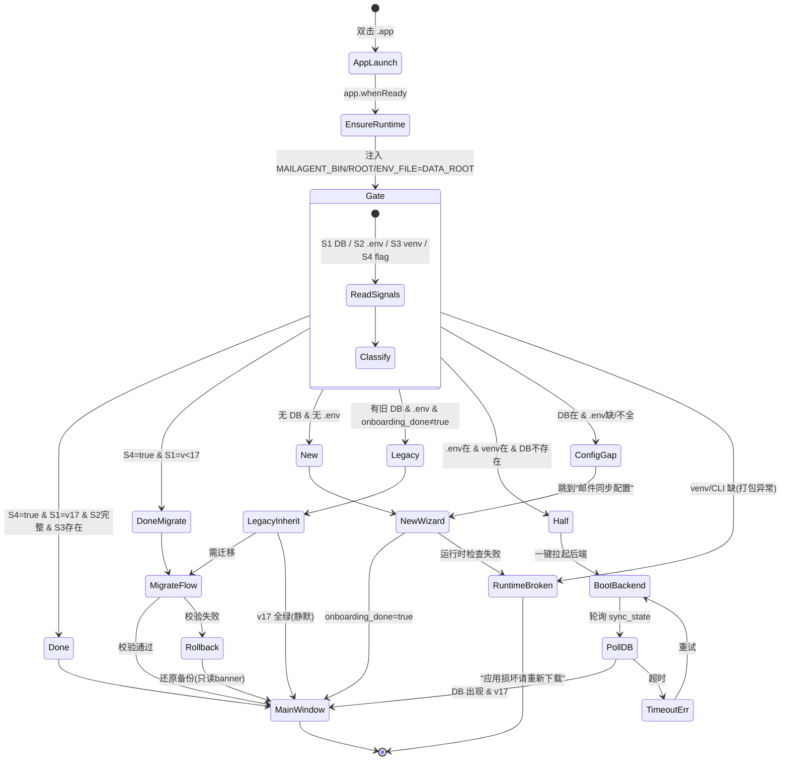
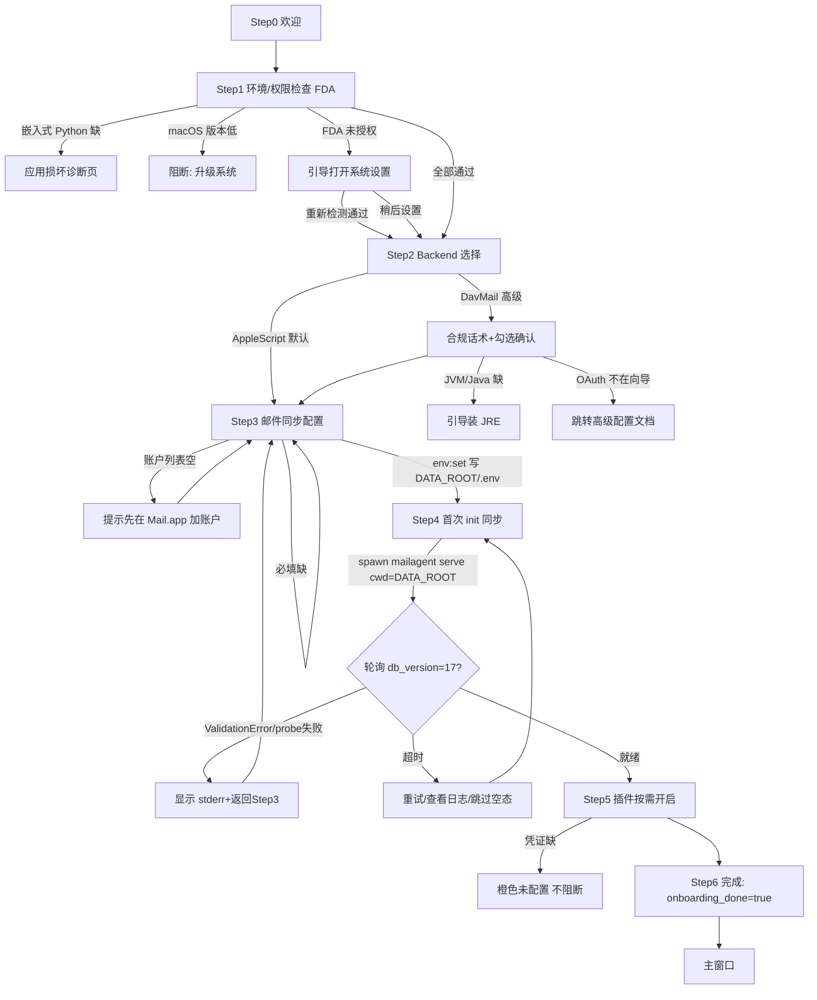
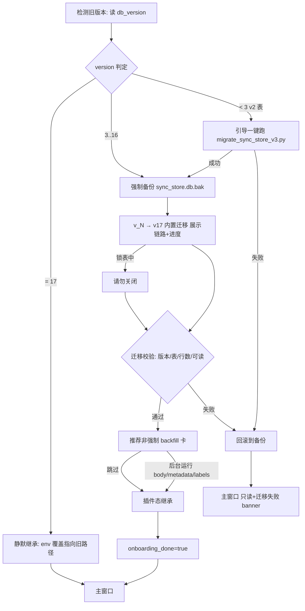

# MailAgent 一体化打包 · Onboarding 流程 PRD

> 文档版本：v1.0 · 2026-05-29
> 上游依赖：[`01-architecture-analysis.md`](./01-architecture-analysis.md)（架构分析与方案）
> 适用范围：Electron `.app` 一体化打包后的「首次启动 → 配置 → 可用」全链路体验
> 角色：产品经理 PRD（可直接交付给前端 + 后端 + 打包工程师拆任务）

---

## 0. 阅读指南

本 PRD 描述的是「打包后的 `.app` 第一次被双击之后发生什么」。它**不**重复 `01` 的打包技术决策（CPython venv via extraResources、BackendLifecycleManager、userData 化、签名公证），而是把那些决策**转成用户可感知的引导流程**。

三句话定调：

1. **装完即用**：新用户双击 `.app`，不碰终端、不写 `.env` 文件、不装 Python / pip / pm2，走完向导即可看到收件箱。
2. **老用户无缝继承**：装过旧后端（`~/Documents/MailAgent` + 旧 DB + `.env`）的用户，首次打开 `.app` 应**静默继承**已有数据与配置，最多补一次 Keychain 凭证，绝不重新初始化、绝不丢历史邮件。
3. **插件按需启用**：30+ 个后端开关收敛为按场景分组的 feature bundle，向导默认只开「邮件同步核心」，其余引导用户在使用中按需开启，缺凭证 / 缺依赖时给明确提示而非静默失败。

> 关键术语：
> - **DATA_ROOT** = `~/Library/Application Support/MailAgent`（打包后统一数据目录，含 `.env` / `data/sync_store.db` / `data/attachments/` / `logs/` / `prompts/` / `ai_chat.db`）。
> - **三信号** = onboarding 门控的同步原子检查：`sync_store.db` 存在性 + `DB_VERSION`、`.env` 完整性、嵌入式 venv/CLI 存在性。
> - **门控点** = Electron `app.whenReady()` 回调中、`createWindow()`（`index.ts:368`）调用之前。

---

## 1. 背景与目标

### 1.1 背景

当前 MailAgent 前端**完全没有 onboarding 门控逻辑**：`app.whenReady()` 直接 `createWindow()` + 注册全部 IPC handler，没有任何首启检查。一旦打包成 `.app`：

- `db.ts:getDb()` 找不到 `sync_store.db` 时 `throw new Error('sync_store.db not found...')`，不导向引导；
- `cli_runner.ts:getMailagentBin()` 找不到 CLI 时 `throw new CliError('E_NO_BIN')`，不导向引导；
- 这两个错误以未捕获异常 / IPC error 冒泡到 renderer，新用户点开即收件箱空白、全部操作报错。

现有安装流程（`INSTALL.md`）是 9 步纯手工 CLI 序列（克隆 → venv → pip → 编辑 `.env` → LaunchControl → 启动后端 → 下载 dmg → 拖入 Applications → 设置 Secrets），普通用户无法自助完成。

同时，已经存在**充分的检测信号**散落在代码里但未被聚合成判定逻辑：`.env` 存在性（`env-path.ts:resolveEnvPath()`）、`sync_store.db` 存在性与 `db_version`（`sync_state` 表，实测 = `17`，代码常量 `DB_VERSION=17`）、venv/CLI 存在性（`cli_runner.ts:projectVenvBin()`）、`settings.json`（`userData/settings.json`）、Keychain 4 个凭证槽（service = `ink.chenge.mailagent`）。

### 1.2 目标（可验证）

| # | 目标 | 验证口径 |
|---|---|---|
| G1 | 装完即用 | 全新 macOS 机器，下载 `.app` → 双击 → 走完向导 → 主窗口显示收件箱，**全程零终端命令**，耗时 < 15 分钟（不含首次 init 同步） |
| G2 | 老用户无缝继承 | 已有 `~/Documents/MailAgent` + DB(v17) + 完整 `.env` 的机器，首次开 `.app` **不触发任何向导步骤**，直接进主窗口，历史邮件 0 丢失 |
| G3 | 老用户跨版本迁移可视化 | DB_VERSION < 17 的用户，向导展示「从 vN → v17」迁移链路 + 进度，迁移后校验通过，**不可降级丢数据** |
| G4 | 插件按需启用 | 每个插件有明确「前置条件 / 依赖 / 输入 / 启用后验证」四段式子流程，缺凭证显橙色「未配置」pill，缺外部依赖显安装引导，**关掉任一插件不崩不丢数据** |
| G5 | 失败可恢复 | 迁移失败可回滚到备份；鉴权失败可重试；权限被拒有明确引导；DB 损坏有诊断与重建路径 |

### 1.3 非目标（首发明确不做）

- **DavMail 默认捆绑**：首发默认 AppleScript backend（零依赖、零合规）。DavMail 作为「企业可选项」独立轨道，依赖系统 Java + 引导式配置，**不捆绑 JRE、不当默认路径**（理由见 `01` §6 与本 PRD §10.3 合规话术）。
- **DavMail OAuth 自动化**：O365Manual 手动抓 code 对普通用户不可行；首发不在向导内做 DavMail OAuth，企业用户走单独的高级配置入口 + 文档。
- **公司多租户分发**：well-known client_id 伪装不可分发；面向外部用户的版本必须先解决 Apple 公证（$99/y）与（若启用 davmail）IT 审批 / Graph API。

---

## 2. 用户分类与检测矩阵

### 2.1 四类用户画像

| 类别 | 画像 | 典型来源 |
|---|---|---|
| **新用户（NEW）** | 无 DATA_ROOT、无旧 `~/Documents/MailAgent`、无任何 DB/.env | 全新下载 `.app` 的外部用户 |
| **老用户（LEGACY）** | 有 `~/Documents/MailAgent` + 旧 `data/sync_store.db` + 旧 `.env`，曾用 CLI/PM2 跑过后端 | 现有内部 dogfood 用户、开发者 |
| **半装用户（HALF）** | venv/CLI 存在、`.env` 存在，但 `sync_store.db` 不存在（后端从未成功跑过 init） | beta 用户、配了一半中断的用户 |
| **已完成用户（DONE）** | `settings.json.onboarding_done == true`，三信号全绿 | 已走完向导、回访的常态用户 |

### 2.2 检测信号定义

| 信号 | 取值方式 | 检查成本 | 代码锚点 |
|---|---|---|---|
| **S1 DB 存在 + 版本** | `existsSync(resolveDbPath())`；若存在再读 `sync_state` 表 `key='db_version'`（与 `DB_VERSION=17` 比对） | 同步，毫秒级 | `db.ts:resolveDbPath()`；`sync_store.py:223` |
| **S1' DB 版本灰色态（C-9）** | 仅读 `db_version` 标量**不足以**区分「真 v2 老库」与「全新空库」：`sync_state` 表不存在时后端 fallback=1，真 v2 判定是「`db_version<3` 且 `email_metadata` 存在且**无 `internal_id` 列**」。前端 detect 须补 `PRAGMA table_info(email_metadata)` 看有无 `internal_id`，或把 v2 判定下放后端探测 | 同步，毫秒级 | `sync_store.py:282`（fallback=1） |
| **S2 .env 完整性** | `existsSync(resolveEnvPath())`；若存在则解析必填项是否非空 | 同步，毫秒级 | `env-path.ts:resolveEnvPath()`；`env.ts` env:get |
| **S3 venv/CLI 存在** | 打包模式下 = `existsSync(<resourcesPath>/python/bin/mailagent)`；非打包回退 `projectVenvBin()` | 同步，毫秒级 | `cli_runner.ts:projectVenvBin()`（需改造为从 `process.resourcesPath` 推导） |
| **S4 onboarding 标记** | `settings.json.onboarding_done`（新增字段，默认 false） | 同步读 JSON | `settings.ts:DEFAULTS`（需新增字段） |
| **S5 Keychain 凭证** | `keytar.getPassword('ink.chenge.mailagent', <slot>)`（4 槽：cli/llm/llm-translate/custom-api） | **异步** | `keychain.ts:14-19` |

> **必填项口径（S2）**：后端 `config.py` 中 `Field(...)` 强制必填的是 `NOTION_TOKEN` / `EMAIL_DATABASE_ID` / `USER_EMAIL`。`MAIL_ACCOUNT_NAME`（默认 `Exchange`）与 `CALENDAR_DATABASE_ID`（默认 `""`）有默认值不强制。向导仍应引导用户填 `MAIL_ACCOUNT_NAME`（AppleScript 路径必须正确指向真实账户名），`CALENDAR_DATABASE_ID` 仅在开启日历插件时必填。

> S5 是**辅助信号**，不作为主分类依据（异步、且 Keychain 可能有残留旧条目）。主分类只用 S1+S2+S3+S4 四个同步信号，避免门控异步竞态。

### 2.3 信号 → 分类 → 流程入口 判定表

判定顺序：先看 S4 快速短路，再按 S1/S2/S3 组合落类。

| 优先级 | S4 onboarding_done | S1 DB | S2 .env | S3 venv/CLI | → 分类 | → 流程入口 |
|---|---|---|---|---|---|---|
| P0 | `true` | 存在 v17 | 完整 | 存在 | **DONE** | 直接 `createWindow()`（主窗口） |
| P0' | `true` | 存在 v<17 | 完整 | 存在 | **DONE 但需迁移** | 进主窗口 + 顶部 RestartBanner「数据库需升级」→ 触发迁移子流程（§4.4） |
| P1 | 任意 | 不存在 | 不存在 | 不存在 | **NEW** | 完整新用户向导（§3） |
| P2 | `false`/缺 | 存在 v≤17 | 完整 | 存在 | **LEGACY** | 老用户继承向导（§4），静默/最小打扰 |
| P3 | `false`/缺 | **不存在** | 完整 | 存在 | **HALF** | 半装恢复流程（§3 末「半装捷径」）：一键拉起后端 + 轮询等 DB |
| P4 | `false`/缺 | 存在 | **缺/不完整** | 存在 | **配置不全** | 跳到向导「邮件同步配置」步骤（§3 Step 4），补必填项 |
| P4' | `false`/缺 | **文件存在但无 `sync_state`/`db_version` 键** | 任意 | 存在 | **DB 灰色态（C-9）** | 不靠前端标量判定，spawn 一次后端做版本探测（`_init_database` 输出判定），再按结果落 LEGACY/v2 提示，避免把真 v2 老库误判为空库 |
| P5 | `false`/缺 | 不存在 | 完整 | **不存在** | **运行时缺失（异常）** | 打包版本理论不应出现（venv 内嵌）；展示「应用文件损坏，请重新下载」诊断页（§7.4） |

> **嵌入式 venv 前提下 S3 恒为真**：`01` 决策采用「嵌入式 CPython venv via extraResources」，正常打包包内 venv 必然存在。S3=false 在打包版只可能是 `.app` 文件被破坏（漏签 SIGKILL、不完整下载），所以归为「运行时缺失（异常）」诊断页，而非引导用户去 `pip install`。**这是与 `01` 决策的强一致点：onboarding 不再含 git clone / pip install 步骤。**

### 2.4 门控点（Electron 启动序列插入位置）

门控插入在 `index.ts` 的 `app.whenReady().then()` 回调中、`createWindow()`（`index.ts:368`）**调用之前**。此时所有 IPC handler（含 `env:get/set`、`settings:*`、`services:*`）已注册完毕，向导窗口可直接复用它们。

```
app.whenReady()
  ├─ setAppUserModelId / dock icon / app menu / bootNativeTheme
  ├─ registerAppearanceIpc / registerCliLifecycle
  ├─ 注册全部 IPC handler            ← 现状（保留）
  ├─ ★ ensurePythonRuntime()         ← 新增：定位嵌入式 venv + 注入 MAILAGENT_BIN / MAILAGENT_PROJECT_ROOT / MAILAGENT_ENV_FILE = DATA_ROOT/*
  ├─ ★ const verdict = await gateOnboarding()   ← 新增：组合 S1~S4（S5 异步并行预取）
  ├─ if verdict == DONE     → createWindow()               （现状路径）
  ├─ if verdict == LEGACY   → runLegacyInherit() → createWindow()
  ├─ else                   → createOnboardingWindow(verdict)   ← 独立轻量 BrowserWindow（参考 createPopoutWindow 模式）
  └─ setDeeplinkSink()
```

向导完成后写 `settings.json.onboarding_done = true`，再 `createWindow()` 主窗口并关闭向导窗口。

> **硬约束**：门控必须在任何 email/admin IPC handler 被 renderer 调用前完成 DB 与 CLI 就绪验证；否则 `getDb()` / `E_NO_BIN` 异常无法被 onboarding UI 接管。

---

## 3. 新用户流程（NEW）

> 设计原则：**每一步都能失败、每一步都能后退、每一步都给「为什么需要」**。向导是独立 BrowserWindow（~720×560），左侧步骤进度条，右侧内容区。

### 流程总览

```
Step 0 欢迎  →  Step 1 环境/权限检查(FDA)  →  Step 2 Backend 选择 + (可选)DavMail 鉴权
   →  Step 3 邮件同步配置  →  Step 4 首次 init 同步(进度)  →  Step 5 插件按需开启  →  Step 6 完成
```

### Step 0 · 欢迎

- **UI 文案要点**：「欢迎使用 MailAgent —— 把你的邮件实时同步到 Notion，并用 AI 帮你分类、起草回复。接下来约 5 分钟完成设置。」
- 副文案：「你的所有数据保存在本机 `~/Library/Application Support/MailAgent`，不上传到第三方服务器（除你配置的 Notion）。」
- 主按钮：「开始设置」；次按钮：「我已有旧版数据，从旧目录导入」→ 进 §4 老用户继承（手动入口，应对自动检测漏判）。
- **失败处理**：无（纯展示）。

### Step 1 · 环境与权限检查（FDA）

检查项（并行执行，逐项显示 ✓ / ✗ / ⏳）：

| 检查 | 通过条件 | 失败处理 |
|---|---|---|
| macOS 版本 | ≥ 12（Monterey） | 阻断 + 文案「需要 macOS 12 或更高版本」 |
| 嵌入式 Python 运行时 | `MAILAGENT_BIN` 指向的可执行文件存在且可 `--version` | 阻断 + 「应用文件可能损坏，请重新下载」（指向 §7.4） |
| DATA_ROOT 可写 | `DATA_ROOT` 目录可创建 / 可写 | 阻断 + 「无法写入数据目录，请检查磁盘权限」 |
| **完全磁盘访问（FDA）** | 检测能否读取 Mail.app 数据（AppleScript 探测 / 读取受保护路径试探） | **非阻断但强引导**（见下） |
| **自动化 / 控制 Mail.app（Automation，C-3）** | AppleScript 路径的回复/草稿（`draft.ts`→`create_reply_draft.sh`→System Events）需 Apple Events 权限，与 FDA 是**两类独立授权** | **非阻断但强引导**：深链 `x-apple.systempreferences:com.apple.preference.security?Privacy_Automation`；未授权则草稿/回复功能置灰 |

- **FDA 文案要点**：「MailAgent 需要『完全磁盘访问权限』才能读取 Mail.app 的邮件。请点击下方按钮打开系统设置 → 隐私与安全 → 完全磁盘访问 → 勾选 MailAgent，然后回到这里点『重新检测』。」
- 按钮：「打开系统设置」（深链 `x-apple.systempreferences:com.apple.preference.security?Privacy_AllFiles`）+「重新检测」+「稍后设置（部分功能受限）」。
- **失败处理**：FDA 无法经 entitlements 自动获取（硬约束），只能引导手动授予 + 轮询检测。允许「稍后设置」跳过，但在主窗口持续显示「FDA 未授权」横幅，邮件读取相关功能置灰。

> 检测信号：FDA 状态需运行时探测（尝试读取受保护资源），无系统 API 直接查询，采用「试读 → 捕获 EPERM」启发式。

> **⚠ ad-hoc 签名下的 TCC 授权失效风险（C-3）**：当前 ad-hoc 签名（`identity:null`，无稳定 Team ID）下，macOS TCC 把 FDA/Automation 授权**绑定到 code signing 指纹**。自动更新换包若签名指纹变化 → 已授予的 FDA/Automation 可能被系统重置，用户需**重新授权**——这对「装完即用 + 自动更新」是隐性硬伤。这是「必须尽早公证（稳定 Developer ID）」的又一论据（不止 Gatekeeper「已损坏」一条）。详见 `01` §6.4 / §11 C-3。

### Step 2 · Backend 选择（+ 可选 DavMail 鉴权）

- **默认推荐 AppleScript**（卡片高亮）：「推荐 · 零配置 · 适用 Mail.app 已配置好账户的用户」。选它直接进 Step 3。
- **DavMail（企业 / Outlook EWS）** 折叠在「高级」里，展开后显示**合规话术**（强制阅读，见 §10.3），需用户勾选「我已了解上述风险」才能继续。
- **UI 文案要点（AppleScript 卡）**：「使用你 Mail.app 里已登录的账户读写邮件。需要在上一步授予完全磁盘访问。」
- **DavMail 子流程（仅企业可选，首发可标记 Beta）**：
  - 输入 `USER_EMAIL` + 自定义 cipher key（提示「设定后不可更改，更改需重新授权」）。
  - 引导启动嵌入式/系统 Java + davmail.jar（检测 `java` 是否在 PATH，缺失给 Temurin/Zulu JRE 21 安装引导）。
  - OAuth：首发**不在向导内自动化**（O365Manual 手动抓 code 不可行），跳转到独立「DavMail 高级配置」文档 + 外部命令引导。
- **失败处理**：
  - 选 AppleScript 但 FDA 未授权 → 回退 Step 1。
  - DavMail JVM 未就绪 / probe 失败 → 显示「DavMail 服务未启动」+ 重试 + 「切换回 AppleScript」。

### Step 3 · 邮件同步配置

表单字段（全部通过 `env:set` IPC 写入 `DATA_ROOT/.env`，行级原子写不破坏注释）：

| 字段 | env key | 必填 | UI 文案要点 | 校验 |
|---|---|---|---|---|
| Mail.app 账户名 | `MAIL_ACCOUNT_NAME` | AppleScript 路径必填 | 「请选择要同步的 Mail.app 账户」+ **下拉框**（调 `mailagent debug mail-structure` 列出真实账户名） | 非空、在账户列表中 |
| 同步邮箱 | `SYNC_MAILBOXES` | 否（默认 `收件箱`） | 多选 chips：收件箱 / 发件箱 / … | 至少一项 |
| Notion Token | `NOTION_TOKEN` | **是** | 「在 Notion → Settings → Connections 创建 Integration，粘贴 secret」+ 「如何创建？」帮助链接 | 非空、`secret_`/`ntn_` 前缀启发式 |
| 邮件数据库 ID | `EMAIL_DATABASE_ID` | **是** | 「打开你的邮件数据库 → 复制 URL 里的 32 位 ID」 | 32 位 hex 启发式 |
| 日历数据库 ID | `CALENDAR_DATABASE_ID` | 仅开日历时 | 「如需同步会议到日历，填此项；可稍后在设置补」 | 选填，填则 32 位校验 |

- **Notion Token 安全存储**：Token 属敏感字段。写入策略——`.env` 写明文（后端 pydantic 读取），同时镜像到 Keychain（`settings:secrets:set`）。`env:get` 返回时 redact 为 `***`。
- **失败处理**：
  - 账户列表为空（`mailagent debug mail-structure` 返回空）→ 提示「未检测到 Mail.app 账户，请先在 Mail.app 添加账户」+ 重新检测。
  - 必填项空 → 内联红字，禁用「下一步」。
  - Notion Token / DB ID 格式可疑 → 黄字警告但不阻断（允许用户坚持）。

### Step 4 · 首次 init 同步（进度反馈）

- 通过 BackendLifecycleManager spawn **`mailagent serve`**（不是 `main.py`——`mailagent` CLI 当前无 serve 子命令，须先由计划 P1-4a 把 `EmailNotionSyncApp` 迁入 `src/service.py` 并加 `serve` 包装，见 `01` §11 C-1）；首次启动会建表 + migrate，DB 从无到 v17，并调 `mailagent init` 系列命令做首轮拉取。
- **DB 就绪门控**：向导轮询 `sync_state` 表出现 + `db_version=17`（**取代 admin:health CLI fork 500ms**，直读 SQLite），就绪后才放行进度展示。
- **UI 文案要点**：「正在初始化数据库并同步邮件…」+ 进度条（已同步 N / 预估 M 封）+ 当前阶段（建表 → 拉取缓存 → 写入 Notion）。
- 大邮箱（6-7 万封）提示：「邮箱较大，首次同步可能需要数分钟到数小时。你可以让它在后台继续，先去配置插件。」按钮：「转入后台并继续」。
- **失败处理**：
  - DB 建表失败 / Config() ValidationError（必填字段或 cwd≠.env 目录）→ 显示后端 stderr 摘要 + 「返回上一步检查配置」。这是 `01` 标注的最高风险点（相对 CWD），向导必须保证 spawn 时 `cwd = DATA_ROOT` 且 `MAILAGENT_ENV_FILE=DATA_ROOT/.env`。
  - 轮询超时（默认 5 分钟无 DB / 无版本号）→ 「初始化耗时异常，查看日志 / 重试 / 跳过（进主窗口空态）」。
  - backend probe 失败 exit(1)（autorestart=false）→ 「后端启动失败」+ 错误详情 + 重试。

### Step 5 · 插件按需开启

- 展示 feature bundle 卡片（§5 详）。默认仅「邮件同步核心」开启（不可关）。
- 文案：「以下是可选功能，你可以现在开启，也可以稍后在设置里随时调整。」
- 每张卡片：开关 + 一句话说明 + 依赖/前置提示 + （需凭证的）「配置」按钮。
- **失败处理**：开启需凭证的插件但凭证缺失 → 不阻断向导，标橙色「未配置」，引导到对应配置面板（可跳过）。

### Step 6 · 完成

- 文案：「设置完成！MailAgent 正在后台同步你的邮件。」
- 写 `settings.json.onboarding_done = true`，关闭向导，`createWindow()` 打开主窗口。
- 若 Step 4 转入后台，主窗口顶部显示同步进度条。

### 半装捷径（HALF，P3）

当检测为 HALF（venv+.env 在、DB 不在）：跳过 Step 0-3，直接进「一键拉起后端」页：

- 文案：「检测到你已配置好账户，但后端还没成功运行过。点击下方按钮启动同步。」
- 按钮：「启动同步」→ BackendLifecycleManager spawn → 轮询 DB 出现（同 Step 4 的就绪门控与超时策略）→ 进主窗口。

---

## 4. 老用户流程（LEGACY）

> 核心原则：**默认静默继承，最小打扰**。三信号全绿 + DB=v17 时根本不弹向导（P2 直接 `runLegacyInherit()` → `createWindow()`）。只有「需迁移」或「凭证缺失」时才介入。

### 4.1 检测旧版本

`runLegacyInherit()` 在门控点执行：

1. 通过 env 覆盖把后端指向旧目录：`MAILAGENT_PROJECT_ROOT=~/Documents/MailAgent`、`MAILAGENT_ENV_FILE=~/Documents/MailAgent/.env`、`SYNC_STORE_DB_PATH=~/Documents/MailAgent/data/sync_store.db`（或写 `settings.json.dbPath`）。
2. 读旧 DB `db_version`，与 `DB_VERSION=17` 比对，决定是否触发迁移子流程。

> **继承策略选择**（向用户透明）：默认**就地继承**（不搬数据，env 覆盖指向旧路径），迁移成本最低。可选「迁移到标准目录」（复制 DB + attachments + ai_chat.db + token.dat/cipher key 到 DATA_ROOT，保持 `DATA_ROOT/data/` 层级）。**attachments 与 db 必须同级不可拆**（`attachment.ts` 用 `dirname(dirname(dbPath))` 倒推 DATA_ROOT）。

> **🔴 就地继承防双 writer（C-2，高）**：就地继承让打包版内嵌的**新代码**接管旧库。两个隐患必须在继承前处理：
> 1. **不可逆 in-place 迁移**：内嵌新代码（`DB_VERSION` 可能 > 旧库）首次 `serve` 即对旧库自动升级，**单向不可降级**（MIGRATION.md：回滚需代码+DB 同版本一起回）。所以**就地继承也必然改旧库**，不能视为「无损」。
> 2. **双后端并发写同一 WAL DB**：若用户原有 PM2 / 独立 `python3 main.py`（旧代码）仍在跑，会与打包版 `BackendLifecycleManager` spawn 的新后端并发写同一库——`busy_timeout=500ms` 只防瞬时锁，**不防双 writer 语义冲突 + outbox 双消费**，且旧代码遇新 schema 可能崩。
>
> **继承前必做**：①检测旧后端是否在跑（扫 `pm2 jlist` / 探测 9200 端口占用），在跑则提示用户停止并确认单一 writer；②就地继承**同样强制备份**（见 §4.2，不再豁免）；③文案明确告知「升级后旧版后端 / PM2 将无法再使用此数据库」。

### 4.2 备份（强制前置）

- **触发条件（C-2 修订）**：需要 schema 迁移（v<17）、用户选「迁移到标准目录」、**或就地继承**——三者**任一**都强制先备份。理由：内嵌新代码首次启动必然触发 in-place 迁移即必然改旧库，就地继承不再豁免备份。
  - `cp data/sync_store.db data/sync_store.db.bak.<timestamp>`
- **UI 文案要点**：「升级前自动备份你的数据库到 `sync_store.db.bak.<时间>`，这是唯一的后悔药。」
- **不可跳过**（硬约束：迁移单向不可降级，回滚 = 代码 + DB 备份一起还原）。

### 4.3 继承 .env 与 DB 路径

- 不重写已有 `.env`，仅读取。缺失的必填项 / 缺失的 Keychain 凭证 → 在主窗口 Settings 显示橙色「未配置」pill，不阻断。
- `ai_chat.db`（旧在 `~/.mailagent/frontend/ai_chat.db`）与 davmail `token.dat` + `DAVMAIL_POC_CIPHER_KEY`（须配对迁移，改 key 即 token 失效）一并纳入继承范围（仅当用户选「迁移到标准目录」才物理复制）。

### 4.4 幂等数据库迁移（展示迁移链路与进度）

- **v3 → v17（内置自动迁移）**：启动一次 `main.py`，`_init_database()` 全量建表 + PRAGMA 检测补列，从当前版本一路升到 v17，幂等、重复启动无副作用。
- **UI 展示**：「正在升级数据库：v{N} → v17（共 {17-N} 步）」+ 进度条 + 当前步骤（如「v13 → 新增 imap_uid 列」）。大库（6-7 万封）`CREATE INDEX` 会锁表数秒，显示「升级中，请勿关闭」。
- **v2 → v3（破坏性，需外部脚本）**：`_init_database()` 检测到无 `internal_id` 的 v2 表只打 WARNING 并 return，**不自动迁移**。向导检测到 v2 时：
  - 文案：「检测到极早期版本数据（2026-05-14 之前），需要执行一次主键迁移。点击下方按钮自动完成。」
  - 由 BackendLifecycleManager 调用 `scripts/archive/migrate_sync_store_v3.py`（向导封装，**用户不手敲命令**），完成后再走 v3→v17 内置迁移。
  - 失败 → 回滚到 §4.2 备份（§7.1）。

### 4.5 迁移结果校验

迁移后自动校验：

| 校验 | 通过条件 |
|---|---|
| 版本号 | `sync_state.db_version == 17` |
| 关键表存在 | `email_metadata` / `email_body` / `email_outbox` / `calendar_event` / `folder_email` 全部存在 |
| 行数一致 | 迁移前后 `email_metadata` 行数不减少 |
| 可读性 | 前端 `getDb()` 只读连接成功打开 |

- 校验失败 → 「迁移校验未通过，已保留备份。建议回滚（§7.1）」。

### 4.6 推荐（非强制）跑 backfill 补齐

迁移成功后，展示**可选**的 backfill 建议卡（默认不勾选，明确说明「不跑也能正常用，只是部分历史数据字段为空」）：

| backfill | 补什么 | 耗时（~6300 封） | 可后台 | 命令（向导封装） |
|---|---|---|---|---|
| body | 邮件正文 + 附件 SSoT（v4） | ~1.5-2h（AppleScript ~1s/封） | 是（但与主服务争用 AppleScript，建议提示暂停主同步） | `mailagent backfill body --all`（支持 `--resume-from`/`--retry-dead`） |
| AI labels | `ai_priority`/`ai_action` 等（从 Notion 反拉） | ~15-25 min（3 qps） | 是 | `python3 -m src.llm_agent.notion_backfill` |
| metadata | `to_addr`/`cc_addr`/`sender_name` | Notion 路径 ~15-25 min | 是（与主服务并发安全） | `mailagent backfill metadata --source notion` |

- **顺序约束**（强制，向导按此排序）：先 body/metadata 填满 SSoT，**再**启用 `NOTION_READ_FROM_SQLITE=true` / 前端 / KOS ingest，否则会用空值覆写 Notion 的 To/CC。
- **磁盘预检**：backfill body 后 `email_body` + attachments 可能 GB 级，跑前检测可用磁盘空间，不足则警告。
- **UI 文案要点**：「这些是后台补全任务，不影响你现在使用。新邮件会正常同步，历史邮件的缺失字段会逐步补齐。」
- 全部可「稍后在设置 → 维护里运行」。

### 4.7 插件态继承

- 读旧 `.env` 中的插件开关状态，映射到 feature bundle UI（§5）。
- 开着但凭证缺失（如 `LLM_AGENT_ENABLED=true` 但 Keychain 无 key）→ 橙色「未配置」+ 引导补凭证。
- `MAILAGENT_BACKEND`（不在白名单，不可 UI 热切换）保持原值，仅展示只读 + 提示「如需更改请联系管理员 / 编辑配置文件」。

### 4.8 完成

- 写 `settings.json.onboarding_done = true` + 默认值，进主窗口。
- 若 backfill 后台运行，主窗口维护区显示进度。

---

## 5. 插件按需启用子流程

> 控制面把后端 30+ Pydantic bool 开关收敛为按场景分组的 feature bundle。读态走 `env:get`，写 `.env` 走 `env:set`+env-parser 行级写，重启生效走 `BackendLifecycleManager.restart()`（kill+respawn 取代 pm2）。
> **两类重启须 UI 区分**：① 改后端开关 → 重启 mail-sync 进程；② Notion Agent harness（chat/config 直读 `process.env`）→ 须重启 Electron。灵动岛 `island:setEnabled` 是唯一免重启的运行时切换。

### 5.1 通用四段式（每个插件）

每张插件卡统一呈现：**前置条件 → 依赖提示 → 所需输入 → 启用后验证**。状态色：绿（已启用且健康）/ 橙（已开但未配置/凭证缺失）/ 灰（父开关关、置灰 + tooltip）/ 蓝（可启用）。

### 5.2 各插件子流程

| 插件 | env 总开关 | 前置条件 | 依赖提示 | 所需输入 | 启用后验证 | 重启类型 |
|---|---|---|---|---|---|---|
| **Notion 同步** | （核心，由 `NOTION_TOKEN`+`EMAIL_DATABASE_ID` 驱动） | Notion Token + 邮件 DB ID 已填 | —— | Step 3 已收集 | 测试写一条到 Notion 成功 / 健康行 | mail-sync |
| **Notion Agent CLI** | `MAILAGENT_AGENT_HARNESS` | **需先开 Notion 同步** | 需独立 `notion-agent` 二进制 + `~/.notionagents/notion_account.json`（token_v2） | 引导执行 `notion-agent init` 授权（向导封装/深链） | `cliFound && token_v2 非空` → chat 可发一轮 | **Electron**（harness 读 process.env） |
| **灵动岛通知** | `PING_ISLAND_ENABLED` | 安装 `ping-island.app` | socket `/tmp/island.sock` 可连（fail-open） | 无 | `island:setEnabled` 后 probe = connected | **免重启**（island:setEnabled） |
| **LLM AI 智能** | `LLM_AGENT_ENABLED` | —— | **双前提**：开关 ON + Keychain 有 `llm-api-key`；开启前须关 Notion Custom Agent（防双跑） | API key（写 Keychain `ACCOUNT_LLM`）+ endpoint | runner 初始化成功 + 跑一封测试分类 | mail-sync |
| **每日巡检** | `MAILAGENT_DAILY_DIGEST_ENABLED` | **需先开灵动岛**（双开关 `ping_island_enabled && daily_digest_enabled`） | 依赖 ping-island.app | 无 | 触发一次 digest 成功 | mail-sync |
| **日历同步** | `CALENDAR_CALDAV_SYNC_ENABLED` | **仅 davmail backend**（applescript 模式置灰 + tooltip） | DavMail CalDAV 1080 端口就绪 + `CALENDAR_DATABASE_ID` | 日历 DB ID | CalendarSyncWorker 启动 + 拉一条事件 | mail-sync |
| **飞书通知** | `FEISHU_NOTIFY_ENABLED`（+ `REDIS_EVENTS_ENABLED` 反向） | —— | 反向回复按钮链路需 Redis（`REDIS_EVENTS_ENABLED`+`redis_url`） | 飞书 app 凭证 / webhook | 推一条测试通知 | mail-sync |
| **KOS 知识图谱** | `MAILAGENT_KOS_INGEST_ENABLED` 等三层 | **企业功能，默认折叠** | 需 3 个 OAuth 凭据（`KOS_MCP_BASE`/`KOS_OAUTH_CLIENT_ID`/`KOS_OAUTH_CLIENT_SECRET`，**不在白名单**，须手动 `.env`） | OAuth 三件套 | producer fire-and-forget 无报错 | mail-sync |
| **项目周报同步** | `PROJECT_PROGRESS_SYNC_ENABLED` | 企业功能 | xlsx 源 + Notion 目标 | 源路径 / 目标 DB | 跑一次 dry-run 成功 | mail-sync |

### 5.3 依赖拓扑与可用性呈现

- **根节点 = `MAILAGENT_BACKEND`**：决定 CalDAV/folder/uid_backfill 等下游可用性。applescript 模式下「日历同步」「folder 同步」自动置灰。
- **父子置灰**：父开关关 → 子开关置灰 + tooltip（如「需先开启 Notion 同步」「需先开启灵动岛」）。
- **凭证缺失**：开了但 Keychain/`.env` 缺凭证 → 橙色「未配置」pill（如 LLM 开了但无 key 会静默失败）。
- **外部依赖未就绪**：`ping-island.app` / davmail JVM / Java 未装 → 蓝色「安装引导」入口。
- **不裸暴露 42 key**：按 feature bundle 分组，运维级 key（`MAILAGENT_BACKEND`、KOS OAuth、`DAVMAIL_POC_CIPHER_KEY`）标「高级 / 企业」或建议迁 Keychain。

---

## 6. 状态机 / 流程图

### 6.1 总状态机（三类用户分支 + 回退）



### 6.2 新用户向导步骤流（含失败回退）



### 6.3 老用户迁移子流程（含回滚）



---

## 7. 边界与异常

### 7.1 迁移失败回滚

- **触发**：v2→v3 脚本异常、v3→v17 `_init_database()` 抛错、§4.5 校验失败。
- **动作**：停止后端 → 用 §4.2 备份 `sync_store.db.bak.<ts>` 覆盖回 `sync_store.db` → 进主窗口「只读 + 迁移失败」banner，提供「查看日志」「重试迁移」「联系支持」。
- **硬约束**：单向不可降级，回滚是 DB + 代码同版本一起还原。打包版「代码」即当前 `.app`，故回滚主要是 DB 还原；若新 `.app` 的 `DB_VERSION` 高于备份且无法兼容，提示「请用与备份匹配的旧版本应用打开」。

### 7.2 鉴权失败重试

- **Notion Token 无效**：首次写 Notion 401/403 → 「Notion Token 无效或权限不足，请检查 Integration 是否已连接到该数据库」+ 回 Step 3 重填。
- **DavMail OAuth 失败 / token 过期（90 天）**：refresh token 失效 → 「需要重新授权 DavMail」+ 跳转高级配置文档（首发不在向导自动化）。cipher key 与 token.dat 不配对（BadPaddingException）→ 「加密密钥不匹配，需删除 token 重新授权」。
- **重试策略**：鉴权类失败不自动重试（避免锁账户），由用户手动「重试」；网络类失败指数退避自动重试 3 次。

### 7.3 权限被拒（FDA）

- 用户拒绝 FDA 或忘记授权 → 主窗口持续「FDA 未授权」横幅，邮件读取功能置灰，提供「打开系统设置」深链 + 「重新检测」。
- AppleScript Automation 权限（控制 Mail.app）被拒 → 类似处理，引导系统设置 → 自动化。

### 7.4 DB 损坏 / 运行时损坏

- **DB 损坏**（`getDb()` 抛 `SQLITE_CORRUPT` / 无法打开）→ 诊断页：「数据库文件损坏」+ 「从最近备份恢复（列出 `*.bak.*`）」/「重新初始化（清空重建，需重新 init 同步，会丢历史 SSoT）」/「导出损坏文件供排查」。
- **运行时损坏**（嵌入式 venv 缺失 / SIGKILL 漏签 / 不完整下载，S3=false）→ 「应用文件可能损坏（常见于下载中断或安全拦截），请从官方渠道重新下载安装」+ 「查看签名状态」（调 `codesign --verify`）。
- **半装超时**（HALF 拉起后端轮询超时）→ 「后端启动耗时异常」+ 查看 `logs/sync.log` + 重试 + 跳过进空态主窗口。

### 7.5 其他边界

- **env-only flag 静默失效**：若 spawn 时 cwd≠`.env` 目录或 `load_dotenv` 找不到文件，`MAILAGENT_FRONTEND_DEEPLINK_ENABLED` / island socket 等 env-only flag 静默用默认值。**门控必须保证 cwd=DATA_ROOT 且 MAILAGENT_ENV_FILE 绝对路径**，并在启动自检中验证这些 flag 已生效。
- **LLM 双跑**：启用本地 LLM 前未关 Notion Custom Agent → 两者竞争写 AI Action/Priority。插件子流程在开启 LLM 前强制弹确认「请确认已暂停 Notion Custom Agent」。
- **SQLite WAL 并发**：前端 `writeFlagDirect` 与后端 FanoutWorker 共享同一 WAL（`busy_timeout=500ms`）。打包后必须共享同一 WAL 文件不可分离；门控的 env 覆盖必须保证前后端指向同一 DB 路径。

---

## 8. 成功指标与验收标准

### 8.1 成功指标（量化）

| 指标 | 目标值 | 测量方式 |
|---|---|---|
| 新用户 onboarding 完成率 | ≥ 85% | 进入向导 → 写 `onboarding_done=true` 的转化率 |
| 新用户首启到收件箱（不含 init 同步） | ≤ 15 min（P50） | 向导内埋点 Step0 → Step6 时长 |
| 老用户静默继承率（v17 全绿） | 100% 不弹向导 | P2 路径命中无 onboarding 窗口 |
| 老用户迁移成功率 | ≥ 99%（失败必可回滚，0 数据丢失） | 迁移后 §4.5 校验通过率 |
| FDA 授权完成率 | ≥ 90% | Step1 FDA 检测通过率 |
| 首启崩溃率 | < 1% | 门控接管所有 getDb/E_NO_BIN 异常 |

### 8.2 验收标准（功能性，逐项可测）

**A. 用户分类与门控**
- [ ] 全新机器（无 DATA_ROOT / 无旧目录）→ 命中 NEW → 弹完整向导。
- [ ] 有 `~/Documents/MailAgent` + DB(v17) + 完整 `.env` 机器 → 命中 LEGACY P2 → **不弹向导**直接进主窗口，历史邮件可见、0 丢失。
- [ ] DB v<17 → 命中迁移路径 → 展示「vN→v17」链路 + 进度 → 校验通过进主窗口。
- [ ] venv+`.env` 在、DB 不在 → 命中 HALF → 一键拉起后端 → 轮询 DB 出现进主窗口。
- [ ] DB 在、`.env` 必填缺 → 跳到「邮件同步配置」补填。
- [ ] 门控点位于 `createWindow()` 之前，三信号同步检查毫秒级完成，不阻塞事件循环。

**B. 新用户流程**
- [ ] 全程无终端命令，无 git clone / pip install 步骤（嵌入式 venv 前提）。
- [ ] FDA 未授权可「稍后」跳过，主窗口持续横幅引导。
- [ ] Backend 默认 AppleScript，DavMail 折叠在高级且强制阅读合规话术 + 勾选确认。
- [ ] `MAIL_ACCOUNT_NAME` 来自真实账户下拉（`debug mail-structure`），账户为空有提示。
- [ ] 必填项（NOTION_TOKEN/EMAIL_DATABASE_ID/USER_EMAIL）空则禁用下一步。
- [ ] Step4 spawn `mailagent serve`（非 `main.py`，见 C-1）时 cwd=DATA_ROOT、`MAILAGENT_ENV_FILE=DATA_ROOT/.env`；DB 就绪门控直读 `sync_state`（非 admin:health CLI）。
- [ ] Config() ValidationError 能展示 stderr 并返回上一步。

**C. 老用户流程**
- [ ] 迁移前强制备份且不可跳过；备份文件名含时间戳。
- [ ] v2 用户引导一键跑 `migrate_sync_store_v3.py`（不手敲命令）。
- [ ] 迁移失败可回滚到备份，进只读主窗口。
- [ ] backfill 推荐为非强制、默认不勾、可后台、有顺序约束（body/metadata 先于 NOTION_READ_FROM_SQLITE）。
- [ ] attachments 与 db 保持 `DATA_ROOT/data/` 同级（前端倒推不失败）。
- [ ] 插件态从旧 `.env` 继承；开但缺凭证显橙色 pill。

**D. 插件按需启用**
- [ ] 每个插件呈现「前置/依赖/输入/验证」四段式。
- [ ] 父开关关时子开关置灰 + tooltip（Notion Agent 需先开 Notion 同步；每日巡检需先开灵动岛；日历仅 davmail）。
- [ ] 凭证缺失橙色 pill；外部依赖未就绪显安装引导。
- [ ] 两类重启 UI 可区分（mail-sync 重启 vs Electron 重启）；灵动岛免重启。
- [ ] 关掉任一插件主流程不崩、不丢数据（fail-open 验证）。

**E. 异常与回退**
- [ ] 迁移失败 / DB 损坏 / 运行时损坏 / 鉴权失败 / FDA 被拒 / 半装超时 各有对应处理页与可操作按钮，无死胡同。

---

## 9. 关键依赖与改造点清单（供工程拆任务）

| # | 改造项 | 位置 | 来源决策 |
|---|---|---|---|
| 1 | 新增 `gateOnboarding()` 门控 + `ensurePythonRuntime()` 注入 env | `index.ts` `whenReady` → `createWindow()` 前 | 本 PRD §2.4 |
| 2 | 新增独立 onboarding BrowserWindow（参考 `createPopoutWindow`） | `index.ts` | §3 |
| 3 | `settings.ts:DEFAULTS` 新增 `onboarding_done: boolean` | `handlers/settings.ts` | §2.2 S4 |
| 4 | `projectVenvBin()` 改为从 `process.resourcesPath` 推导 | `cli_runner.ts` | §2.3 |
| 0 | **🔴 `mailagent serve` 子命令（C-1 前置）**：`EmailNotionSyncApp` 迁入 `src/service.py` + CLI 加 `serve` + `main.py` 改薄壳；BackendLifecycleManager spawn 的是 `serve` 不是 `main.py` | `src/service.py` + `src/cli/main.py` + `main.py` | `01` §11 C-1 / `02` P1-4a |
| 5 | BackendLifecycleManager（spawn/kill/health-watch `mailagent serve`，取代 pm2；含就地继承防双 writer C-2） | 新增 | `01` keyDecisions 进程托管 |
| 6 | DB 就绪门控改直读 `sync_state`（取代 admin:health CLI fork） | 新增 | `01` + §3 Step4 |
| 7 | `config.py` env_file + 数据路径绝对化（DATA_ROOT 前缀） | `src/config.py` | `01` config 绝对化（最高优先级） |
| 8 | feature bundle 分组 UI + 依赖拓扑/置灰/橙 pill | 新增 Settings/向导 | `01` pluginControlPlane + §5 |
| 9 | 迁移子流程封装（v2→v3 脚本 + v3→v17 内置 + 校验 + 回滚 + 备份） | 新增 | §4 |
| 10 | backfill 后台任务封装 + 进度 UI + 磁盘预检 | 新增 | §4.6 |

---

## 10. 附录

### 10.1 实测核对（2026-05-29）

- `DB_VERSION = 17`（`sync_store.py:223`）；生产库 `sync_state.db_version = 17`（实测 sqlite3 查询返回 `17`）。
- 必填字段：`NOTION_TOKEN` / `EMAIL_DATABASE_ID` / `USER_EMAIL` 为 `Field(...)` 强制；`MAIL_ACCOUNT_NAME` 默认 `Exchange`、`CALENDAR_DATABASE_ID` 默认 `""`（`config.py:14-41`）。
- 门控插入点：`index.ts:368 createWindow()`，其前已注册全部 IPC handler（`index.ts:223-368`）。
- Keychain：service `ink.chenge.mailagent`，4 槽 `cli-api-key` / `llm-api-key` / `llm-translate-api-key` / `custom-api-key`（`keychain.ts:14-19`）。
- MANAGED_ENV_KEYS：env-keys.ts 约 42 个有效 key（含全部插件总开关）；`MAILAGENT_BACKEND` / KOS OAuth 三件套 / `DAVMAIL_POC_CIPHER_KEY` **不在**白名单。

### 10.2 与 `01-architecture-analysis.md` 的对齐点

| `01` 决策 | 本 PRD 体现 |
|---|---|
| 嵌入式 CPython venv | onboarding **无** git clone/pip 步骤；S3 恒真，缺失=运行时损坏诊断页 |
| BackendLifecycleManager 取代 PM2 | Step4/HALF 拉起后端、插件重启走 kill+respawn |
| 全量 userData 化 DATA_ROOT | 所有路径前缀 DATA_ROOT；attachments 与 db 同级不可拆 |
| config 绝对化 | spawn cwd=DATA_ROOT + MAILAGENT_ENV_FILE 绝对路径（§7.5 防 env-only flag 静默失效） |
| 首发默认 AppleScript | Step2 默认 AppleScript，DavMail 折叠+合规话术 |
| 签名/公证 | §1.3 非目标声明公证为对外发布前置；DB 损坏诊断含 codesign 检查 |

### 10.3 DavMail 合规话术（Step2 高级展开 / 文档原文）

> **重要提示 · 请仔细阅读**
>
> DavMail 模式（用于 Outlook / Exchange 企业邮箱）当前使用 **Outlook for Windows 的 well-known client_id 进行身份伪装**，这是一种**概念验证（PoC）方式**：
>
> - 它**未经你公司 IT 审批**，可能违反 Microsoft 服务条款与公司安全策略，**不可用于正式分发或多人使用**。
> - 微软在登录页会显示「正在尝试登录到 Microsoft Office 吗？」的警告，Azure AD 登录日志会记录使用方归属不实。
> - **EWS 协议将于 2026-10-01 关停**，届时 DavMail 6.7 链路将失效；长期方案是**申请独立的 Microsoft Graph API 应用注册**（推荐，需走公司 IT 审批）。
> - OAuth 初次授权需手动操作（O365Manual 模式），对普通用户不友好，本向导**不在此处自动化**，请参阅《DavMail 高级配置》文档。
>
> **推荐**：个人 Mail.app 用户请使用默认的 AppleScript 模式（零配置、零合规风险）。企业用户如确需 DavMail，请先完成 IT 审批 / Graph API 申请。
>
> ☐ 我已了解上述风险，仍要继续配置 DavMail（仅限个人评估用途）

---

*PRD 完*
