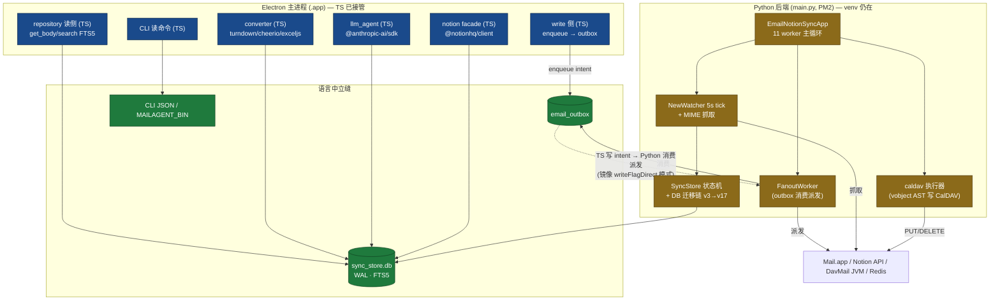

# 后端 Python → TypeScript 增量绞杀迁移方案评估

> 文档类型：技术栈演进 roadmap（决策级，非落地手册）
> 作者：首席架构师（基于 12 子系统可移植性评分卡）
> 日期：2026-05-29
> 范围：评估「把当前 Python 后端逐模块绞杀（strangler）为 TypeScript / Node.js，最终与 Electron 前端同栈」这条**未来路线**的可行性、波次、缝合机制、终止判据与风险。
> 状态：roadmap 草案 → 待评审（**不进入当前 Sprint**）
> 关联：[`01-architecture-analysis.md`](./01-architecture-analysis.md)（打包方案）· [`02-landing-plan.md`](./02-landing-plan.md)（落地计划）· [`03-onboarding-prd.md`](./03-onboarding-prd.md)（onboarding PRD）

---

## 0. 阅读指南与立场声明（必读）

本文回答一个问题：**「未来要不要、怎么、按什么顺序把 Python 后端迁成 TypeScript？」**

在往下读之前，必须把三条立场钉死，否则全文会被误读：

### 立场 1：这是 roadmap，不是现在做的事

当前交付路线是 **01/02/03 文档定义的「方式 2」——Python 后端 + 嵌入式 CPython venv 打包**，做到「装完即用」。本文描述的 TS 迁移是**未来若干个 minor 版本里逐步演进**的可选轨道，**不抢占当前打包/onboarding 的工程预算**。先把方式 2 跑通、产品能分发，本文才有意义。

### 立场 2：打包收益是「全有或全无」，增量迁移的理由只能是 DX，不是瘦身

这是全文最重要的一句话，**请放在任何讨论的最前面**：

> **只要后端还剩一个 Python 模块在跑，就仍须随 `.app` 打包整个嵌入式 CPython 运行时（约 281MB venv）。**

打包体积的收益曲线不是线性的——它是一个**阶跃函数**：迁移 11/12 个模块，venv 体积**一点不减**（仍要 281MB + Python 解释器 + 所有 C 扩展 `.so`）；只有当**最后一个 Python 模块也被消灭**、`main.py` 进程被彻底停掉、`venv/` 从 `extraResources` 移除的那一刻，体积才从 ~430MB 跌回纯 Electron 的 ~200MB，签名链（afterSign 递归签所有 `.so/.dylib`）才消失，部署复杂度才真正下降。

因此，**迁移到一半永远不能摘 venv**。增量绞杀过程中的收益**只能是**：

- **开发体验（DX）**：前端工程师不必跨 Python/TS 两套栈、两套测试框架、两套依赖管理；改一个邮件列表过滤逻辑不必在 `config.py`（pydantic）和 `env-keys.ts`（手工白名单）之间来回对齐。
- **降耦 / 消除漂移**：消灭「双重 schema」（`config.py` 593 行 pydantic ↔ TS `MANAGED_ENV_KEYS` 手工子集）、「双写一致性」（`OutboxRepository.enqueue` Python ↔ `writeFlagDirect` TS 镜像）这类**跨语言镜像维护点**。
- **延迟**：消除 CLI fork 的 ~200–500ms Python 冷启动惩罚（虽然 Sprint 16 已把高频 flag/read 绕过 CLI 直写 SQLite）。

**任何把「迁一半就能省体积」当卖点的论证都是错的，必须当场纠正。**

### 立场 3：绞杀的契约是语言中立的「SQLite 表 + email_outbox + CLI JSON」

迁移之所以可增量、可并行、可灰度，是因为前后端早已不靠「Python 函数调用」耦合，而靠三条**语言中立**的缝（seam）：

1. **SQLite 表**（`better-sqlite3` 与 Python `sqlite3` 共享同一 WAL DB 文件）；
2. **`email_outbox` 表**（写侧 intent 聚合点，Sprint 15 SSoT inversion 的产物）；
3. **CLI JSON 契约**（`mailagent -o json <cmd>` 的 `{status, data, meta, error}` 信封 + **10 个整数退出码（0/1/2/4/5/6/7/8/9/130）/ 11 个 `E_*` 错误码 enum**，D-6 修正：多个 enum 映射到同一退出码，被 `test_schema_contract*.py` 强制锁定）。

TS 实现只要满足同一缝的契约，就能与剩余 Python **同进程外共存**、按 `internal_id` 范围或 feature flag 灰度切量。这是整个绞杀策略能成立的物理基础（详见 §4）。

---

## 1. 执行摘要（结论先行）

### 1.1 总工作量量级

12 个子系统，逐项人天累加：

| 量级口径 | 人天合计 |
|---|---|
| 子系统纯重写下界（各子系统 effort 下限相加） | **约 114 人天** |
| 子系统纯重写上界（各子系统 effort 上限相加） | **约 187 人天** |
| ＋ 测试 port（>2 万行 pytest → vitest/jest，calendar 一家 6823 行） | **+30–50 人天** |
| ＋ 对拍/影子基础设施（影子写、checksum diff、按 internal_id 灰度切量 harness，一次性） | **+5–10 人天** |
| **规划区间（含双跑期 + 测试 port + 对拍框架）** | **约 180–260 人天（≈ 9–13 人月）** |

> **D-3 修正**：早先口径（130–200）把「测试 port + 对拍框架」折叠进区间差额（约 +13~16 人天）是**明显低估**——重 heavy 覆盖子系统（repository/llm/calendar/events/notion/backend/同步内核/CLI）的测试 LOC 累加远超 2 万行，且每波都要求逐字段对拍，对拍基础设施本身是独立工程。据此上修为 **180–260 人天（≈ 9–13 人月）**，下界尤其不应乐观。这是**纯重写 + 等价测试 port + 双跑对拍**的工程量，**不含**产品决策、合规（DavMail/Graph）、新功能。单人节奏下是一条跨**多个 minor 版本、约一年**的长线，绝非一个 Sprint 能吃下。

### 1.2 波次概览（一句话版）

| 波次 | 一句话 | 子系统 | 人天 |
|---|---|---|---|
| **Wave 1** | 先迁无状态纯函数叶子（converter / repository 读侧），零耦合、测试好、当「排练靶」 | converter、repository | 8–14 |
| **Wave 2** | 迁读侧 + HTTP 客户端 + CLI 读命令组 + 旁路 feature-flag 模块，全藏在 SQLite/JSON 缝后 | MIME 解析子单元、LLM、project_progress+kos、CLI 读命令、Feishu/SSE 叶子 | 27–42 |
| **Wave 3** | 迁写侧——一切经 `email_outbox` 缝派发：Notion facade、events/notify 写侧、calendar 调度层、backend、CLI 写命令组 | backend、notion、events+notify、calendar、CLI 写命令 | 46–73 |
| **Wave 4** | 最后绞杀皇冠明珠：sync_store 状态机 + DB 迁移链 + NewWatcher 主循环 + MIME 写路径 + main.py 编排 | mail 同步内核、main.py+config | 45–75 |

### 1.3 何时才能摘 venv（一句话）

> **当且仅当 Wave 4 完成、`main.py` 的 11 个 worker 全部有 TS 等价实现、SSE server 迁到 Node、且「最后的纯 Python 集合」（见 §6）也被消灭或显式判定为「永久保留为 Python 子进程」时**——若选择前者，停掉 PM2 mail-sync 进程、从 `extraResources` 删除 `venv/`，体积阶跃回落、签名链消失；若选择后者，**则永远不摘 venv，停在混合态**（§9 给出何时该选哪条）。

### 1.4 一句话

> 这是一条「DX/降耦驱动、按 outbox + SQLite + CLI JSON 三缝增量绞杀、皇冠明珠（sync_store + 迁移链 + 主循环）垫到最后、且**摘 venv 是全有或全无的终局动作**」的长线路线；它值得在方式 2 稳定后启动，但任何时刻都应以「现在停在混合态是否可接受」作为继续推进的 gate，而不是默认一路迁到底。

---

## 2. 可移植性总表（12 子系统，按波次排序）

> 难度 1（最易）– 5（最难）。Python 锁定度：none/low/medium（无 high——评分卡里最硬的 caldav/vobject 也只到 medium）。绞杀缝：clean（可独立绞杀）/ messy（半耦合）/ none（无独立缝，必须整体替换）。

| # | 子系统 | LOC | 难度 | Py 锁定 | 关键 TS 平替 | 测试覆盖 | 绞杀缝 | 波次 | 人天 | 热路径 |
|---|---|---:|:---:|:---:|---|:---:|:---:|:---:|:---:|:---:|
| 1 | **src/converter**（6 无状态转换器） | 1782 | 2 | medium | cheerio / turndown / exceljs / execa+soffice / pdf-parse·mammoth | light | **clean** | **1** | 4–7 | ✅ |
| 2 | **src/repository**（v4 SSoT 读写） | 1967 | 2 | low | better-sqlite3 / turndown / crypto / RegExp | heavy | **clean** | **1** | 4–7 | ✅ |
| 3 | **src/llm_agent**（本地 LLM 分类） | 3246 | 2 | low | @anthropic-ai/sdk / undici / zod / @notionhq/client | heavy | **clean** | **2** | 4–7 | ✅ |
| 4 | **src/project_progress + src/kos** | 4015 | 3 | medium | SheetJS·exceljs / undici / postal-mime / p-limit | medium | **clean** | **2** | 6–10 | ❌ |
| 5 | **src/cli**（agent 接口，薄路由） | 11260 | 3 | low | commander·oclif / js-yaml / dotenv / crypto.timingSafeEqual | heavy | **clean** | **2→3** | 6–10 | ❌ |
| 6 | **src/mail MIME/会议解析** | 3113 | 3 | low | postal-mime / ical.js·node-ical / rrule.js / execa(osascript) | light | **messy** | **2** | 5–8 | ✅ |
| 7 | **src/mail/backend**（双 backend 抽象） | 2964 | 3 | low | imapflow / nodemailer / mailparser / better-sqlite3 | heavy | **clean** | **3** | 8–13 | ✅ |
| 8 | **src/notion**（facade） | 2762 | 3 | low | @notionhq/client / fetch FormData / p-retry | heavy | **clean** | **3** | 8–12 | ✅ |
| 9 | **src/events + src/notify** | 5994 | 3 | low | ioredis / axios / crypto.createHmac / net.Socket / execa | heavy | **clean** | **3** | 6–10 | ✅ |
| 10 | **src/calendar_notion + src/calendar_sync** | 6211 | 4 | **medium** | ⚠ 无成熟 caldav/vobject 平替（需手写 WebDAV XML）/ rrule.js / nodemailer / @notionhq/client | heavy | **messy** | **3** | 18–28 | ✅ |
| 11 | **src/mail 同步内核**（皇冠明珠） | 5720 | **5** | low | better-sqlite3 / async-await+setInterval / luxon / pino | heavy | **none** | **4** | 30–50 | ✅ |
| 12 | **main.py + config.py + 前端共存缝** | 2887 | **5** | medium | zod+dotenv / AbortController·EventEmitter / pm2 REST | light | **messy** | **4** | 15–25 | ✅ |

**读表要点：**

- **Python 锁定度普遍 low** —— 全栈里只有 4 个子系统是 medium，且 medium 的根因各不相同：converter 是 `pypdf`/`python-pptx`（PDF/PPTX 文本提取 TS 生态弱）、project_progress 是 `pandas` DataFrame API、calendar 是 `caldav`+`vobject`（**唯一真正没有成熟 TS 平替的硬骨头**）、main.py 是 `pydantic-settings`（zod 可替但 ~130 个 Field 逐个搬，D-5）。**没有任何子系统是 high/不可迁**。
- **难度 ≠ 锁定度**。皇冠明珠 sync_store 锁定度 low（纯 SQLite + asyncio，TS 完全能做），但难度 5——难在它是**全项目横切面**（15+ 模块直接 import）+ **DB 迁移链 v3→v17** + **指数退避状态机**，没有干净缝可藏 strangler proxy（`stranglerSeam: none`）。
- **测试是护城河也是工作量乘数**。heavy 覆盖（repository / llm_agent / calendar / events / notion / backend / 同步内核 / CLI）既是重写的回归保险，也意味着等量的测试要 port 到 vitest/jest——calendar 一家就有 6823 行 pytest。**两个测试薄弱点（converter 的 html_converter 无专属测试 / reader.py 零专属单测）是重写前必须补测的缺口**，否则失去回归兜底。

---

## 3. 依赖与耦合图：clean seam 切点 vs 深耦合垫后

下图标出「能独立绞杀的 clean seam 切点」（绿）与「与主循环/状态机深耦合、必须垫后的」（红）。橙色为 messy（半耦合，需拆子单元或保留 Python 执行器）。

```mermaid
flowchart TB
  classDef clean fill:#1f7a3d,stroke:#0d3d1e,color:#fff
  classDef messy fill:#b06a00,stroke:#5c3700,color:#fff
  classDef crown fill:#8b1a1a,stroke:#4d0e0e,color:#fff
  classDef seam fill:#1a4a8b,stroke:#0d2747,color:#fff

  subgraph W1["Wave 1 — 叶子纯函数 (clean)"]
    CONV["converter<br/>6 无状态转换器"]:::clean
    REPO["repository<br/>v4 SSoT 读写"]:::clean
  end

  subgraph W2["Wave 2 — 读侧 / HTTP / 旁路 (clean·messy)"]
    LLM["llm_agent"]:::clean
    PPK["project_progress + kos"]:::clean
    CLIR["cli 读命令组"]:::clean
    MIME["mail MIME/会议解析<br/>(拆 3 子单元)"]:::messy
  end

  subgraph W3["Wave 3 — 写侧, 经 outbox 缝 (clean·messy)"]
    BACKEND["mail/backend<br/>IMailBackend"]:::clean
    NOTION["notion facade"]:::clean
    EVNOT["events + notify"]:::clean
    CAL["calendar<br/>(caldav 保 Python 执行器)"]:::messy
    CLIW["cli 写命令组"]:::clean
  end

  subgraph W4["Wave 4 — 皇冠明珠 (none·messy)"]
    SYNC["sync_store 状态机<br/>+ DB 迁移链 v3→v17<br/>+ NewWatcher 主循环"]:::crown
    MAINPY["main.py 编排<br/>+ config.py"]:::crown
  end

  subgraph SEAMS["语言中立缝 (绞杀的物理基础)"]
    OUTBOX[("email_outbox<br/>intent 聚合")]:::seam
    SQLITE[("sync_store.db<br/>WAL · FTS5")]:::seam
    CLIJSON["CLI JSON 信封<br/>{status,data,meta,error}"]:::seam
  end

  %% clean 切点: 直接挂缝
  REPO -->|读写| SQLITE
  CONV -->|纯函数, 无状态| CLIJSON
  LLM -->|llm_processing 表| SQLITE
  PPK -->|feature-flag 旁路| SQLITE
  CLIR --> CLIJSON
  BACKEND -->|imap_uid 字段| SQLITE
  NOTION -->|notion_page_id 字段| SQLITE
  EVNOT -->|Redis BLPOP/PUBLISH 缝| OUTBOX
  CLIW -->|enqueue| OUTBOX

  %% messy: 半耦合
  MIME -.->|parse 纯函数可切<br/>applescript 获取保 Python| SQLITE
  CAL -.->|读侧藏 SQLite<br/>写侧 caldav 保 Python| SQLITE

  %% crown: 无独立缝, 横切面
  SYNC ==>|15+ 模块直 import<br/>无 strangler 藏身处| OUTBOX
  SYNC ==> SQLITE
  MAINPY ==>|11 worker 内存共享引用| SYNC

  %% 前端已有缝
  FE["前端 Electron<br/>better-sqlite3 直读写<br/>+ execa fork CLI"]:::seam
  FE -->|getDb 只读| SQLITE
  FE -->|writeFlagDirect 直写| OUTBOX
  FE -->|cli_runner fork| CLIJSON
```

**图的核心判读：**

- **绿色（clean seam）= 可任意顺序独立绞杀**：converter / repository / llm_agent / project_progress+kos / backend / notion / events+notify / CLI。它们要么是纯函数（converter），要么对外只暴露 SQLite 表 / CLI JSON / outbox 缝，调用方不感知语言切换。这是绞杀的「易吃部分」。
- **橙色（messy）= 必须拆子单元或保 Python 执行器**：MIME 解析（`parse_email_source` 纯函数可切，但 `applescript.py` 取数路径与 reader 耦合）；calendar（读侧藏 SQLite 可切，但 `caldav`+`vobject` 写路径无 TS 平替，需把 CalDAV 执行器**保留为 Python 子进程**长期共存）。
- **红色（皇冠明珠）= 无独立缝，必须整体替换**：sync_store 被 15+ 模块直接 import，是 Python **方法调用级**横切面（不是 SQLite 表边界），藏不下 strangler proxy；NewWatcher 主循环在内存里组装了 arm/radar/notion/llm/kos/island 6 个 hook；main.py 的 11 个 worker 靠 `watcher.sync_store`/`watcher.arm`/`watcher.email_repo` 等**内存对象引用**共享状态。这三者必须等所有上游 TS 化后，作为终局动作整体绞杀。

---

## 4. 共存缝（seam）机制 —— 绞杀的心脏

绞杀（strangler fig）能成立，唯一前提是：**迁移期内，新的 TS 实现与尚未迁移的 Python 能在同一份生产数据上无缝共存、互不破坏**。本节是全文最关键的工程内核。

### 4.1 三条语言中立契约（已经存在，不是要新建的）

MailAgent 的幸运之处在于：前后端早在 Sprint 5 / Sprint 15 / Sprint 16 就已经把耦合面收敛到**三条不依赖 Python 的缝**。这意味着绞杀的地基**现成**：

| 缝 | 物理形态 | 现状（谁在用） | 迁移期角色 |
|---|---|---|---|
| **① SQLite 表** | `sync_store.db`（WAL 模式，FTS5 虚表 + trigger） | Python `sqlite3` 全量读写；前端 `db.ts` `getDb()` readonly 直读邮件/正文/搜索/日历 | TS 与 Python **共享同一 DB 文件**；WAL 允许多 reader + 单 writer 并发，`busy_timeout=500ms` 兜底 race |
| **② `email_outbox` 表** | 写侧 intent 聚合点（`op_type` / `target` / `payload_json` / `status='pending'`） | Sprint 15 起所有 mutating 操作写此表，`FanoutWorker` 5s tick 消费派发到 Mail.app + Notion；前端 `write_ops.ts:writeFlagDirect` 已**直写**此表（绕过 CLI，~5ms） | **写侧绞杀的唯一缝**：TS 写 intent 进 outbox，Python `FanoutWorker` 继续消费派发——TS 无需自己实现派发逻辑，写侧可在 Python 派发器还活着时先迁 |
| **③ CLI JSON 信封** | `mailagent -o json <cmd>` → `{schema_version, status, data, meta, error}` + 10 退出码 / 11 `E_*` enum（D-6） | 前端 `cli_runner.ts` 通过 `execa` fork 消费；`test_schema_contract*.py` 强制锁定契约 | TS CLI 二进制只要 emit 同 schema + 退出码，`cli_runner.ts` **零改动**；`MAILAGENT_BIN` 环境变量逐命令组切 Python↔TS |

> **关键事实（已在代码验证）**：`write_ops.ts:writeFlagDirect` 的 INSERT/UPDATE merge 语义（「同 `(internal_id, op_type='flag_sync', target, status='pending')` 已存在则 UPDATE payload，否则 INSERT」）**已经完全镜像** Python `OutboxRepository.enqueue`。也就是说，前端早已是「绕过 Python 直接操作 outbox 缝」的活样本——TS 后端要做的，是把这套已验证的镜像模式从「前端 flag 写」推广到「所有写操作」。

### 4.2 主循环（main.py 5s tick + 11 workers）的归属与为何最后迁

`main.py` 的 `EmailNotionSyncApp` 编排 11 个 asyncio worker（NewWatcher 5s tick 轮询、reverse_sync、redis_consumer、FanoutWorker、CalendarSyncWorker、FolderSyncWorker、island_dispatch、SSE server :9200、stats_reporter、alert、davmail watchdog），它们**通过 Python 内存对象引用深度共享状态**（`watcher.sync_store`、`watcher.arm`、`watcher.email_repo`…）。

这决定了主循环**没有干净的子缝可摘**——它要么整体保留，要么整体替换。绞杀路径只能是：**先让每个 worker 各自有 TS 等价实现并挂到三条缝上，最后才停掉 Python 主循环进程**。具体而言：

- `NewWatcher`（5s tick 检测新邮件 + 抓取）→ TS 用 `setInterval` + **按 backend 二分检测机制（⚠ D-1 修正）**：**生产主路径 davmail = imapflow 的 IMAP `STATUS UIDNEXT` 比对 + 多 folder `UID SEARCH` + `BATCH FETCH`**（`davmail_backend.py:1101 check_for_changes / 1127 get_new_emails`，含 UIDVALIDITY mismatch 处理——这才是必须重写的热路径协议逻辑，比读 SQLite 难）；**Envelope Index 直读（`better-sqlite3` mode=ro，`sqlite_radar.py:84`）仅是 AppleScript emergency fallback 的检测机制**，不是生产主路径，不可当主循环接管手段；
- `FanoutWorker`（outbox 消费）→ **可最早迁**（Wave 3），它已是经 `email_outbox` 表与上游解耦的独立 worker；
- `redis_consumer` → ioredis BLPOP；`SSE server` → Express/Fastify SSE 端点（前端 `events_bridge` 已有 fallback 轮询，迁移期可降级）。

**只有当这些 worker 全部 TS 化、SSE server 迁到 Node 后，才能停 PM2 `mail-sync` 进程**——这正是 §1.3 / §6 所说的「摘 venv 时刻」。

### 4.3 前端已有缝如何复用扩展

前端 Electron 主进程**已经通过三条独立路径直接操作 SQLite，完全绕过 Python**（01 文档 §2.1 已记录），这是迁移期最宝贵的现成资产：

1. `db.ts getDb()` → readonly 查询（邮件列表/详情/搜索/线程/日历/folder）；
2. `db.ts getWriteDb()` + `write_ops.ts writeFlagDirect` → 直写 `email_metadata` + `email_outbox`（Sprint 16，flag/read 从 ~500ms CLI fork 降到 ~5ms）；
3. `env.ts` → 原子读写 `.env`。

**绞杀策略 = 把后端的 TS 实现「长」进 Electron 主进程**：Wave 1 的 repository 读侧直接扩展 `db.ts` 查 `email_body`/`email_attachment`/`email_translation`；Wave 3 的写侧扩展 `write_ops.ts` 的 outbox enqueue 模式到所有写操作。前端不再 fork Python CLI 做这些操作，CLI fork 逐步降级为「LLM run / resync 等低频操作」的 adapter。

### 4.4 迁移中态架构图

下图是「Wave 3 进行中」的典型快照：TS 已接管读侧 + 部分写侧（经 outbox），Python 仍持有主循环 + sync_store 状态机 + DB 迁移链 + caldav 执行器。**venv 仍在，因为皇冠明珠未动**。

**中态的双写一致性是命门**：迁移期 TS `enqueue` 与 Python `OutboxRepository.enqueue` 的 merge 语义**必须始终同步**——任何一侧语义漂移（比如对同一 pending 行的 UPDATE 条件不一致）会导致静默数据不一致。降低风险的办法：**让其中一方成为唯一真相**（要么 TS 全量接管 enqueue、Python 只消费；要么反之），尽快消灭「双实现镜像」状态，而非长期维护两套。

> **⚠ 镜像不止 merge 语义，还有 echo-prevention（D-2 修正，Wave 3 硬前置）**：Python `OutboxRepository.enqueue` 有一条当前 TS `writeFlagDirect` **没有**的分支——`source='notion_webhook'` 且 `target='notion'` 时直接 `return -1` 静默跳过（`outbox.py:130-139`），用于切断 `Notion → handler → outbox → fanout → Notion` 死循环。现状 TS 只写 `source='frontend_direct'` 撞不到这条，所以 flag 场景「镜像」成立；但一旦 Wave 3 把 TS 写**推广到 webhook 触发的反向写**（reverse_sync / handler 路径），缺 echo-prevention 会直接**烧光 Notion 配额 + 死循环**。因此「把镜像模式推广到所有写操作」必须**同步实现 echo-prevention**，这是 Wave 3 写侧的硬前置，不能拖到 Wave 4。

> **⚠ WAL 单 writer 锁竞争需重估（D-9）**：现状 `busy_timeout=500ms` 是按「秒级人工 flag 写 vs 5s tick」标定的（`db.ts:101` 注释自承），且前端 500ms 与 `davmail_uid_mapper` 的 5–10s **取值不一致**。当 TS 写从「低频人工」推广到「所有写操作」（高频）后，TS `enqueue` 与 Python `FanoutWorker` 的 `claim_next`（`UPDATE status pending→processing`）会争用同一表写锁——需统一 `busy_timeout` 取值 + 做高频写压测，确认无 `FanoutWorker` claim 饿死 / `SQLITE_BUSY` 抖动。

---

## 5. 绞杀波次详解

每波都是**独立可发布的增量**（§7 映射到 minor 版本）。原则：**叶子纯函数 → 读侧/HTTP 客户端 → 写侧走 outbox 缝 → 皇冠明珠**，依赖永远从下游往上游迁，保证任一时刻系统可运行。

### Wave 1 — 叶子纯函数（converter + repository）

**模块**：`src/converter`（6 转换器）、`src/repository`（v4 SSoT）。
**为何最先**：两者都是 `clean` seam，难度 2，与 Mail.app/Redis/asyncio 完全解耦；前端 `better-sqlite3` 已直读 `email_metadata`，扩展到 `email_body`/`email_attachment`/`email_translation` 是最自然的下一步。
> **⚠ converter 无法在 Wave 1「整体去 Python」（D-10 修正）**：converter 的干净叶子（`notion_rich_text`/`html_to_markdown`/`html_converter`/`office` soffice 路径）可全迁，但 `attachment_text` 的 **pptx/PDF 文本提取属 §6.1「最后的纯 Python 集合」候选**——即使 Wave 1 也摘不掉 converter 里的这块 Python 子进程。这正是「摘 venv 必须等最后一个 Python 子进程消灭」（§0 立场 2）的微观例证：Wave 1 完成 ≠ converter 去 Python 完成。
**迁移手法**：
- **第一个迁移单元选 `smart_query_transform`**（repository 内，127 行纯函数，CJK 感知 query 改写，测试覆盖 100%）——作为整个 TS 迁移流程的「**排练靶**」：建 vitest 工程、port pytest case、跑对拍，把工具链跑通。
- 然后 `notion_rich_text`（80 行）→ `html_to_markdown`（82 行）→ `office_converter`（soffice 子进程换 execa，半天）→ `office_converter` xlsx 路径（exceljs，注意 utf-8-sig BOM）→ `html_converter`（最大文件，**先补 30+ Notion API 边界测试再迁**）→ `eml_generator`（nodemailer raw MIME）→ `attachment_text`（**pptx 提取保留 Python 子进程**，pdf 用 pdfjs-dist）。
- repository 读侧（`get_body`/`get_attachments`/`search_*`）先迁，Python 继续负责写侧；再迁写侧 `commit_email_with_body`（双阶段事务：先 FS 落盘再 DB 写，rollback 清文件，必须精确重现）。
**验证（对拍）**：同一批邮件，Python 与 TS 转换输出做 diff（markdownify↔turndown 的 heading/link 格式差异需逐 case 比对，影响 FTS5 索引质量与 LLM prompt）；FTS5 `snippet()`/`bm25()` 需确认 better-sqlite3 的 SQLite ≥3.25。
**回滚**：纯函数无状态，TS 实现保留在独立模块，出错直接切回 Python CLI 路径（`MAILAGENT_BIN` 或前端 IPC 降级 fork）。

### Wave 2 — 读侧 / HTTP 客户端 / 旁路 feature-flag 模块

**模块**：`src/llm_agent`、`src/project_progress`+`src/kos`、`src/cli` 读命令组、`src/mail` MIME 解析子单元（icalendar_parser + applescript 取数）、events/notify 的纯 HTTP 叶子（Feishu/SSE publisher）。
**为何这个顺序**：这些要么是 feature-flag 隔离的旁路（project_progress/kos 默认 OFF，主循环不依赖其返回值，**迁移风险极低**），要么对外只暴露稳定的 SQLite 表/CLI JSON 缝（llm_agent 的 `llm_processing` 表 + CLI JSON），要么是无状态 HTTP 叶子（Feishu）。
**迁移手法**：
- **llm_agent**：`@anthropic-ai/sdk` 与 Python SDK API 面**完全对称**（`messages.create` 参数名/结构体一致），是全后端阻力最小的一块。`schema.py`（枚举 + JSON schema dict）几乎零成本 port（`as const` 数组）。`runner.py` 对 `EmailReader`（MIME）有依赖——**要么先迁 MIME 解析，要么保留 Python runner 做 MIME fetch、TS 只做 LLM+写库层**。`store.mark_success` 双写 `email_metadata.ai_priority/ai_action` 主表列必须复现，否则前端列表过滤失效。
- **project_progress+kos**：kos 实际锁定度 none（httpx → axios 1:1），可先迁；project_progress 纯函数层（progress_parser/slug/priority/detector）次之；`xlsx_parser`（pandas DataFrame）+ `runner`（MIME）最后，**pandas 的 Timestamp/NaN/NaT 语义 vs SheetJS 原始 cell 值有差异，date 解析需额外处理**。
- **CLI 读命令组**：`email get/list/search/body`、`admin stats/health/db-version`、`folder list/get`、`debug`、`calendar 读侧`。CLI 是纯路由层，本身 Python lock 极低；阻力在依赖侧——读命令依赖的域模块本波已迁，写命令组留 Wave 3。`MAILAGENT_BIN` 逐命令组切。
- **MIME 解析子单元**：`icalendar_parser`（纯函数，测试好，ical.js/node-ical + rrule.js）先迁；`applescript.py`/`applescript_arm.py`（osascript 子进程语言无关，前端已有 execa）可单独换；`reader.py` 的 `parse_email_source` **零专属单测，必须先补测再迁**（encoded-word 解码、magic-bytes MIME 检测、message/rfc822 嵌套 walk）。
**验证（双跑对拍 / 影子写）**：llm_agent 按 `internal_id` 范围灰度，TS 版与 Python 版**平行跑同一封邮件**、比对 `labels_json` + `ai_priority`/`ai_action`，zero downtime；CLI 读命令对同一查询比对 JSON stdout 逐字段（含 ndjson `_meta` 行）。
**回滚**：feature flag 切回 Python；CLI 命令组 `MAILAGENT_BIN` 切回。

### Wave 3 — 写侧（一切经 outbox 缝）

**模块**：`src/mail/backend`、`src/notion` facade、`src/events`+`src/notify` 写侧、`src/calendar` 调度层、`src/cli` 写命令组。
**为何在读侧之后**：写侧必须经 `email_outbox` 缝才能与 Python `FanoutWorker` 共存——TS 写 intent，Python 派发。这要求 outbox 缝（Wave 之前已存在）稳定、且写侧依赖的 converter（Wave 1）/ MIME（Wave 2）已就绪。
**迁移手法**：
- **backend**：`sender.py`（纯函数 build_mime + smtp_send，无状态）**最先迁**；`imap_client.py`（294 行薄封装，被 folder_sync/calendar_sync 共用）作独立单元；`davmail_backend.py`（1394 行，含 ~400 行 Arm/Radar 兼容 shim）——TS 版**可丢弃 shim**，直接实现原生 `IMailBackend`，但需同步改 NewWatcher 的 ~22 处 `self.arm.*`/`self.radar.*` 调用点。**RFC 2047 中文 encoded-word（GB2312/BIG5）必须实测**，否则前端邮件头乱码；UIDVALIDITY mismatch 处理（imaplib `untagged_responses` dict）→ imapflow 等价 API 不同，需重验协议合规。
- **notion**：`client.py`+`queries.py`（纯 HTTP 读侧）可早迁；`pages.py`（1145 行，内嵌 `NOTION_READ_FROM_SQLITE` 灰度双路径）等 converter 就绪后迁——**迁移前务必确认 v4 灰度已全量**，否则 TS 要同时维护 v2 内存路径 + from_sqlite 两条创建路径。文件上传三步流程的不同 `Notion-Version` header（2025-09-03 vs 2022-06-28）需精确复现。
- **events+notify**：Feishu/SSE publisher（Wave 2 已可提前）；`RedisConsumer`+`EventHandlers`+`island_dispatch` 全家本波（EventHandlers 是多依赖注入枢纽，须等 backend/SyncStore 缝稳定）。island AF_UNIX socket 协议已完整文档化（`frontend/ISLAND-PLUGIN.md §3.1-3.3`），Node `net.Socket` 可直接实现。
- **calendar**：**读侧藏 SQLite 可早迁**（前端已直读 `calendar_event`）；`expander.py`（RRULE，rrule npm 完全对等）作独立叶子；**写侧 `caldav`+`vobject` 无 TS 平替——保留 Python CalDAV 执行器作子进程**（CLI JSON / IPC socket 调用），TS 只替调度/orchestration 层。calendar_notion 与 calendar_sync **双向耦合，必须同批迁**。
- **CLI 写命令组**：`resync`/`flag`/`archive`/`draft`/`backfill`/`notion`/`init`——依赖的 NotionSync / AppleScriptArm 本波已迁后跟进。
**验证（影子写）**：TS 写 outbox intent，与 Python `OutboxRepository.enqueue` 在同一 `(internal_id, op_type, target)` 上的 merge 行为做对拍；初期可让 TS 写「影子 outbox 行」（标记 source）只观测不派发，确认与 Python 一致后再切真写。backend 用 IMAP 真机灰度（先只读 SELECT，再 STORE/APPEND）。
**回滚**：写命令 `MAILAGENT_BIN` 切回 Python；outbox 是幂等 intent，回滚不丢数据（Python 派发器仍消费）。

### Wave 4 — 最后的皇冠明珠

**模块**：`src/mail` 同步内核（sync_store 状态机 + DB 迁移链 v3→v17 + NewWatcher 主循环 + reverse_sync）、`src/mail` MIME 写路径剩余、`main.py` + `config.py`。
**为何最后**：sync_store 是全项目横切面（15+ 模块直 import，`stranglerSeam: none`）+ DB 迁移链必须先在 TS 侧完整复现才能保证生产库零数据丢失原地升级 + NewWatcher 集成 6 个 hook。这三者无法在稳定接口后单独替换，必须等所有上游 TS 化。
**迁移手法**：
- **先迁 `FanoutWorker`**（其实 Wave 3 已做——它经 outbox 表解耦，是「皇冠明珠里最早能摘的零件」）。
- **DB 迁移链（DB_VERSION=17，⚠ D-4 修正）**：**不是 14 个离散 versioned migration 步骤**——实际升级逻辑 = 两处数值版本 gate（`if current_version < 3` / `< 5`）+ v6/v10/v13 的**列存在性幂等 `ADD COLUMN` 检查**（`PRAGMA table_info` 看列在不在，`sync_store.py:740-770`；迁移测试仅覆盖 v6/v10/v13）。TS 复现的**真正难点不是线性 14 步，而是「列存在性探测幂等 + 老库可能停在任意中间 schema 态」**：必须对多个真实起始版本的生产库副本各跑一遍原地升级 + 全表 checksum 对拍（零行丢失），而非照搬版本号线性升级。
- **状态机**：`pending→fetch_failed→failed→dead_letter` + sent-box 降级 skipped 的指数退避规则，逐转换 port 测试（test_sync_store_status_machine 等 ~2317 行）。
- **`allocate_davmail_internal_id`**：`BEGIN IMMEDIATE` + KV 自增（AppleScript ROWID <10⁹ vs DavMail ≥10⁹ 双空间），**并发正确性单独压测**（better-sqlite3 是同步 blocking，与 Python `busy_timeout=10s` 的并发模型不同，需评估线程隔离）。
- **`_normalize_date_received_iso`**：DST-aware 历史日期（`/etc/localtime` symlink → ZoneInfo IANA），TS 用 luxon IANAZone，**偏差会导致历史邮件时间错位 ~1h**，需大批量历史邮件对拍。
- **NewWatcher 主循环 + main.py**：每个 worker 已有 TS 等价后，用 `setInterval`(5s tick) + AbortController 重写编排；`config.py`（**593 行 / 约 130 个 Field**，D-5 修正）→ zod，**与 `env-keys.ts` MANAGED_ENV_KEYS 白名单对齐**（建议 Wave 2 就做代码生成 `config.py → env-keys.ts` 消除漂移）。
**验证（全量双跑对拍）**：TS 主循环与 Python 主循环**并行跑同一邮箱**（TS 写「影子 DB」或只读观测），逐邮件比对最终 `email_metadata` 状态、`notion_page_id`、附件落盘；DB 迁移链对生产库副本跑升级 + 全表 diff。**这是整个迁移最薄的回归护城河**（main.py 无集成测试），只能靠长周期 e2e dogfood。
**回滚**：保留 Python main.py 进程作 hot standby，TS 主循环出问题立即停 TS、重启 PM2 mail-sync——**只要 venv 还在，回滚永远可行；这也是「摘 venv」必须是最后一步、且需极高信心的原因**。

---

## 6. 「最后的纯 Python 集合」识别 + 摘 venv 判据

### 6.1 迁完 Wave 1–4 后，理论上仍可能残留的 Python

即便走完四波，有几类代码**可能被有意保留为 Python 子进程**（迁移成本/收益不划算）：

| 残留候选 | 原因 | 处置选项 |
|---|---|---|
| **caldav + vobject CalDAV 写执行器** | `caldav`/`vobject` 无成熟 TS 平替；手写 WebDAV PROPFIND/REPORT/PUT + multi-VEVENT in-place 改写是高风险高成本 | (A) 长期保留为 Python 子进程；(B) 等 ical.js 生态成熟后再迁；(C) 改走 Graph API（与合规路线耦合） |
| **attachment_text 的 pptx 提取** | `python-pptx` 在 TS 无成熟平替 | 保留 Python 子进程，或接受「跳过 pptx 文本索引」降级 |
| **PDF/CJK 文本提取** | `pypdf` 在复杂中文 PDF 上质量优于 pdf-parse | pdfjs-dist 替代 + 质量对拍；不达标则保 Python |
| **一次性运维脚本** | `notion_backfill.py`、`migrate_sync_store_v3.py` 等不在主路径 | **不迁，长期保留 Python**（不影响打包——它们不随 `.app` 常驻运行） |

> **判断口径**：运维脚本类（非主路径、非常驻）保留 Python **不影响摘 venv 决策**——只要它们不是 `.app` 运行时必需的常驻进程。真正卡摘 venv 的，是 **caldav 执行器 / pptx-pdf 提取**这类「主路径上仍被常驻调用的 Python 子进程」。

### 6.2 摘 venv 的判据（全部为真才动手）

摘 venv = 从 `extraResources` 删除 `venv/`、停掉 PM2 `mail-sync` Python 进程、体积阶跃回落到纯 Electron。**这是不可逆的终局动作，以下前置必须全绿**：

1. ☐ **Wave 1–4 全部完成且双跑对拍稳定 ≥1 个完整 dogfood 周期**（建议 ≥4 周真机使用无 regression）。
2. ☐ **DB 迁移链 v3→v17 已在 TS 侧完整复现**，对生产库副本跑原地升级 + 全表 checksum 对拍零差异。
3. ☐ **main.py 的 11 个 worker 全部有 TS 等价实现**且接管生产流量（NewWatcher / FanoutWorker / reverse_sync / redis_consumer / calendar / folder / island / SSE / stats / alert / watchdog）。
4. ☐ **本机 SSE server（:9200，当前 `aiohttp.web` 而非 FastAPI，D-8 修正）已迁到 Node**（Express/Fastify），前端实时事件不依赖该 Python 进程。（注：远程 VPS 的 `webhook-server` 才是 FastAPI，跑在 `170.106.181.89`、**不随 `.app` 打包**，不在本次摘 venv 范围。）
5. ☐ **「最后的纯 Python 集合」已清零，或每一项已显式判定为「永久 Python 子进程」并接受其代价**——若选后者，**则不摘 venv，停在混合态**（见 §9）。
6. ☐ **状态机 + 指数退避 + outbox merge 语义的回归测试全绿**（已 port 到 vitest/jest）。
7. ☐ **回滚预案就位**：保留一个可一键拉起的 Python main.py hot standby 镜像，确认摘 venv 后若 TS 主循环崩溃，有降级路径（哪怕是「重新下发带 venv 的版本」）。
8. ☐ **AppleScript emergency fallback 链路的归属已了断（D-7 修正，与 CLAUDE.md 死硬约束「AppleScript fallback 始终可用」直接相关）**：`applescript_arm`（`fetch_email_content_by_id`，emergency 回切核心）+ `create_reply_draft.sh`（内嵌 python 解释器路径，01 §11 C-7）+ 其 PyObjC `.so` 依赖，要么**已确认在无 venv 下仍可回切**（execa 调 osascript 只换了胶水层，底层若仍依赖 PyObjC/Python 脚本则 fallback 仍锁 venv），要么**已显式判定放弃 AppleScript fallback**（接受 davmail 单后端风险）。这一条不了断，就不能摘 venv。

**只要其中任一为否，就继续打包整个 venv，绝不提前摘。**

---

## 7. 与版本路线绑定（vX.Y 映射）

每波是独立可发布增量。建议节奏（**前提：方式 2 已在 v1.x 稳定交付**）：

| 版本 | 吃哪一波 | 可发布增量（用户/开发者可感知的变化） | 摘 venv？ |
|---|---|---|:---:|
| **v1.x** | （无迁移） | 方式 2：Python 后端 + 嵌入式 venv，装完即用 | ❌（venv 在） |
| **v2.0** | Wave 1 | converter/repository TS 化；前端读侧少一次 IPC round-trip（translation:get 直查 SQLite）；TS 迁移工具链 + 对拍框架就位 | ❌ |
| **v2.1** | Wave 2 | llm_agent/旁路模块/CLI 读命令/MIME 解析子单元 TS 化；CLI 冷启延迟在读路径消失；config→env-keys 代码生成消除「双重 schema」漂移 | ❌ |
| **v2.2 / v2.3** | Wave 3（量大，可拆两个 minor） | backend/notion/events+notify/calendar 调度层/CLI 写命令 TS 化；写侧经 outbox 缝；caldav 降为 Python 子进程 | ❌ |
| **v3.0** | Wave 4 | sync_store 状态机 + DB 迁移链 + 主循环 TS 化；双跑对拍期 | ❌（双跑期 venv 仍在） |
| **v3.x（cutover）** | 摘 venv | §6.2 判据全绿后，删 venv、停 Python 进程；**体积阶跃回落、签名链消失** | ✅（终局） |

> **每个版本都必须能独立发布、独立回滚**——这是绞杀相对「大爆炸重写」的核心优势。任一版本若双跑对拍不稳，停在该版本的混合态继续打包 venv，不强推下一波。

---

## 8. 风险与反对意见

### 8.1 回归风险集中在 sync_store + DB 迁移链

皇冠明珠（Wave 4）是**全项目回归风险的奇点**：状态机的迁移链（DB_VERSION=17，数值 gate `<3`/`<5` + v6/v10/v13 列存在性幂等检查，见 §5 D-4 修正）+ 指数退避 + `allocate_davmail_internal_id` 并发 + DST 历史日期，任一处偏差都可能**静默损坏生产数据**。测试覆盖虽厚（~2317 行）但 main.py 本身无集成测试。**缓解**：DB 迁移链对生产库副本跑 checksum 对拍；主循环长周期影子运行；保留 Python hot standby。

### 8.2 MIME 长尾 edge case

`reader.py`（964 行）**零专属单测**，RFC 2047 中文 encoded-word（GB2312/BIG5）、Outlook TNEF、charset 探测、message/rfc822 嵌套——postal-mime/mailparser 对 Python `policy.default` 的 `get_content()` 自动解码行为**对等性需逐 case 验证**，否则前端邮件头/正文乱码。**缓解**：迁移前补 reader.py 单测（这是 Wave 2 的硬前置）。

### 8.3 Office/PDF 提取生态弱

`pypdf`（CJK PDF）/ `python-pptx`（pptx）/ `pandas+calamine`（xlsx，性能 4–18x）在 TS 生态**无对等强平替**。强迁会降低 FTS5 索引质量。**缓解 / 反对意见**：这几项**本就该保留 Python 子进程**，不必为「纯 TS」执念硬迁——见 §6.1。

### 8.4 双跑期成本

每个 clean seam 子系统在切换前都要「Python + TS 平行跑 + 对拍」一段时间，calendar 一家就有 6823 行 pytest 要 port。双跑期内**维护成本翻倍**（两套实现 + 对拍基础设施）。**缓解**：双跑窗口尽量短，确认对拍稳定后立即切单一真相，不长期维护镜像。

### 8.5 caldav / DavMail / 合规耦合

calendar 写侧 `caldav`+`vobject` 是唯一无 TS 平替的硬骨头；且 DavMail PoC 用伪装 client_id **不可上生产**、EWS 2026-10-01 关停。**backend 迁移时间窗与 Graph API 路线图（Issue #404 未 merge）耦合**——若 DavMail 失效，backend 重写的目标都得改。**缓解**：calendar/backend 写侧的迁移**不应早于合规路线明朗**。

### 8.6 何时该叫停不迁

- 若 caldav 执行器 + pptx/pdf 提取**注定保留 Python**，则**永远摘不掉 venv**——此时 Wave 3/4 的全部工作量只换来 DX，**收益锐减**，应严肃评估是否值得（见 §9）。
- 若双跑对拍持续暴露 sync_store 状态机/迁移链的偏差，且修复成本不收敛，**应在 Wave 4 前叫停，永久停在「TS 读侧/写侧 + Python 主循环」的混合态**——这本身是一个稳定、可接受的终态。

---

## 9. 决策建议

### 9.1 什么条件下值得推进到完全迁移（摘 venv）

**全部满足**才推进：

1. 「最后的纯 Python 集合」可清零——即 **caldav 写路径已迁 Graph API 或 ical.js 成熟、pptx/pdf 提取有可接受的 TS 方案**（否则永远摘不掉 venv，Wave 4 只换 DX）。
2. **团队已稳定单栈 TS** 且不再需要 Python 技能维护后端（DX 收益真实兑现）。
3. **打包体积 / 签名复杂度 / 启动延迟是真实痛点**（用户反馈或分发数据支撑），而非工程洁癖。
4. Wave 1–3 的双跑对拍已证明绞杀方法论在本项目可靠（即「方法已被验证」）。

### 9.2 什么条件下应永久停在混合态

**满足任一**即停：

1. **caldav/pptx/pdf 注定保 Python** → venv 摘不掉 → Wave 4 的 30–75 人天只买 DX，**ROI 不成立**，停在「Wave 1–3 完成 + Python 主循环」的混合态（读侧/写侧 TS、皇冠明珠 Python）。
2. **sync_store 双跑对拍不收敛** → 强迁主循环风险高于收益，停在 Wave 3。
3. **方式 2（嵌入式 venv）已充分满足分发需求**、用户无体积/启动抱怨 → 没有业务驱动力，**保持现状是最优解**。

### 9.3 总建议

> **启动顺序**：先把方式 2（01/02/03）交付稳定 → v2.0 用 Wave 1 当低风险「排练」验证方法论 + 兑现读侧 DX → 每完成一波都重新评估「现在停在混合态是否可接受」。**默认终点不是「全迁完摘 venv」，而是「迁到 ROI 拐点为止」**——很可能那个拐点就在 Wave 3 之后（读写侧 TS、皇冠明珠 + caldav 永久 Python），那是一个完全健康、可长期维护的混合终态。把「摘 venv」当作一个**需要 §6.2 全绿才解锁的可选终局**，而非既定目标。

---

## 附录 A：12 子系统人天明细

| 子系统 | 人天下界 | 人天上界 |
|---|---:|---:|
| src/converter | 4 | 7 |
| src/repository | 4 | 7 |
| src/llm_agent | 4 | 7 |
| src/project_progress + src/kos | 6 | 10 |
| src/cli | 6 | 10 |
| src/mail MIME/会议解析 | 5 | 8 |
| src/mail/backend | 8 | 13 |
| src/notion | 8 | 12 |
| src/events + src/notify | 6 | 10 |
| src/calendar_notion + src/calendar_sync | 18 | 28 |
| src/mail 同步内核 | 30 | 50 |
| main.py + config.py | 15 | 25 |
| **合计** | **114** | **187** |

子系统纯重写合计 114–187；**叠加测试 port（+30–50）+ 对拍框架（+5–10）后，规划区间 = 约 180–260 人天（≈ 9–13 人月）**（D-3 修正，原 130–200 低估）。

---

## 10. 评审修订记录（2026-05-29 批判复审后并入）

> 本节是对前 9 节的勘误与补强，由独立评审 agent 对照代码核查后产出。前文已就地修正。整体结论：评审认定这是一份「立场清醒、互相一致、数据底盘扎实」的 roadmap，最强处是把「摘 venv = 全有或全无的阶跃函数」钉死且全文无自相矛盾。以下为已修订缺口。

| 编号 | 严重度 | 缺口 | 修订 |
|---|---|---|---|
| **D-1** | 高 | §4.2/§5 把 **AppleScript fallback 的 Envelope Index 直读**当成生产主路径检测机制规划 TS 迁移。实为：生产主路径 = davmail，新邮件检测走 IMAP `STATUS UIDNEXT` + `UID SEARCH`（`davmail_backend.py:1101/1127`），**不读 Envelope Index**；后者仅 AppleScript fallback。 | **已就地改 §4.2**：按 backend 二分——davmail 走 imapflow STATUS/SEARCH/FETCH（真正要重写的热路径协议逻辑），Envelope Index 直读仅 fallback。 |
| **D-2** | 中 | §4.1/§4.4 称 outbox 双写「完全镜像」，略过 **echo-prevention**（`source=notion_webhook`+`target=notion`→`return -1`，`outbox.py:130-139`）。TS `writeFlagDirect` 无此分支，一旦接管 webhook 反向写会**死循环 + 烧 Notion 配额**。 | **已就地补 §4.4**：列为 Wave 3 写侧硬前置，TS 推广写操作时必须同步实现 echo-prevention。 |
| **D-3** | 中 | 工作量 130–200 把测试 port（>2 万行 pytest）+ 对拍框架折进模糊差额，低估。 | **已就地改 §1.1/附录 A**：拆出测试 port（+30–50）+ 对拍框架（+5–10），上修为 **180–260 人天**。 |
| **D-4** | 中 | §5/§8.1 称「14 个版本迁移链」——把 `DB_VERSION` 数值差当迁移步数。实际 = 数值 gate `<3`/`<5` + v6/v10/v13 列存在性幂等 `ADD COLUMN`（`sync_store.py:740-770`，测试仅覆盖 v6/v10/v13）。 | **已就地改 §5/§8.1**：真正难点是「列存在性探测幂等 + 老库停在任意中间态」，需对多个起始版本真实库副本各跑升级对拍，而非线性 14 步。 |
| **D-5** | 低 | §5/§2 「config.py 593 字段」——把行数当字段数。 | **已就地改**：593 行 / 约 130 个 Field。 |
| **D-6** | 低 | §0/§4.1 「11 个退出码」——实为 10 个整数退出码（0/1/2/4/5/6/7/8/9/130），11 是 `E_*` enum 数。 | **已就地改**：10 退出码 / 11 `E_*` enum。 |
| **D-7** | 中 | §6.2 摘 venv 判据未纳入 **AppleScript emergency fallback**（CLAUDE.md 死硬约束「始终可用」）的归属——applescript_arm + create_reply_draft.sh + PyObjC `.so` 是否在无 venv 下仍可回切，未交代。 | **已就地补 §6.2 判据 8**：fallback 链路要么确认无 venv 可回切，要么显式判定放弃，否则不能摘 venv。 |
| **D-8** | 低 | §6.2 称本机 SSE server 为 FastAPI——实为 `aiohttp.web`；FastAPI 是远程 VPS 的 webhook-server（不随 `.app` 打包）。 | **已就地改 §6.2 判据 4**。 |
| **D-9** | 低 | §4.1 WAL 单 writer 锁竞争论证偏薄；前端 `busy_timeout=500ms` 与 `davmail_uid_mapper` 5–10s 不一致，高频写推广后未压测。 | **已就地补 §4.4**：统一 busy_timeout + 高频写压测确认无 claim 饿死。 |
| **D-10** | 低 | §5 Wave1 把 converter 当「整体最易吃」，与 §6.1 承认 pptx/pdf 子模块注定保 Python 有张力。 | **已就地补 Wave 1**：converter 干净叶子可全迁，但 attachment_text 的 pptx/pdf 属「最后纯 Python 集合」，Wave 1 ≠ converter 去 Python 完成。 |

**评审认定最扎实处**（保留信心）：① §0 立场 2「摘 venv 是阶跃函数」钉死且全文无滑坡；② 三条语言中立缝（SQLite/outbox/CLI JSON）准确反映代码，outbox flag 写的 merge 镜像经核对确实成立；③ 波次依赖方向（叶子→读→写→皇冠明珠）站得住，「难度≠锁定度」判读精准（sync_store 锁定度 low 但难度 5，因 15+ 模块直 import 无独立缝）；④ §9 双向决策门把「摘 venv」降级为「需全绿才解锁的可选终局」，诚实标注 main.py 无集成测试是最薄护城河；⑤ 体积/LOC 数字（venv 281M、DB_VERSION=17、各文件 LOC）实测核对准确。

---

> **结语**：本文不是「迁不迁」的二元命题，而是一张「按缝绞杀、按波发布、按 ROI 拐点决定终点」的地图。最该记住的一句仍是 §0 立场 2：**只要还剩一个 Python 模块就得打包整个 venv——所以打包瘦身是全有或全无的终局，增量迁移的正当理由只能是 DX 与降耦。** 拿这把尺子衡量每一波是否值得继续，就不会迷路。
